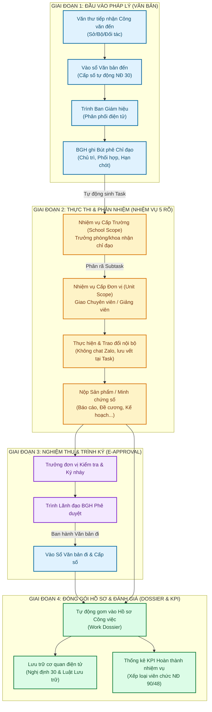
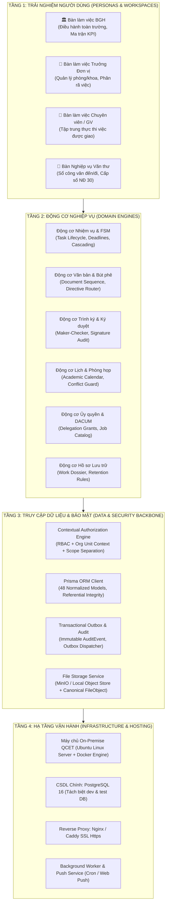

# 🧭 QCET E-OFFICE — MASTER ARCHITECTURE BLUEPRINT
## Bản Thiết Kế Toàn Cảnh & La Bàn Chiến Lược Hệ Thống

> [!IMPORTANT]
> **Tài liệu Định hướng Cấp cao (Source of Truth)** dành cho Ban Giám hiệu, Trưởng dự án và Đội ngũ Kỹ thuật.
> Được xây dựng nhằm thiết lập lại **trục định hướng chiến lược**, kết nối toàn bộ 48 Models cơ sở dữ liệu, 80+ API endpoints, 120+ Components và quy trình pháp lý thực tế tại **Trường Cao đẳng Kỹ thuật Công nghệ Quy Nhơn (QCET)**.
>
> *Mở file này trong Obsidian để kích hoạt các liên kết ngữ nghĩa `[[...]]` và sơ đồ tương tác.*

---

## 📑 MỤC LỤC CHIẾN LƯỢC

1. [[#1. CHẨN ĐOÁN & LA BÀN ĐỊNH HƯỚNG CHIẾN LƯỢC|1. Chẩn đoán Hiện tượng Mất định hướng & La bàn Chiến lược]]
2. [[#2. MÔ HÌNH TRỤC XƯƠNG SỐNG THÔNG TIN (UNIFIED INFORMATION SPINE)|2. Mô hình Trục Xương Sống Thông tin (The Core Business Cycle)]]
3. [[#3. BẢN ĐỒ KIẾN TRÚC TOÀN CẢNH HỆ THỐNG (SYSTEM LANDSCAPE ARCHITECTURE)|3. Bản đồ Kiến trúc Toàn cảnh 4 Tầng (System Landscape Architecture)]]
4. [[#4. ĐẶC TẢ 4 KHÔNG GIAN BÀN LÀM VIỆC THEO VAI TRÒ (ROLE-BASED WORKSPACES)|4. Đặc tả 4 Bàn Làm Việc Theo Vai Trò (Personas & Workspaces)]]
5. [[#5. BẢN ĐỒ HIỆN TRẠNG & ĐÁNH GIÁ KHOẢNG CÁCH (REALITY CHECK & GAP AUDIT)|5. Đánh giá Hiện trạng Thực tế & Ma trận Khoảng cách (Gap Audit)]]
6. [[#6. CHIẾN LƯỢC ĐỘT PHÁ PILOT & LỘ TRÌNH 3 PHÂN KỲ|6. Kế hoạch Hành động Đột phá: Đưa Hệ thống vào Vận hành Thí điểm]]
7. [[#7. HƯỚNG DẪN ĐIỀU HÀNH BỘ NÃO DỰ ÁN TRÊN OBSIDIAN|7. Hướng dẫn Điều hành Dự án với Obsidian Vault]]

---

## 1. CHẨN ĐOÁN & LA BÀN ĐỊNH HƯỚNG CHIẾN LƯỢC

### 1.1. Chẩn đoán: Tại sao dự án đi rất xa nhưng lại mất định hướng?

Khi một hệ thống công nghệ được phát triển sâu, đội ngũ thường rơi vào **"Cái bẫy phức tạp cục bộ" (The Local Complexity Trap)**:
* **Lạc trong rừng kỹ thuật:** Chúng ta đã xây dựng một nền tảng kỹ thuật cực kỳ vững chắc (State machine 5 trạng thái, 10 bước Authorization Engine, FSM Maker-Checker, Base UI headless components, Framer Motion tokens, Prisma schemas chuẩn hóa). Nhưng khi quá chú trọng vào việc hoàn hảo hóa từng chi tiết kỹ thuật nhỏ, chúng ta mất dần cái nhìn về **bức tranh toàn cảnh (The Big Picture)**.
* **Tách rời giữa "Đề án thực tế" và "Màn hình ứng dụng":** Báo cáo trình Ban Giám hiệu nói về việc tiết kiệm 700 triệu - 1 tỷ VNĐ so với 1Office/PortalOffice, về giải quyết bài toán Zalo trôi việc, về Sổ văn bản Nghị định 30, về đánh giá viên chức Nghị định 90. Nhưng trên code, hệ thống lại phân mảnh thành hàng chục views, concepts độc lập chưa được kết nối bằng một câu chuyện nghiệp vụ liền mạch.
* **Phình phạm vi vô thức (Scope Creep):** Có quá nhiều ý tưởng hay (chat realtime, kho vật tư xưởng nghề, đóng dấu watermark, OCR, PWA mobile) cùng xuất hiện khiến nguồn lực bị dàn trải, trong khi luồng công việc cốt lõi (Core Workflow) chưa được chốt chặn nghiệm thu.

```
                  ┌──────────────────────────────────────────────┐
                  │          NGUY CƠ: VŨNG LẦY PHỨC TẠP          │
                  │   Mải mê tối ưu FSM, RBAC, Tokens, UI...    │
                  │   nhưng chưa có luồng sử dụng trọn vẹn!      │
                  └──────────────────────┬───────────────────────┘
                                         │
             ┌───────────────────────────┴───────────────────────────┐
             ▼                                                       ▼
┌─────────────────────────┐                             ┌─────────────────────────┐
│  MẤT ĐỊNH HƯỚNG ĐI ĐÂU? │                             │  CẦN: LA BÀN CHIẾN LƯỢC │
│  - Làm tiếp cái gì?     │ ══════════════════════════> │  - 1 Trục dữ liệu duy nhất│
│  - Khi nào thì xong?    │   (Tái định vị ngay hôm nay)│  - 1 Mục tiêu Pilot rõ ràng│
│  - Ai sẽ dùng đầu tiên? │                             │  - 3 Phân kỳ dứt khoát  │
└─────────────────────────┘                             └─────────────────────────┘
```

### 1.2. Tuyên ngôn La bàn Chiến lược (The North Star)

> [!TIP]
> **TÔN CHỈ BẤT BIẾN CỦA QCET E-OFFICE:**
> *"QCET E-Office không phải là một phần mềm ERP quản trị doanh nghiệp cồng kềnh, mà là **Trung tâm Chỉ đạo, Thực thi & Khép kín Hồ sơ Công việc số** được 'may đo' cho một trường đào tạo kỹ thuật công nghệ công lập."*

#### 3 Trụ cột Giá trị cốt lõi:
1. **Tiết kiệm & Tự chủ (Financial & Tech Sovereignty):** Tiết kiệm 100% chi phí bản quyền thương mại (700tr - 1 tỷ VNĐ so với 1Office/PortalOffice); tự chủ 100% mã nguồn và cơ sở dữ liệu trên máy chủ nội bộ trường.
2. **Quy tắc "5 Rõ" theo chỉ đạo của Thủ tướng Chính phủ (Văn bản 01/VBHN-VPCP):**
   - **Rõ việc:** Tên công việc và sản phẩm yêu cầu cụ thể.
   - **Rõ người chủ trì:** Đúng 01 cá nhân/đơn vị chịu trách nhiệm chính.
   - **Rõ người phối hợp:** Các đơn vị/cá nhân hỗ trợ thực thi.
   - **Rõ hạn chót:** Deadline ấn định theo múi giờ chuẩn ICT (UTC+7).
   - **Rõ sản phẩm bàn giao:** Minh chứng số (file báo cáo, quyết định, biên bản).
3. **Căn cứ Thi đua Viên chức (Nghị định 90/2020/NĐ-CP & 48/2023/NĐ-CP):** Dữ liệu hoàn thành nhiệm vụ thực tế trên hệ thống là thước đo khách quan để xếp loại viên chức cuối năm (Hoàn thành xuất sắc / Tốt / Hoàn thành / Không hoàn thành).

---

## 2. MÔ HÌNH TRỤC XƯƠNG SỐNG THÔNG TIN (UNIFIED INFORMATION SPINE)

Hệ thống QCET E-Office xoay quanh **một chu trình nghiệp vụ khép kín duy nhất** kết nối 3 phân hệ trụ cột: **Văn bản $\to$ Công việc $\to$ Hồ sơ lưu trữ**.



### Quy tắc "4 Không" của chu trình:
1. **Không trôi việc:** Mọi chỉ đạo từ văn bản hoặc giao ban đều biến thành `Task` có ID, không chấp nhận giao việc miệng hoặc qua tin nhắn cá nhân.
2. **Không giấy tờ lòng vòng:** Phiếu trình, ý kiến chuyên môn và chữ ký nháy thực hiện trực tiếp trên môi trường số.
3. **Không trễ hạn mù mờ:** Tính toán trạng thái thời gian thực dựa trên múi giờ ICT (`Đúng hạn`, `Sắp đến hạn`, `Quá hạn`).
4. **Không đùn đẩy:** Phân định rạch ròi 1 Người chủ trì chính (`DIRECT_ASSIGNEE`), người phối hợp (`COLLABORATOR`) và người giám sát (`SUPERVISOR`).

---

## 3. BẢN ĐỒ KIẾN TRÚC TOÀN CẢNH HỆ THỐNG (SYSTEM LANDSCAPE ARCHITECTURE)

Kiến trúc toàn cảnh của QCET E-Office gồm **4 Tầng liên kết ch���t chẽ**:



---

## 4. ĐẶC TẢ 4 KHÔNG GIAN BÀN LÀM VIỆC THEO VAI TRÒ (ROLE-BASED WORKSPACES)

Để loại bỏ sự rối rắm giao diện, hệ thống định hình **4 Không gian trải nghiệm chuyên biệt** (Không ai phải nhìn thấy thứ mình không cần dùng):

### 4.1. Bàn làm việc Ban Giám hiệu (Executive Cockpit)
* **Đối tượng:** Hiệu trưởng, các Phó Hiệu trưởng.
* **Mục tiêu tối thượng:** Nắm bắt toàn cảnh trong 30 giây; chỉ đạo và phê duy���t tức thì.
* **Các khối chức năng trọng tâm:**
  1. **Ma trận Tiến độ Đơn vị (Unit Progress Matrix):** Nhìn thấy ngay Phòng/Khoa nào đang có việc quá hạn cao nhất để đôn đốc trong giao ban.
  2. **Hàng đợi Phê duyệt Khẩn (Urgent Approvals Queue):** Tờ trình, công văn đến hỏa tốc, nhiệm vụ chờ nghiệm thu.
  3. **Bút phê 1 chạm (Quick Directive):** Ghi ý kiến chỉ đạo $\to$ Chọn Trưởng đơn vị chủ trì $\to$ Ấn định ngày xong $\to$ Tự động sinh Task.

### 4.2. Bàn làm việc Trưởng Đơn vị (Unit Leader Workspace)
* **Đối tượng:** Trưởng/Phó Phòng, Trưởng/Phó Khoa, Giám đốc Trung tâm.
* **Mục tiêu tối thượng:** Quản lý dòng chảy công việc của đơn vị; không bỏ sót chỉ đạo của BGH.
* **Các khối chức năng trọng tâm:**
  1. **Hộp việc cần xử lý:** Việc BGH giao cho Đơn vị $\to$ Nút bấm nhanh: *Tự làm* hoặc *Phân công cho Chuyên viên/Giảng viên*.
  2. **Bảng Theo dõi Tiến độ Nội bộ (Unit Kanban & Table):** Theo dõi ai trong phòng/khoa đang làm việc gì, tiến độ bao nhiêu %, ai sắp quá hạn.
  3. **Ký nháy Tờ trình:** Xem xét hồ sơ/sản phẩm của cấp dưới trước khi ký nháy trình BGH.

### 4.3. Bàn làm việc Chuyên viên / Giảng viên (Staff Focus Workspace)
* **Đối tượng:** Giảng viên, Chuyên viên, Nhân viên các phòng ban.
* **Mục tiêu tối thượng:** Tập trung hoàn thành công việc của chính mình mà không bị xao nhãng.
* **Các khối chức năng trọng tâm:**
  1. **Hôm nay tôi làm gì? (My Focus Today):** Danh sách công việc cá nhân sắp xếp theo mức độ ưu tiên và hạn chót.
  2. **Báo cáo Tiến độ & Nộp Sản phẩm:** Cập nhật % hoàn thành, tải lên file đính kèm (giáo án, đề cương, báo cáo tổng hợp).
  3. **Tạo Tờ trình điện tử:** Soạn thảo phiếu trình $\to$ Gửi Trưởng phòng duyệt.

### 4.4. Bàn Nghiệp vụ Văn thư & Lưu trữ (Document Registry Workspace)
* **Đối tượng:** Cán bộ Văn thư trường, Lưu trữ viên, Chánh/Phó Văn phòng.
* **Mục tiêu tối thượng:** Tuân thủ 100% Nghị định 30/2020/NĐ-CP về công tác văn thư.
* **Các khối chức năng trọng tâm:**
  1. **Sổ Đăng ký Văn bản Đến:** Nhập số đến tự động (tăng liên tục từ 01/01 đến 31/12), scan PDF, trích yếu, chuyển BGH phân phối.
  2. **Sổ Đăng ký Văn bản Đi:** Cấp số văn bản đi tự động, kiểm tra thể thức, đóng dấu số h��a.
  3. **Xuất Sổ In ấn (Excel/PDF):** Xuất sổ văn bản theo đúng mẫu Phụ lục IV Nghị định 30 để phục vụ thanh tra lưu trữ.

---

## 5. BẢN ĐỒ HIỆN TRẠNG & ĐÁNH GIÁ KHOẢNG CÁCH (REALITY CHECK & GAP AUDIT)

Để trả lời câu hỏi *"Dự án đang ở đâu và còn thiếu những gì?"*, đây là bảng đối chiếu thực tế giữa **Mã nguồn hiện tại** và **Mục tiêu nghiệp vụ**:

| Phân hệ Nghiệp vụ | Trạng thái Codebase Hiện tại | Mức độ Hoàn thiện | Điểm nghẽn Cốt lõi Cần giải quyết |
| :--- | :--- | :---: | :--- |
| **1. Quản lý Công việc (Task Hub)** | • Đã có FSM state machine chuẩn<br>• Đã có giao diện Table & Kanban tinh gọn (`DESIGN.md`)<br>• Đã có `Task`, `TaskActor`, `TaskDeliverable` models | **85%** | Cần chuyển đổi dứt điểm các endpoint đọc mock sang Prisma queries thực tế; bảo đảm cascade subtask mượt mà. |
| **2. Cơ cấu Tổ chức & Phân quyền (Org & RBAC)** | • Đã có `OrganizationalUnit`, `PositionAssignment`<br>• Đã có Authorization Engine 10 bước<br>• Đã có phân định Maker-Checker (ADR-001) | **80%** | Dữ liệu phòng ban đang có sự phân tách giữa OrgUnit và Department cũ; cần đồng bộ sạch sẽ theo RFC-02. |
| **3. Văn bản & Bút phê (Documents)** | • Đã có schema `Document`, `DocumentIncomingWorkflow`<br>• Đã có form giao diện sơ khởi văn bản đến/đi | **40%** | **MẮT XÍCH CHƯA NỐI:** Chưa có nút "Bút phê chuyển thành Task"; chưa có hàm cấp số tự động theo Nghị định 30. |
| **4. Lịch Tuần & Phòng họp (Calendar)** | • Đã có schema `Meeting`, `MeetingParticipant`<br>• Đã có giao diện lịch công tác và view sảnh TV | **60%** | Cần kích hoạt thuật toán phát hiện trùng lịch phòng họp và nút xuất file Word lịch tuần phục vụ chào cờ đầu tuần. |
| **5. Trình ký & Ký số (E-Approval)** | • Đã có `SignatureRecord`, `TaskApprovalProcess`<br>• Đã nghiên cứu luồng ký nháy | **25%** | Chưa có giao diện ký nháy trực quan trên PDF. Đây là mục tiêu trọng tâm của Phase 2. |
| **6. Hồ sơ Công việc & Lưu trữ (Dossier)** | • Đã có schema `WorkDossier`, `DossierItem`<br>• Đã có định nghĩa vòng đời đóng gói | **30%** | Chưa có trigger tự động gom Task và Văn bản đã hoàn thành vào một Dossier để lưu trữ cơ quan. |

---

## 6. CHIẾN LƯỢC ĐỘT PHÁ PILOT & LỘ TRÌNH 3 PHÂN KỲ

Để thoát khỏi tình trạng mất phương hướng, chúng ta áp dụng chiến lược: **"Thu hẹp mặt trận — Đột phá một điểm — Triển khai thực chiến"**.

```
                ┌─────────────────────────────────────────────────────────┐
                │          CHIẾN LƯỢC ĐỘT PHÁ PILOT (3-4 TUẦN)            │
                │        Thử nghiệm tại: PHÒNG ĐÀO TẠO & KHOA CNTT         │
                └────────────────────────────┬────────────────────────────┘
                                             │
      ┌──────────────────────────────────────┴──────────────────────────────────────┐
      ▼                                                                             ▼
[SPRINT PILOT: 2 TUẦN TỚI]                                                [TIÊU CHUẨN NGHIỆM THU DOR]
1. Đấu nối DB thực tế Task Hub                                            1. BGH giao được 5 việc thật
2. Chuẩn hóa Bàn làm việc BGH & Trưởng Đơn vị                            2. Phòng Đào tạo phân rã việc cho CV
3. Kiểm tra thông báo & đính kèm minh chứng                               3. Khoa CNTT nộp báo cáo qua app
4. Kích hoạt Lịch công tác tuần không trùng phòng                         4. Xuất được file Word Lịch tuần
```

### 6.1. Giai đoạn 1: Vận hành Thí điểm (Pilot Flight Plan — 3 đến 4 tuần)
* **Đơn vị thí điểm:** **Văn phòng Trường**, **Phòng Đào tạo** và **Khoa CNTT**.
* **Kịch bản thực tế cần chạy thông suốt:**
  1. *Hiệu trưởng* đăng nhập $\to$ Thấy Ma trận tiến độ 3 đơn vị thí điểm $\to$ Tạo 1 việc chỉ đạo cho Trưởng phòng Đào tạo (Hạn chót: Thứ 6).
  2. *Trưởng phòng Đào tạo* đăng nhập $\to$ Thấy việc Hiệu trưởng giao $\to$ Phân rã thành 2 việc con giao cho 2 Chuyên viên phòng.
  3. *Chuyên viên* đăng nhập $\to$ Thấy việc tại "Hôm nay tôi làm gì" $\to$ Thực hiện, kéo thanh tiến độ lên 100%, đính kèm file báo cáo.
  4. *Trưởng phòng & Hiệu trưởng* bấm "Nghiệm thu" $\to$ Việc chuyển trạng thái `HOÀN THÀNH` $\to$ Ghi nhận điểm KPI viên chức.
  5. *Đăng ký phòng họp:* Khoa CNTT đăng ký phòng Hội thảo tầng 2 $\to$ Hệ thống báo xanh nếu trống, báo đỏ nếu trùng lịch.

### 6.2. Giai đoạn 2: Số hóa Công văn (NĐ 30) & Trình ký Online (Tháng tiếp theo)
* **Trọng tâm:** Xóa sổ ghi chép sổ giấy và vác hồ sơ giấy đi xin chữ ký nháy.
* **Hạng mục:**
  - Nhập sổ văn bản đến $\to$ Bút phê điện tử $\to$ Tự động sinh Task.
  - Luồng Tờ trình điện tử (Chuyên viên soạn $\to$ Trưởng đơn vị ký nháy $\to$ Ban Giám hiệu phê duyệt).
  - Xuất Sổ văn bản đến/đi ra file Excel theo chuẩn Phụ lục IV Nghị định 30.

### 6.3. Giai đoạn 3: Mở rộng Hệ sinh thái & Tích hợp Nâng cao (Tùy nhu cầu)
* Tích hợp Chữ ký số SmartCA / Token USB của Ban Cơ yếu Chính phủ.
* Đóng gói PWA đẩy thông báo Push Notification ra điện thoại di động.
* Module Quản lý vật tư thực hành xưởng nghề (dành riêng cho các khoa kỹ thuật: Điện, Cơ khí, Ô tô).

---

## 7. HƯỚNG DẪN ĐIỀU HÀNH BỘ NÃO DỰ ÁN TRÊN OBSIDIAN

Để biến thư mục `docs/` thành một **"Buồng lái quản trị tri thức" (Knowledge Cockpit)** sống động:

### 7.1. Cấu trúc Vault Chuẩn hóa
```
docs/
├── MASTER_ARCHITECTURE_BLUEPRINT.md  <-- TÀI LIỆU NÀY (TRỤC TRUNG TÂM)
├── Index.md                          <-- BẢN ĐỒ LIÊN KẾT NHANH (MỤC LỤC VAULT)
├── domain/                           <-- TRI THỨC NGHIỆP VỤ & PHÁP LÝ
│   ├── task-management.md
│   ├── incoming-documents.md
│   ├── outgoing-documents.md
│   ├── permission-matrix.md
│   └── regulations_knowledge_base.md
├── architecture/                     <-- THIẾT KẾ KỸ THUẬT & ADRs
│   ├── enterprise-product-architecture.md
│   ├── DATABASE_OPERATIONS.md
│   └── decisions/ (ADR-001 đến ADR-008, RFC-01 đến RFC-11)
├── product/                          <-- ĐẶC TẢ TÍNH NĂNG & METRICS
│   └── specs/
└── ux/                               <-- QUY CHUẨN GIAO DIỆN & TỪ VỰNG
```

### 7.2. Cách tra cứu và duy trì:
1. **Dùng Graph View (`Cmd + G`):** Bạn sẽ thấy `MASTER_ARCHITECTURE_BLUEPRINT.md` nằm ở vị trí tâm điểm (Hub), tỏa nhánh đến các ADRs, Specs và Domains.
2. **Khi có ý tưởng mới:** Tạo RFC mới trong `docs/architecture/decisions/RFC-xx.md`, gắn link về `[[MASTER_ARCHITECTURE_BLUEPRINT]]`.
3. **Khi hoàn thành một tính năng:** Đánh dấu tick `[x]` vào bảng kiểm soát tiến độ tại Chương 5 để nắm chắc mức độ sẵn sàng triển khai.

---

> 💡 **LỜI NHẮC KIẾN TRÚC SƯ TRƯỞNG:**
> *"Một hệ thống phần mềm thành công không được đo bằng số lượng dòng code hay độ phức tạp của thuật toán, mà được đo bằng việc **nó có giúp một giảng viên bớt đi 30 phút chạy giấy tờ và giúp Thầy Hiệu trưởng an tâm về tiến độ của nhà trường hay không**. Hãy kiên định giữ vững trục cốt lõi này!"*
