# QCET Enterprise Product & Workflow Architecture v1

> **Source of truth** cho toàn bộ hệ thống E-Office QCET.
> Mọi issue, thiết kế, và code review tham chiếu tài liệu này.
>
> **Trạng thái**: Draft v1 — Analysis only, không sửa implementation code.
>
> **Khung pháp lý tham chiếu**:
> - Nghị định 30/2020/NĐ-CP — Công tác văn thư
> - QĐ 388/QĐ-BGDĐT — Quy chế E-Office (Bộ GDĐT)
> - QĐ 283/QĐ-CĐKTCNQN — Quy chế tổ chức hoạt động
> - QĐ 420/QĐ-CĐKTCNQN — Quy chế phân công công tác
> - NĐ 13/2023/NĐ-CP — Bảo vệ dữ liệu cá nhân
> - Luật 117/2025/QH15 — Bảo vệ bí mật nhà nước

---

## Mục lục

- [§0 — Executive Summary & Semantic Principles](#0--executive-summary--semantic-principles)
- [§1 — Identity, Organization, Position & Authority Model](#1--identity-organization-position--authority-model)
- [§2 — Domain Model & Data Ownership](#2--domain-model--data-ownership)
- [§3 — Task Lifecycle State Machine](#3--task-lifecycle-state-machine)
- [§4 — Document Workflow State Machines](#4--document-workflow-state-machines)
- [§5 — Meeting & Dossier Lifecycles](#5--meeting--dossier-lifecycles)
- [§6 — Business Process / BPMN Flows](#6--business-process--bpmn-flows)
- [§7 — Swimlane Responsibility Mapping](#7--swimlane-responsibility-mapping)
- [§8 — Permission & Capability Matrix](#8--permission--capability-matrix)
- [§9 — Information Architecture & Navigation](#9--information-architecture--navigation)
- [§10 — End-to-End User Flows](#10--end-to-end-user-flows)
- [§11 — Service Blueprint](#11--service-blueprint)
- [§12 — Security Architecture & Threat Model](#12--security-architecture--threat-model)
- [§13 — Quality Attributes & Non-Functional Requirements](#13--quality-attributes--non-functional-requirements)
- [Phụ lục: Tham chiếu Kế hoạch Triển khai](#phụ-lục-tham-chiếu-kế-hoạch-triển-khai)

## §0 — Executive Summary & Semantic Principles

### Tổng quan Hệ thống

QCET E-Office là hệ thống quản lý công việc và văn thư nội bộ cho trường Cao đẳng Kinh tế - Kỹ thuật Quảng Nam, bao gồm:

| Dimension | Quy mô |
|-----------|--------|
| Prisma models | 48 |
| Enums | 30+ |
| API endpoints | 80+ |
| Typed capabilities | 70+ |
| Authorization engine steps | 10 |
| Page routes | 14 |
| UI components | 120+ |

### 4 Chiều Ngữ nghĩa Orthogonal (PHẢI Tách Biệt)

Bốn chiều sau đây **KHÔNG ĐƯỢC trộn lẫn** trong bất kỳ quyết định thiết kế nào. Mỗi chiều có owner riêng, storage riêng, và lifecycle riêng:

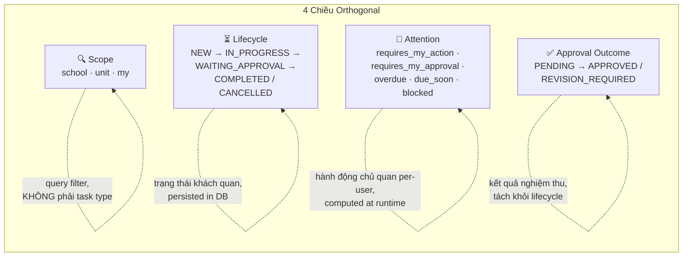

#### Chi tiết từng chiều

| Chiều | Định nghĩa | Source of Truth | Persisted? | Ví dụ dễ nhầm |
|-------|-----------|-----------------|------------|----------------|
| **Scope** | Phạm vi quan sát/truy vấn. Một task luôn thuộc đúng 1 scope (SCHOOL/DEPARTMENT/INDIVIDUAL), nhưng user có thể **nhìn** nhiều scope. | `Task.scope` (DB) + `WorkspaceScopeType` (contract) | ✅ Per task | "Scope = loại task" ❌ — Scope = query view |
| **Lifecycle** | Trạng thái vòng đời khách quan. Progression đơn hướng (trừ revision cycle). | `Task.status` (DB) → `state-machine.ts` (domain) | ✅ Per task | "OVERDUE = lifecycle state" ❌ — OVERDUE là derived flag, không phải DB status |
| **Attention** | Hành động mà **user cụ thể** cần thực hiện. Computed tại runtime dựa trên lifecycle + user role + assignment. | `attention-resolver.ts` (domain) | ❌ Computed | "Chờ tôi duyệt = task status" ❌ — Đó là user attention |
| **Approval Outcome** | Kết quả đánh giá sản phẩm bàn giao. Tách biệt khỏi task lifecycle. | `TaskDeliverable.reviewStatus` (DB) | ✅ Per deliverable | "APPROVED = task COMPLETED" ❌ — Deliverable approved, task vẫn IN_PROGRESS nếu còn deliverable khác |

### Nguyên tắc Đóng khung (Frozen)

1. **Single Task System**: Chỉ có MỘT loại entity `Task`. Scope (SCHOOL/DEPARTMENT/INDIVIDUAL) là thuộc tính phân loại, KHÔNG phải type. Subtask là hierarchy (`parentTaskId`), không phải hệ thống riêng.

2. **Lifecycle ≠ Display Status**: DB lưu 6 giá trị (`TaskStatus` enum). Domain layer canonicalize thành 5 (`CanonicalTaskStatus`). Contract expose 7 (`TaskLifecycleStatus`). UI hiển thị 10 (`display-config.ts`). Đây là mapping layers có chủ đích, KHÔNG phải duplication — xem [§10 Gap G1, G2](#g1--status-type-hierarchy-fragmentation) để biết vấn đề thực sự.

3. **"Chờ tôi duyệt" = Attention, KHÔNG phải Status**: `requires_my_approval` là kết quả computed bởi `canUserReviewTask()` trong `attention-resolver.ts`, gated bởi SoD (maker ≠ checker). Không có trường DB nào lưu giá trị này.

4. **Notification ≠ Outstanding Action**: `Notification` model là kênh thông báo (có thể bỏ qua). Outstanding action là phần tử trong attention queue cần user hành động. Hiện tại chưa có formal attention queue — xem [§10 Gap A10](#a10--no-formal-attention-queue).

5. **Technical ADMIN ≠ Business Authority**: `UserRole.ADMIN` → `SystemRole.SYSTEM_ADMIN`. Authorization engine Step 3 (Separation of Powers) **block** SYSTEM_ADMIN khỏi MỌI institutional action (ký văn bản, duyệt công việc, chỉ đạo). ADMIN chỉ có thể: `account.manage`, `org.manage`, `position.manage`, `system.configure`, `audit.view`. Xem [§5](#5--permission--capability-matrix).

6. **Task List renders top-level only**: Workspace table/kanban chỉ hiển thị task có `parentTaskId = null`. Subtask hiển thị trong detail view theo hierarchy.

### Cấu trúc Mapping Status

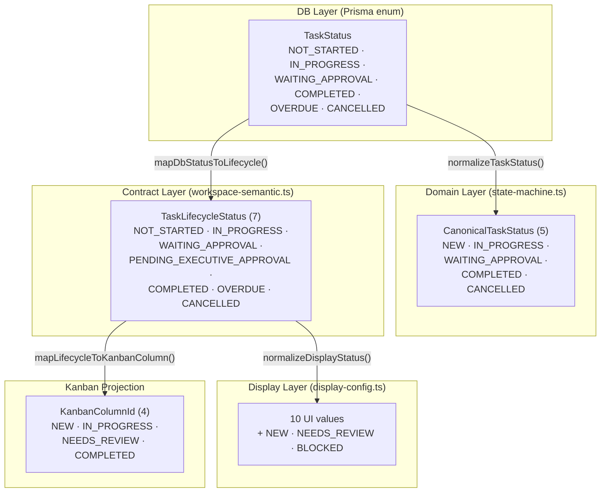

> **Semantic invariant**: `OVERDUE` KHÔNG phải là status chuyển tiếp trong FSM. Nó là derived flag (`dueDate < now && status ∉ {COMPLETED, CANCELLED}`). DB enum có OVERDUE là legacy — xem [§10 Gap G1](#g1--status-type-hierarchy-fragmentation).

---

## §1 — Identity, Organization, Position & Authority Model

### 1.1 Hệ thống Role 7 Tầng

Hệ thống sử dụng 7 tầng role/position khác nhau, mỗi tầng phục vụ mục đích riêng:

| # | Tầng | Source File | Values | Mục đích |
|---|------|-------------|--------|----------|
| 1 | **Institutional Role** (UserRole enum) | `schema.prisma:10-16` | BAN_GIAM_HIEU, TRUONG_PHONG, CHUYEN_VIEN, VAN_THU, ADMIN | Legacy role gắn trực tiếp trên User model |
| 2 | **System Role** (SystemRole) | `authorization-context.ts` | SYSTEM_ADMIN, SECURITY_ADMIN, ORG_ADMIN | Mapped từ UserRole cho authorization engine |
| 3 | **Client Session Role** | `types/auth.ts` | ADMIN, MANAGER, STAFF | Simplified role cho UI routing/display |
| 4 | **Position Assignment** | `schema.prisma` + `authorization-engine.ts:77-122` | HIEU_TRUONG, PHO_HIEU_TRUONG, PHO_HIEU_TRUONG_DT, PHO_HIEU_TRUONG_HC, TRUONG_PHONG, PHO_TRUONG_PHONG, TRUONG_KHOA, PHO_TRUONG_KHOA, GIAM_DOC_TRUNG_TAM, PHO_GIAM_DOC_TRUNG_TAM, VAN_THU, LUU_TRU, GIANG_VIEN_CHUYEN_VIEN, CHUYEN_VIEN, GIANG_VIEN, VIEN_CHUC | Canonical position — used by authorization engine |
| 5 | **Task Actor Role** (TaskActorRole enum) | `schema.prisma` | ASSIGNER, LEAD_UNIT, COORDINATING_UNIT, DRI, COLLABORATOR, FOLLOWER, REVIEWER, APPROVER, OBSERVER | Vai trò trong ngữ cảnh task cụ thể |
| 6 | **Role Categories** (domain logic) | `state-machine.ts:64-83` | EXECUTIVE set, MANAGER set, STAFF set | Nhóm roles cho FSM guard evaluation |
| 7 | **Institutional Portfolios** (QĐ 420) | `capability.ts` | ACADEMIC, TRAINING, ADMINISTRATION_LOGISTICS, INSTITUTIONAL_STRATEGY, STUDENT_AFFAIRS, HR_ORGANIZATION, +7 more | Lĩnh vực phụ trách theo phân công công tác |

### 1.2 Position Hierarchy

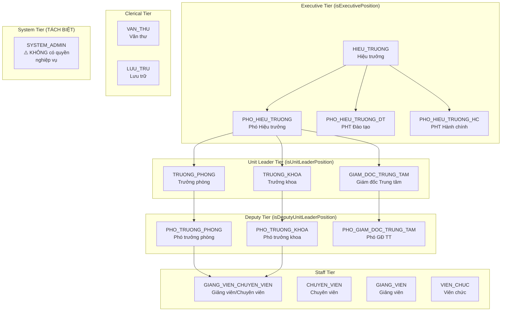

### 1.3 Ba Nguyên tắc Quan trọng

#### Nguyên tắc 1: Technical ADMIN ≠ Business Authority

**Source**: `authorization-engine.ts` Step 3 — Separation of Powers

```
UserRole.ADMIN → SystemRole.SYSTEM_ADMIN

SYSTEM_ADMIN CÓ THỂ:
  ✅ account.manage, org.manage, position.manage, system.configure, audit.view

SYSTEM_ADMIN KHÔNG THỂ:
  ❌ task.approve, task.assign, task.create (business)
  ❌ document.sign, document.direct (statutory)
  ❌ meeting.confirm_minutes, meeting.create_resolution
  ❌ Mọi institutional leadership action
```

Rejection code: `SEPARATION_OF_POWERS_VIOLATION`

#### Nguyên tắc 2: Non-delegable Capabilities

**Source**: `capability.ts:225-238` — `NON_DELEGABLE_CAPABILITIES`

12 capabilities KHÔNG THỂ ủy quyền, dù có `DelegationGrant`:

| Category | Capabilities | Cơ sở pháp lý |
|----------|-------------|----------------|
| Statutory Governance | `position.manage_leadership`, `hr.disciplinary_action`, `finance.treasury_disbursement`, `regulation.institutional_amend` | QĐ 283/QĐ-CĐKTCNQN |
| System Admin | `account.manage`, `system.configure`, `org.manage`, `position.manage` + 4 `system.*` namespaced | Technical security |

#### Nguyên tắc 3: Portfolio-bound Actions

**Source**: `capability.ts:258-277` — `PORTFOLIO_BOUND_ACTIONS`

17 actions yêu cầu portfolio match theo QĐ 420/QĐ-CĐKTCNQN. Executive chỉ ký/duyệt văn bản/công việc thuộc lĩnh vực mình phụ trách:

| Domain | Portfolio-bound Capabilities |
|--------|------------------------------|
| Task | `task.approve`, `task.review`, `task.cancel`, `task.close` |
| Document | `document.direct`, `document.assign_unit`, `document.sign`, `document.review_content` |
| Document Outgoing | `document.outgoing.sign`, `document.outgoing.authorized_sign`, `document.outgoing.sign_kt`, `document.outgoing.review_content`, `document.outgoing.approve_content` |
| Meeting | `meeting.confirm_minutes`, `meeting.create_resolution`, `meeting.publish_resolution` |

**Exception**: Hiệu trưởng (HIEU_TRUONG) bypass portfolio check — có toàn quyền trên mọi lĩnh vực.

### 1.4 Task Actor Role Mapping

| TaskActorRole | Mô tả | Quyền trong task |
|---------------|-------|-----------------|
| ASSIGNER | Người giao việc | Tạo, reassign, cancel, monitor |
| LEAD_UNIT | Đơn vị chủ trì | Phân công nội bộ |
| COORDINATING_UNIT | Đơn vị phối hợp | Tham gia thực hiện |
| DRI | Directly Responsible Individual | Thực hiện, submit result |
| COLLABORATOR | Người phối hợp | Thực hiện cùng DRI |
| FOLLOWER | Người theo dõi | Read-only |
| REVIEWER | Người kiểm tra | Review deliverable |
| APPROVER | Người phê duyệt | Approve/reject |
| OBSERVER | Người quan sát | Read-only, ⚠️ cannot mutate |


---


## §2 — Domain Model & Data Ownership

### Entity Inventory (48 Models, 38 Enums)

#### 9.1 Task Domain

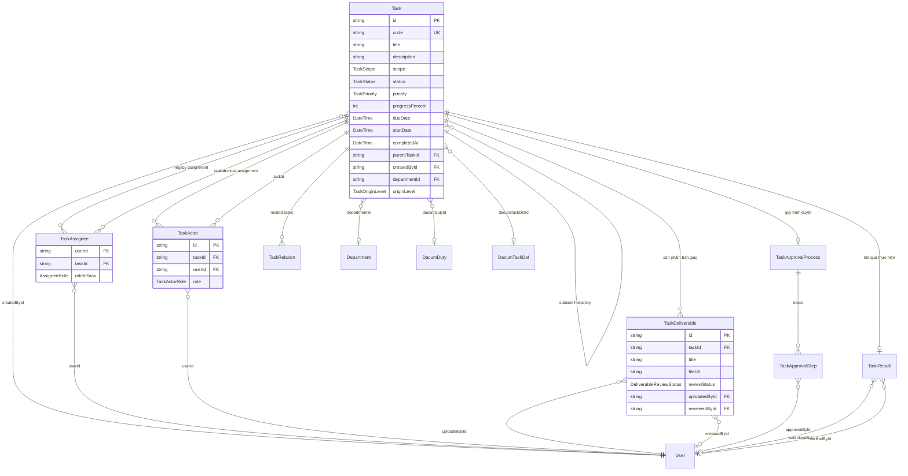

#### 9.2 Document Domain

```mermaid
erDiagram
    Document ||--o| DocumentIncomingWorkflow : "VB đến"
    Document ||--o| DocumentOutgoingWorkflow : "VB đi"
    Document ||--o{ DocumentDirective : "ý kiến chỉ đạo"
    Document ||--o{ DocumentAttachment : "file đính kèm"
    Document ||--o{ SignatureRecord : "chữ ký"
    Document }o--|| User : "registeredById"
    Document }o--o| Department : "departmentId"
    Document }o--o| OrganizationalUnit : "leadUnitId"

    DocumentDirective }o--|| User : "directorId"
    DocumentDirective }o--o| OrganizationalUnit : "assignedUnitId"

    DocumentIncomingWorkflow }o--o| User : "presentedToId"
    DocumentIncomingWorkflow }o--o| User : "directedById"
    DocumentIncomingWorkflow }o--o| User : "assignedToUserId"
    DocumentIncomingWorkflow }o--o| OrganizationalUnit : "leadUnitId"

    DocumentOutgoingWorkflow }o--o| User : "drafterId"
    DocumentOutgoingWorkflow }o--o| User : "contentReviewerId"
    DocumentOutgoingWorkflow }o--o| User : "formatCheckerId"
    DocumentOutgoingWorkflow }o--o| User : "authorizedSignerId"
    DocumentOutgoingWorkflow }o--o| User : "numberAssignedById"
    DocumentOutgoingWorkflow }o--o| User : "organizationSignerId"

    Document {
        string id PK
        DocumentType type
        DocumentStatus status
        DataClassification classification
        DocumentSecurityLevel securityLevel
        DocumentUrgency urgency
        string subject
        string documentNumber
        DateTime issuedDate
    }

    DocumentIncomingWorkflow {
        string id PK
        string documentId FK
        IncomingDocumentStatus status
        string leadUnitId FK
        string coordinatingUnitIds JSON
    }

    DocumentOutgoingWorkflow {
        string id PK
        string documentId FK
        OutgoingDocumentStatus status
        string drafterId FK
        string authorizedSignerId FK
        DateTime authorizedSignedAt
    }
```

#### 9.3 Organization Domain

```mermaid
erDiagram
    User ||--o{ PositionAssignment : "vị trí công tác"
    User }o--o| Department : "departmentId"
    User ||--o{ BodyMembership : "thành viên hội đồng"
    User ||--o{ DacumDelegation : "ủy quyền (legacy)"
    User ||--o{ Account : "OAuth accounts"
    User ||--o{ Session : "phiên đăng nhập"

    OrganizationalUnit ||--o{ OrganizationalUnit : "hierarchy (parentId)"
    OrganizationalUnit ||--o{ PositionAssignment : "vị trí"
    OrganizationalUnit ||--o{ UnitClosurePath : "closure table"

    OrganizationalBody ||--o{ BodyMembership : "thành viên"
    OrganizationalBody }o--o| User : "chairId"

    PositionAssignment }o--|| User : "userId"
    PositionAssignment }o--|| OrganizationalUnit : "unitId"
    PositionAssignment ||--o{ PortfolioAssignment : "phân công phụ trách"
    PositionAssignment ||--o{ DelegationGrant : "ủy quyền (grantor)"
    PositionAssignment ||--o{ DelegationGrant : "ủy quyền (grantee)"

    DelegationGrant }o--o| Document : "sourceDocument"

    PortfolioAssignment }o--|| ResponsibilityArea : "lĩnh vực"

    DacumDuty ||--o{ DacumTaskDef : "task definitions"
    DacumDuty }o--o| JobCatalogItem : "job catalog"

    User {
        string id PK
        string name
        string email UK
        UserRole role
        boolean isActive
        string departmentId FK
        string avatarUrl
    }

    PositionAssignment {
        string id PK
        string userId FK
        string unitId FK
        string positionCode
        DateTime startDate
        DateTime endDate
        string status
    }

    DelegationGrant {
        string id PK
        string grantorPositionId FK
        string granteePositionId FK
        string capabilities JSON
        string portfolioScope
        string sourceDocumentNumber
        DateTime validFrom
        DateTime validUntil
        DelegationStatus status
    }

    OrganizationalUnit {
        string id PK
        string name
        string code UK
        UnitType unitType
        string parentId FK
        UnitStatus status
    }
```

#### 9.4 Infrastructure Domain

```mermaid
erDiagram
    Notification }o--|| User : "userId (recipient)"
    PushSubscription }o--|| User : "userId"
    AuditEvent }o--o| User : "actorId"
    OutboxEvent ||--o{ AuditEvent : "source"

    Notification {
        string id PK
        string userId FK
        string type
        string category
        string title
        string message
        string actorName
        boolean isRead
        DateTime createdAt
    }

    AuditEvent {
        string id PK
        string actorId FK
        string action
        string resourceType
        string resourceId
        string details JSON
        DateTime timestamp
    }

    PushSubscription {
        string id PK
        string userId FK
        string endpoint
        PushSubscriptionStatus status
    }
```

### 9.5 Entity Ownership Table

| Entity | Canonical Source | Persisted | Primary Consumers | Known Duplication |
|--------|----------------|-----------|-------------------|-------------------|
| **Task** | `prisma/schema.prisma` | ✅ | domain/tasks/*, api/tasks/* | — |
| **TaskAssignee** | schema | ✅ | domain/tasks (legacy) | ⚠️ Duplicated by TaskActor (G6) |
| **TaskActor** | schema | ✅ | domain/tasks (newer) | ⚠️ Duplicates TaskAssignee (G6) |
| **TaskDeliverable** | schema | ✅ | api/tasks/[id]/deliverables | — |
| **TaskApprovalProcess** | schema | ✅ | api/tasks/[id]/actions/approve | ⚠️ canApprove boolean not resolved from steps (A5) |
| **TaskResult** | schema | ✅ | api/tasks/[id]/actions/submit-result | — |
| **Document** | schema | ✅ | api/documents/* | ⚠️ Document.status vs Workflow sub-status (A1) |
| **DocumentIncomingWorkflow** | schema | ✅ | api/documents/incoming/* | ⚠️ coordinatingUnitIds as JSON (F1) |
| **DocumentOutgoingWorkflow** | schema | ✅ | api/documents/outgoing/* | ⚠️ recipientList duplicated on Document (F5) |
| **DocumentDirective** | schema | ✅ | api/documents/[id]/directives | ⚠️ collaboratorIds as Text (F1) |
| **User** | schema | ✅ | everywhere | — |
| **Department** | schema | ✅ | Task queries, user listing | ⚠️ Duplicated by OrganizationalUnit (G7) |
| **OrganizationalUnit** | schema | ✅ | authorization engine, position assignments | ⚠️ Duplicates Department (G7) |
| **PositionAssignment** | schema | ✅ | authorization engine | — |
| **DelegationGrant** | schema | ✅ | authorization engine Step 8 | ⚠️ Parallel DacumDelegation exists (G8) |
| **DacumDelegation** | schema | ✅ | legacy delegation-authority-engine | ⚠️ Superseded by DelegationGrant (G8) |
| **Meeting** | schema | ✅ | api/meetings/* | ⚠️ No FSM (A2) |
| **MeetingResolution** | schema | ✅ | api/meetings/[id]/resolutions | Can auto-generate Tasks |
| **WorkDossier** | schema | ✅ | api/dossiers/* | ⚠️ No FSM (A3) |
| **Notification** | schema | ✅ | api/notifications/* | ⚠️ category/type not enumed (F4), actorName denormalized (F3) |
| **AuditEvent** | schema | ✅ | audit service | ⚠️ Incomplete coverage (A6) |
| **UnitWorkAssignment** | schema | ✅ | unit task management | ⚠️ status as raw String (F2), collaboratorUserIds as JSON (F1) |

### 9.6 Enum Inventory (38 Enums)

| Category | Enums | Semantic Issues |
|----------|-------|----------------|
| **Identity** | UserRole | Legacy 5-value, partially superseded by PositionAssignment |
| **Task** | TaskStatus, TaskScope, TaskOriginLevel, TaskPriority, TaskActorRole, AssigneeRole, TaskRelationType | ⚠️ TaskScope ≈ TaskOriginLevel (G6), AssigneeRole ≈ TaskActorRole subset |
| **Approval** | ApprovalProcessStatus, ApprovalStepStatus, DeliverableReviewStatus, AssignmentStatus, AssignmentType | — |
| **Document** | DocumentType, DocumentStatus, IncomingDocumentStatus, OutgoingDocumentStatus, DocumentSecurityLevel, DocumentUrgency, DataClassification | ⚠️ 3 parallel status enums |
| **Organization** | UnitType, UnitStatus, BodyStatus, BodyMemberRole, OrganizationalBodyType | — |
| **Dossier** | DossierStatus, DossierItemType | — |
| **Meeting** | MeetingStatus, MeetingParticipantRole, AttendanceStatus, ResolutionType | — |
| **Delegation** | DelegationStatus | — |
| **Signature** | SignatureType, SignatureVerificationStatus | — |
| **Infrastructure** | OutboxStatus, PushSubscriptionStatus | — |
| **HR** | JobCatalogGroup, ResponsibilityCategory | — |

### 9.7 Semantic Duplication Analysis

#### TaskAssignee vs TaskActor

| Aspect | TaskAssignee (Legacy) | TaskActor (Canonical) |
|--------|----------------------|----------------------|
| Role enum | AssigneeRole: PRIMARY_OWNER, COLLABORATOR, SUPERVISOR | TaskActorRole: ASSIGNER, LEAD_UNIT, COORDINATING_UNIT, DRI, COLLABORATOR, FOLLOWER, REVIEWER, APPROVER, OBSERVER |
| Granularity | 3 roles | 9 roles — distinguishes DRI, REVIEWER, APPROVER |
| COLLABORATOR | ✅ Present | ✅ Present (overlap) |
| Domain usage | `state-machine.ts:isMaker()` checks `assignees[].roleInTask` | `attention-resolver.ts:isTaskMaker()` checks varied field names |
| **Migration path** | PRIMARY_OWNER → DRI, COLLABORATOR → COLLABORATOR, SUPERVISOR → REVIEWER | — |

#### Department vs OrganizationalUnit

| Aspect | Department | OrganizationalUnit |
|--------|-----------|-------------------|
| Structure | Flat list | Hierarchical (parentId, UnitClosurePath) |
| Task FK | `Task.departmentId` → Department | — |
| Position FK | — | `PositionAssignment.unitId` → OrganizationalUnit |
| Auth usage | `state-machine.ts` department boundary check | `authorization-engine.ts` scope boundary check |
| **Migration path** | Link Department.id = OrganizationalUnit.id OR merge into OrganizationalUnit | — |

#### DelegationGrant vs DacumDelegation

| Aspect | DelegationGrant (Canonical) | DacumDelegation (Legacy) |
|--------|----------------------------|-------------------------|
| Basis | Position-to-position | User-to-user |
| Invariants | 7 (anti-self, active tenure, non-delegable check, portfolio boundary, anti-circular depth-10, legal document required, cache invalidation) | None formalized |
| Auth engine | ✅ Step 8 checks DelegationGrant | ❌ Not checked |
| Used by | `authorization-engine.ts`, `delegation-grant-service.ts` | `delegation-authority-engine.ts` (legacy) |

#### TaskScope vs TaskOriginLevel

Both on the same `Task` model:
- `TaskScope`: SCHOOL, DEPARTMENT, INDIVIDUAL — used for query filtering and authority checks
- `TaskOriginLevel`: Similar concept — unclear differentiation

**Recommendation**: Consolidate into single `TaskScope`, remove `TaskOriginLevel`.

---


## §3 — Task Lifecycle State Machine

> **Lưu ý kiến trúc**: Quyết định kiến trúc chuẩn tắc đã được **ACCEPTED tại Architecture Review Gate theo ADR-003**:
> 1. $\text{Lifecycle} \neq \text{Attention}$ là invariant bất biến.
> 2. `NOT_STARTED` là **Canonical Persisted Initial State** duy nhất (`NEW` là legacy/presentation alias, không phải canonical state thứ hai).
> 3. `OVERDUE` chuyển thành derived attention signal, không phải lifecycle status.

> **Nguyên tắc cốt lõi**: 4 machine RIÊNG BIỆT, tuân thủ "Scope ≠ Lifecycle ≠ Attention ≠ Approval Outcome".
> Mỗi machine KHÔNG chứa logic thuộc machine khác.

### 3.1 Task Lifecycle FSM (Kiến trúc Đích per ADR-003)

**CURRENT vs TARGET**: Hiện tại trong mã nguồn `state-machine.ts` sử dụng `NEW` trong khi Prisma DB sử dụng `NOT_STARTED`. Theo quyết định **ADR-003 (ACCEPTED)**, toàn bộ hệ thống chuẩn hóa về `NOT_STARTED` làm trạng thái khởi tạo chuẩn tắc duy nhất:

```mermaid
stateDiagram-v2
    [*] --> NOT_STARTED

    NOT_STARTED --> IN_PROGRESS : Bắt đầu thực hiện\n(any related party)
    NOT_STARTED --> CANCELLED : Hủy\n(creator/executive only;\nSTAFF_CANNOT_CANCEL)

    IN_PROGRESS --> WAITING_APPROVAL : Nộp sản phẩm / báo cáo\n(chỉ DRI/assignee)
    IN_PROGRESS --> CANCELLED : Hủy\n(creator/executive only)

    WAITING_APPROVAL --> COMPLETED : Phê duyệt ✅\n(tuân thủ SoD ADR-001)
    WAITING_APPROVAL --> IN_PROGRESS : Yêu cầu chỉnh sửa\n(approver/reviewer)
    WAITING_APPROVAL --> CANCELLED : Hủy\n(creator/executive only)

    COMPLETED --> [*]
    CANCELLED --> [*]

    note right of COMPLETED : Terminal — Đóng băng bất biến\n(TERMINAL_STATE)
    note right of CANCELLED : Terminal — Đóng băng bất biến
```

#### Approval Guards (WAITING_APPROVAL → COMPLETED)

5 guard kiểm tra tuần tự — **tất cả** phải pass:

| # | Guard | Rejection Code | Logic & Quy chuẩn Kiến trúc |
|---|-------|---------------|----------------------------|
| 1 | **Maker-Checker SoD** | `MAKER_CANNOT_BE_CHECKER` / `SOD_VIOLATION` | **Per ADR-001 (ACCEPTED)**: Hợp nhất kiểm tra đầy đủ Creator ∪ DRI ∪ Assignee ∪ Submitter ∪ Uploader. **Ủy quyền (Delegation) TUYỆT ĐỐI KHÔNG ĐƯỢC vượt rào SoD**; Maker vẫn bị cấm tự phê duyệt dù có giấy ủy quyền. |
| 2 | **Staff Restriction** | `UNAUTHORIZED_APPROVER` | `categorizeRole(actor.role) === STAFF` → DENY (trừ khi có delegation hợp lệ cho non-maker) |
| 3 | **School Scope Authority** | `SCHOOL_SCOPE_REQUIRES_EXECUTIVE` | `task.scope === SCHOOL` → chỉ Executive HOẶC delegation hợp lệ |
| 4 | **Department Boundary** | `DEPARTMENT_MISMATCH` | `task.scope === DEPARTMENT` → Manager phải cùng `departmentId` |
| 5 | **Delegation Fallback** | — | Nếu không pass guards 2-4, kiểm tra `hasDelegation === true` (chỉ áp dụng khi KHÔNG vi phạm Guard 1 SoD) |

#### Status Mapping Layers (Target per ADR-003)

```
DB TaskStatus (Target)     Domain CanonicalTaskStatus       Contract TaskLifecycleStatus
──────────────────────     ──────────────────────────       ────────────────────────────
NOT_STARTED                NOT_STARTED (alias: NEW)         NOT_STARTED
IN_PROGRESS                IN_PROGRESS                      IN_PROGRESS
WAITING_APPROVAL           WAITING_APPROVAL                 WAITING_APPROVAL
                                                            PENDING_EXECUTIVE_APPROVAL ⁽¹⁾
COMPLETED                  COMPLETED                        COMPLETED
CANCELLED                  CANCELLED                        CANCELLED

⁽¹⁾ PENDING_EXECUTIVE_APPROVAL chỉ tồn tại ở contract layer phục vụ multi-step approval
⁽²⁾ OVERDUE được loại bỏ khỏi DB enum, chuyển thành derived attention signal computed tại read-time
```
⁽²⁾ OVERDUE là derived flag, KHÔNG nên là DB enum value — xem Gap G1
```

#### Alias Normalization (state-machine.ts:85-93)

| Alias | → Canonical |
|-------|-------------|
| `NOT_STARTED`, `TODO`, `NEW` | → `NEW` |
| `IN_PROGRESS` | → `IN_PROGRESS` |
| `WAITING_APPROVAL`, `NEEDS_REVIEW` | → `WAITING_APPROVAL` |
| `COMPLETED`, `DONE` | → `COMPLETED` |
| `CANCELLED`, `CANCELED` | → `CANCELLED` |
| (unrecognized) | → pass-through as-is ⚠️ no validation |

### 3.2 Approval Process FSM

**Source**: `prisma/schema.prisma` — `ApprovalProcessStatus` enum + `TaskApprovalProcess`/`TaskApprovalStep` models

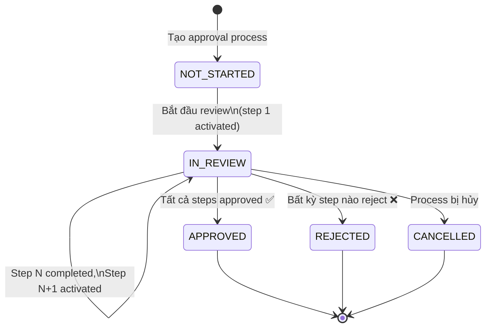

**Multi-step model**:
- `TaskApprovalProcess`: Container, tracks `currentStepNumber` và `overallStatus`
- `TaskApprovalStep`: Individual step, `stepNumber` ordering, `approvedById` tracking
- Mỗi step có thể có approver khác nhau → sequential approval chain

**SoD**: Creator/Primary Owner ≠ Approver (authorization engine Step 10.3)

> **Gap A5**: `canApprove: boolean` trong `UserAttentionContext` chưa resolve từ approval step data. Hiện tại là heuristic-based.

### 3.3 Deliverable Review FSM

**Source**: `prisma/schema.prisma` — `DeliverableReviewStatus` enum

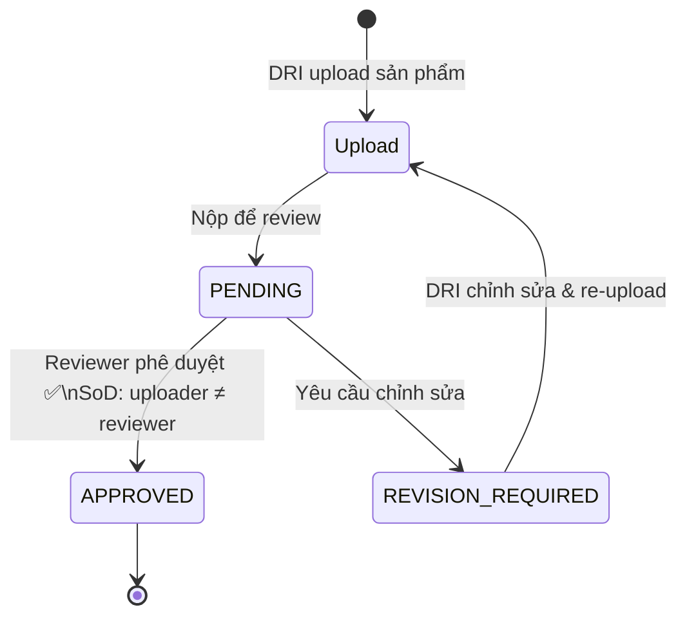

**Separation**: Deliverable APPROVED ≠ Task COMPLETED. Một task có thể có nhiều deliverables; tất cả phải APPROVED trước khi task chuyển WAITING_APPROVAL → COMPLETED.

**SoD**: `uploadedById` ≠ `reviewedById` (authorization engine Step 10.4: Executor ≠ Reviewer)

### 3.4 User Attention Resolution (Computed View — NOT a State Machine)

**Source**: `src/domain/tasks/attention-resolver.ts` — `resolveUserAttention()`

> ⚠️ Đây KHÔNG phải state machine. Attention types là **computed per-user view** dựa trên task state + user context. Không có transition, không có persistence.

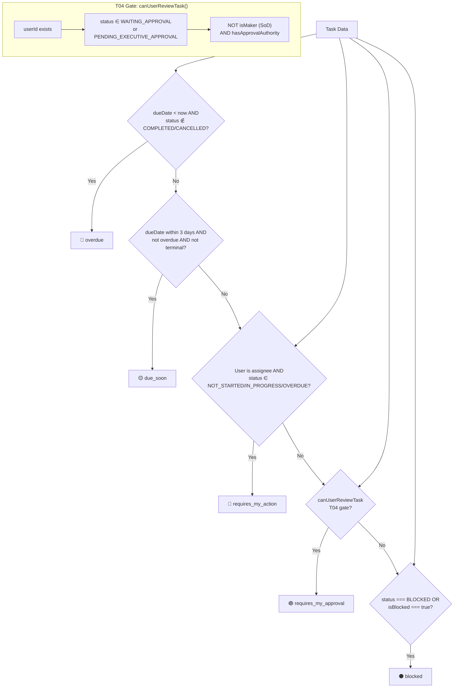

**Attention Resolution Rules**:

| Attention Type | Điều kiện | User Action cần thực hiện |
|---------------|-----------|--------------------------|
| `overdue` | `dueDate < ICT_now` AND `status ∉ {COMPLETED, CANCELLED}` | Xử lý task quá hạn hoặc escalate |
| `due_soon` | `dueDate` within 3 days, not overdue, not terminal | Ưu tiên hoàn thành trước deadline |
| `requires_my_action` | User is assignee AND `status ∈ {NOT_STARTED, IN_PROGRESS, OVERDUE}` | Bắt đầu/tiếp tục thực hiện task |
| `requires_my_approval` | Pass T04 gate (authenticated + review status + NOT maker + has authority) | Xem xét sản phẩm và duyệt/yêu c��u sửa |
| `blocked` | `task.status === 'BLOCKED'` or `task.isBlocked === true` | Giải quyết dependency |

**isMaker() trong attention-resolver.ts** (RỘNG hơn state-machine.ts):
Checks: `createdById` ✅, `assigneeId/leadAssigneeId/primaryOwnerId/driId` ✅, `assignees` array ✅, **`collaborators` ✅**, **`coAssigneeIds` ✅**, `submittedByUserId` ✅, `deliverableUploadedByIds` ✅


## §4 — Document Workflow State Machines

### 4.1 Document Incoming FSM

**Source**: `src/lib/documents/state-machine.ts:35-66`

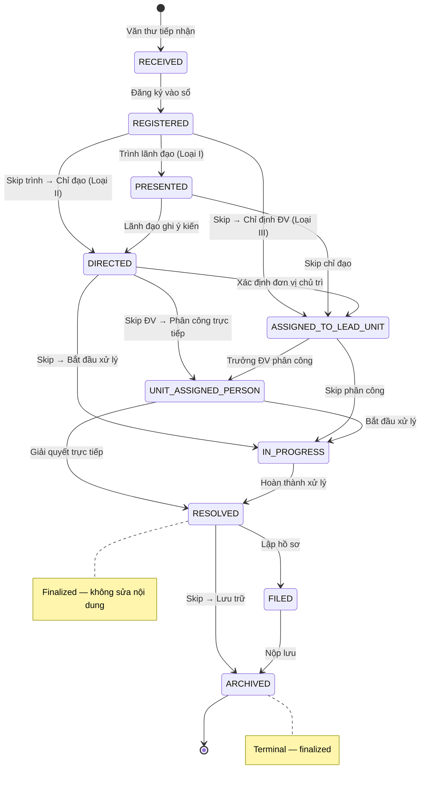

**Skip transitions**: VB Loại II/III có thể skip bước Trình lãnh đạo, đi thẳng đến phân công.

### 4.2 Document Outgoing FSM

**Source**: `src/lib/documents/state-machine.ts:112-143`

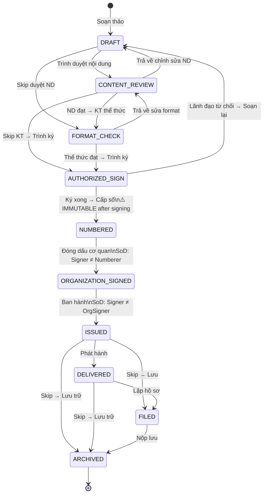

**SoD Assertions** (enforced by static assertions in code + service layer):

| Assertion | Function | Evidence | Layer |
|-----------|----------|----------|-------|
| Drafter ≠ Content Reviewer | `assertDrafterNotContentReviewer()` | `state-machine.ts:176` | FSM |
| Signer ≠ Numberer | `assertSignerNotNumberer()` | `state-machine.ts:190` | FSM |
| Signer ≠ Organization Signer | `assertSignerNotOrganizationSigner()` | `state-machine.ts:204` | FSM |
| Format Checker ≠ Signer | inline check | `outgoing-document-service.ts:648-652` | Service only ⚠️ |

**Immutability Point**: `isDocumentImmutable()` returns `true` when:
1. Status is `DA_HOAN_THANH` or `completed`
2. Has digital signatures
3. Outgoing: `authorizedSignedAt` exists OR status ≥ NUMBERED
4. Incoming: status ∈ {RESOLVED, FILED, ARCHIVED}


## §5 — Meeting & Dossier Lifecycles

### 5.1 Meeting FSM (No Formalized Code — Derived from Enum + API Routes)

**Source**: `prisma/schema.prisma` MeetingStatus enum + API routes

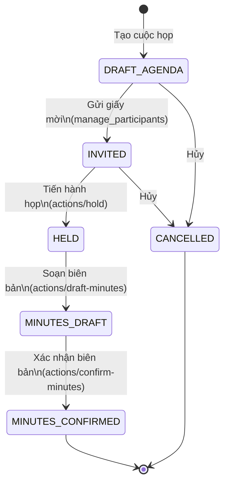

> **Gap A2**: Không có FSM code enforce transitions. API routes thực hiện status change trực tiếp. Cần formalize tại `src/domain/meetings/state-machine.ts`.

### 5.2 Dossier FSM (No Formalized Code — Derived from Enum + API Routes)

**Source**: `prisma/schema.prisma` DossierStatus enum + API routes

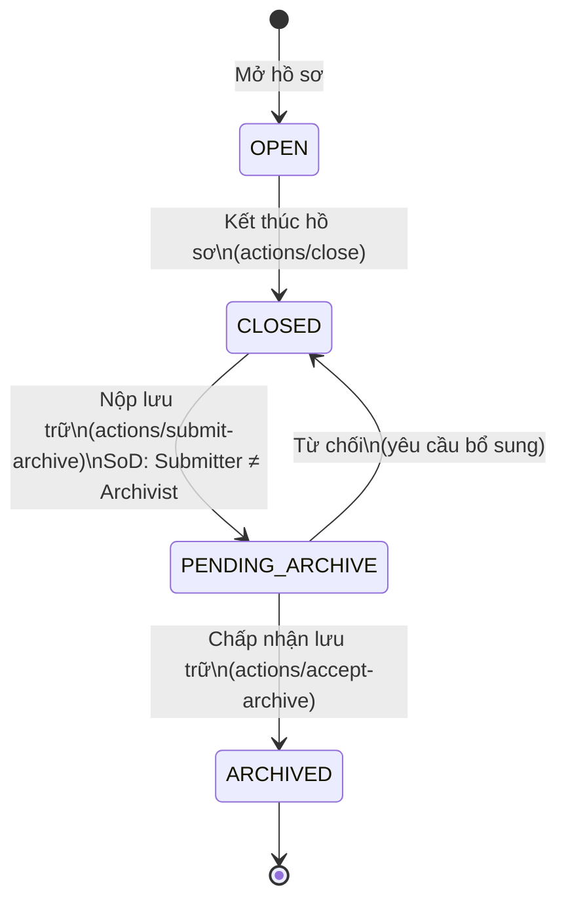

> **Gap A3**: Tương tự Meeting — không có FSM code. SoD (submitter ≠ archivist) được enforce bởi authorization engine Step 10.6, không phải domain FSM.


## §6 — Business Process / BPMN Flows

### 2.1 Task Lifecycle — Quy trình Giao việc & Thực hiện

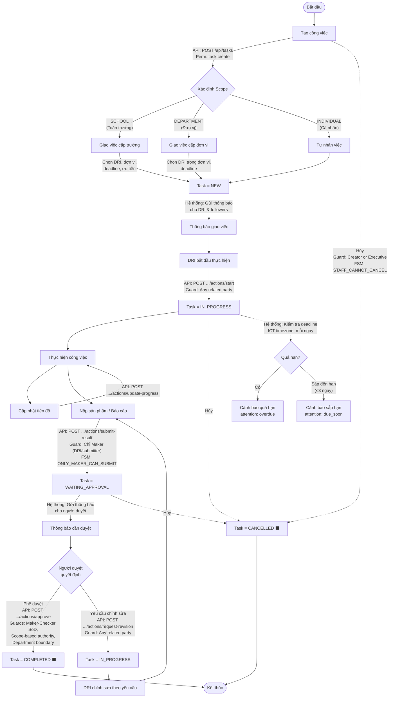

**Approval Guards** (FSM enforcement tại `state-machine.ts`):

| Guard | Code | Mô tả |
|-------|------|-------|
| Maker-Checker SoD | `MAKER_CANNOT_BE_CHECKER` | DRI / người nộp sản phẩm / uploader KHÔNG được tự duyệt |
| Scope Authority | `SCHOOL_SCOPE_REQUIRES_EXECUTIVE` | Task cấp trường → chỉ Executive (hoặc delegation) mới duyệt |
| Department Boundary | `DEPARTMENT_MISMATCH` | Task cấp đơn vị → Manager phải cùng đơn vị |
| Staff Restriction | `UNAUTHORIZED_APPROVER` | Staff không được duyệt (trừ delegation) |
| Terminal Protection | `TERMINAL_STATE` | COMPLETED / CANCELLED → không thể chuyển đổi |

### 2.2 Document Incoming — Quy trình Văn bản Đến (NĐ 30/2020 Điều 22-24)

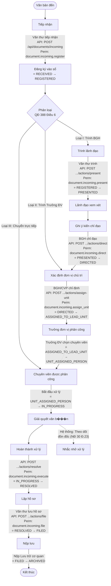

**Mapping NĐ 30/2020 Điều 22-24**:

| Bước NĐ 30/2020 | Trạng thái hệ thống | API Action | Vai trò thực hiện |
|------------------|---------------------|------------|-------------------|
| Tiếp nhận | RECEIVED | `POST /documents/incoming` | Văn thư |
| Đăng ký | REGISTERED | (automatic on create) | Văn thư |
| Trình người có thẩm quyền | PRESENTED | `actions/present` | Văn thư |
| Ghi ý kiến chỉ đạo | DIRECTED | `actions/direct` | BGH |
| Chuyển giao đơn vị | ASSIGNED_TO_LEAD_UNIT | `actions/assign-unit` | BGH/CVP |
| Phân công cá nhân | UNIT_ASSIGNED_PERSON | (unit-level) | Trưởng ĐV |
| Giải quyết | IN_PROGRESS → RESOLVED | `actions/resolve` | Chuyên viên |
| Theo dõi đôn đốc | (system monitoring) | — | Hệ thống |
| Lập hồ sơ | FILED | `actions/file` | Văn thư |
| Nộp lưu | ARCHIVED | — | Lưu trữ |

**Mô hình 2-tier Delegation** (từ `incoming-document-service.ts`):
- **Tier 1** (BGH/Hiệu trưởng): `directDocument()` → xác định đơn vị chủ trì, đơn vị phối hợp, ghi ý kiến chỉ đạo. Workflow chuyển sang `ASSIGNED_TO_LEAD_UNIT` hoặc `DIRECTED`, Document status → `DANG_XU_LY`.
- **Tier 2** (Trưởng đơn vị): `assignUnitWork()` → phân công DRI trong đơn vị, tạo `UnitWorkAssignment`. Nguyên tắc Single DRI: mỗi đơn vị chỉ có 1 người chịu trách nhiệm chính.
- **Clerk-only registration**: Chỉ Văn thư mới có quyền đăng ký VB đến.
- **Filing prerequisite**: Phải ở trạng thái RESOLVED trước khi lập hồ sơ (FILED).

### 2.3 Document Outgoing — Quy trình Văn bản Đi (NĐ 30/2020 Điều 10-15)

```mermaid
flowchart TB
    Start([Soạn VB đi]) --> Draft[Soạn thảo văn bản]
    Draft -->|"Chuyên viên soạn<br/>API: POST /api/documents<br/>Perm: document.outgoing.draft<br/>= DRAFT"| SubmitContent{Trình duyệt nội dung}

    SubmitContent -->|"API: POST .../actions/submit-content-review<br/>Perm: document.outgoing.submit_content_review<br/>= DRAFT → CONTENT_REVIEW"| ContentReview[Duyệt nội dung]

    ContentReview --> ContentDecision{Kết quả duyệt ND}
    ContentDecision -->|"Đạt<br/>API: POST .../actions/approve-content<br/>Perm: document.outgoing.approve_content"| FormatCheck[Kiểm tra thể thức<br/>= CONTENT_REVIEW → FORMAT_CHECK]
    ContentDecision -->|"Trả về chỉnh sửa<br/>= CONTENT_REVIEW → DRAFT"| Draft

    FormatCheck -->|"Văn thư kiểm tra<br/>API: POST .../actions/submit-format-check<br/>Perm: document.outgoing.check_format"| FormatDecision{Kết quả KT thể thức}

    FormatDecision -->|"Đạt<br/>API: POST .../actions/approve-format<br/>Perm: document.outgoing.approve_format"| SignQueue[Trình ký<br/>= FORMAT_CHECK → AUTHORIZED_SIGN]
    FormatDecision -->|"Cần sửa format<br/>= FORMAT_CHECK → CONTENT_REVIEW"| ContentReview

    SignQueue --> SignType{Hình thức ký<br/>NĐ 30/2020 Đ.13}
    SignType -->|"Ký trực tiếp<br/>Perm: document.outgoing.authorized_sign"| Signed
    SignType -->|"Ký KT. (ký thay)<br/>Perm: document.outgoing.sign_kt"| Signed
    SignType -->|"Ký TUQ. (thừa ủy quyền)<br/>Perm: document.outgoing.sign_tuq"| Signed

    Signed[Đã ký] -->|"API: POST .../actions/sign<br/>⚠️ Document immutable after this point"| Number[Cấp số<br/>= AUTHORIZED_SIGN → NUMBERED]

    Number -->|"Văn thư cấp số<br/>API: POST .../actions/assign-number<br/>Perm: document.outgoing.assign_number<br/>SoD: Signer ≠ Numberer"| OrgSign[Ký số cơ quan]

    OrgSign -->|"API: POST .../actions/organization-sign<br/>Perm: document.outgoing.organization_sign<br/>SoD: Signer ≠ OrgSigner<br/>= NUMBERED → ORGANIZATION_SIGNED"| Issue[Ban hành]

    Issue -->|"API: POST .../actions/issue<br/>Perm: document.outgoing.issue<br/>= ORGANIZATION_SIGNED → ISSUED"| Deliver[Phát hành]

    Deliver --> Filing[Lưu hồ sơ<br/>= DELIVERED → FILED]
    Filing --> Archive[Nộp lưu<br/>= FILED → ARCHIVED]
    Archive --> End([Kết thúc])
```

**SoD Rules cho Văn bản Đi** (từ `src/lib/documents/state-machine.ts`):

| Rule | Code | Mô tả | Cơ sở pháp lý |
|------|------|-------|----------------|
| Drafter ≠ Content Reviewer | `assertDrafterNotContentReviewer` | Người soạn không được tự duyệt nội dung | NĐ 30/2020 Đ.10 |
| Signer ≠ Numberer | `assertSignerNotNumberer` | Người ký không được tự cấp số | NĐ 30/2020 Đ.12 |
| Signer ≠ Org Signer | `assertSignerNotOrganizationSigner` | Người ký không được tự đóng dấu cơ quan | NĐ 30/2020 Đ.13 |

**Document Immutability**: Sau khi ký (`authorizedSignedAt` có giá trị HOẶC trạng thái ≥ NUMBERED), văn bản **không thể chỉnh sửa**. Được enforce bởi `isDocumentImmutable()` tại `src/lib/documents/state-machine.ts`.

### 2.4 Meeting — Quy trình Cuộc họp

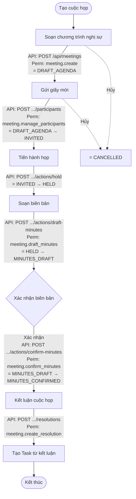

### 2.5 Dossier — Quy trình Hồ sơ Công việc (NĐ 30/2020 Chương IV Điều 25-29)

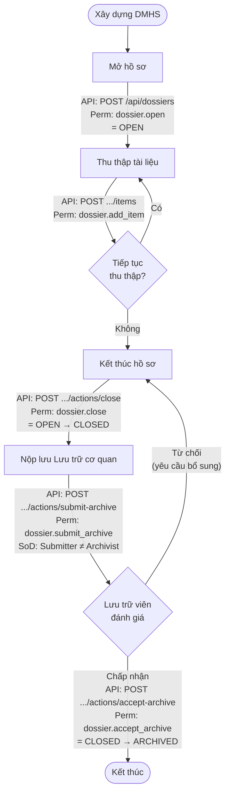

---


## §7 — Swimlane Responsibility Mapping

### 3.1 Task Lifecycle Swimlane

```mermaid
sequenceDiagram
    participant NG as Người giao<br/>(BGH/Trưởng ĐV)
    participant DRI as Người thực hiện<br/>(DRI)
    participant TDV as Trưởng đơn vị
    participant BGH as Ban Giám hiệu
    participant HT as Hệ thống

    NG->>HT: Tạo công việc<br/>(scope, DRI, deadline)
    HT->>DRI: 📩 Thông báo giao việc
    HT->>HT: Task = NEW

    DRI->>HT: Bắt đầu thực hiện
    HT->>HT: Task = IN_PROGRESS

    loop Cập nhật tiến độ
        DRI->>HT: Update progress %
    end

    DRI->>HT: Nộp sản phẩm<br/>(ONLY_MAKER_CAN_SUBMIT)
    HT->>HT: Task = WAITING_APPROVAL

    alt Scope = DEPARTMENT
        HT->>TDV: 📩 Thông báo cần duyệt
        TDV->>HT: Xem xét sản phẩm
        alt Phê duyệt
            TDV->>HT: Approve<br/>(SoD: maker ≠ checker)
            HT->>HT: Task = COMPLETED ⬛
        else Yêu cầu sửa
            TDV->>HT: Request revision
            HT->>HT: Task = IN_PROGRESS
            HT->>DRI: 📩 Cần chỉnh sửa
            DRI->>HT: Chỉnh sửa & nộp lại
        end
    else Scope = SCHOOL
        HT->>BGH: 📩 Thông báo cần BGH duyệt
        BGH->>HT: Xem xét sản phẩm
        alt Phê duyệt
            BGH->>HT: Approve<br/>(SCHOOL_SCOPE_REQUIRES_EXECUTIVE)
            HT->>HT: Task = COMPLETED ⬛
        else Yêu cầu sửa
            BGH->>HT: Request revision
            HT->>DRI: 📩 Cần chỉnh sửa
        end
    end

    HT-->>NG: 📩 Thông báo hoàn thành

    Note over HT: Giám sát deadline (ICT timezone)<br/>overdue / due_soon alerts
```

### 3.2 Document Incoming Swimlane (NĐ 30/2020 Đ.22-24)

```mermaid
sequenceDiagram
    participant VT as Văn thư
    participant LD as Lãnh đạo<br/>(BGH/CVP)
    participant TDV as Trưởng đơn vị
    participant CV as Chuyên viên<br/>xử lý
    participant HT as Hệ thống

    VT->>HT: Tiếp nhận VB đến<br/>(RECEIVED)
    VT->>HT: Đăng ký vào sổ<br/>(→ REGISTERED)

    alt Loại I: Trình BGH
        VT->>HT: Trình lãnh đạo<br/>(→ PRESENTED)
        HT->>LD: 📩 VB cần xử lý
        LD->>HT: Ghi ý kiến chỉ đạo<br/>(→ DIRECTED)
        LD->>HT: Xác định ĐV chủ trì<br/>(→ ASSIGNED_TO_LEAD_UNIT)
    else Loại II: Trình Trưởng ĐV
        VT->>HT: Chuyển ĐV chủ trì<br/>(→ ASSIGNED_TO_LEAD_UNIT)
    else Loại III: Chuyển trực tiếp
        VT->>HT: Chuyển chuyên viên<br/>(→ UNIT_ASSIGNED_PERSON)
    end

    TDV->>HT: Phân công chuyên viên<br/>(→ UNIT_ASSIGNED_PERSON)
    HT->>CV: 📩 VB được phân công

    CV->>HT: Bắt đầu xử lý<br/>(→ IN_PROGRESS)
    CV->>HT: Giải quyết<br/>(→ RESOLVED)

    Note over HT: Theo dõi đôn đốc<br/>(NĐ 30/2020 Đ.23)

    VT->>HT: Lập hồ sơ<br/>(→ FILED)
    VT->>HT: Nộp lưu<br/>(→ ARCHIVED)
```

### 3.3 Document Outgoing Swimlane (NĐ 30/2020 Đ.10-15)

```mermaid
sequenceDiagram
    participant NS as Người soạn<br/>(Chuyên viên)
    participant TDV as Trưởng đơn vị<br/>(Duyệt ND)
    participant VT as Văn thư<br/>(KT thể thức)
    participant LDK as Lãnh đạo ký
    participant VT2 as Văn thư<br/>(Cấp số/BH)
    participant HT as Hệ thống

    NS->>HT: Soạn thảo VB<br/>(DRAFT)
    NS->>HT: Trình duyệt ND<br/>(→ CONTENT_REVIEW)

    TDV->>HT: Xem xét nội dung

    alt Nội dung đạt
        TDV->>HT: Duyệt ND<br/>(→ FORMAT_CHECK)
    else Cần sửa
        TDV->>HT: Trả về<br/>(→ DRAFT)
        NS->>HT: Chỉnh sửa & trình lại
    end

    Note over HT: SoD: Drafter ≠ ContentReviewer

    VT->>HT: Kiểm tra thể thức
    alt Thể thức đạt
        VT->>HT: Trình ký<br/>(→ AUTHORIZED_SIGN)
    else Cần sửa format
        VT->>HT: Trả về sửa<br/>(→ CONTENT_REVIEW)
    end

    LDK->>HT: Ký văn bản<br/>(authorized_sign / KT / TUQ)
    HT->>HT: ⚠️ Document IMMUTABLE

    Note over HT: SoD: Signer ≠ Numberer

    VT2->>HT: Cấp số<br/>(→ NUMBERED)

    Note over HT: SoD: Signer ≠ OrgSigner

    VT2->>HT: Ký số cơ quan<br/>(→ ORGANIZATION_SIGNED)
    VT2->>HT: Ban hành<br/>(→ ISSUED)
    HT->>HT: Phát hành → Lưu hồ sơ → Lưu trữ
```


## §8 — Permission & Capability Matrix

### 8.1 Authorization Pipeline (10 Steps)

**Source**: `src/server/authorization/authorization-engine.ts` — `authorize()`

```mermaid
flowchart TB
    Start([Request]) --> S1

    S1["Step 1: Account Validation<br/>userId exists? isActive?"]
    S1 -->|"DENY: UNAUTHENTICATED<br/>or DEACTIVATED_ACCOUNT"| Deny
    S1 -->|PASS| S2

    S2["Step 2: Data Classification<br/>State Secret? Personal Data?"]
    S2 -->|"DENY: STATE_SECRET_STRICT_PROHIBITION<br/>or PERSONAL_DATA_PRIVACY_BREACH"| Deny
    S2 -->|PASS| S3

    S3["Step 3: Separation of Powers<br/>SYSTEM_ADMIN vs Business Actions"]
    S3 -->|"DENY: SEPARATION_OF_POWERS_VIOLATION<br/>(Admin doing business action<br/>OR non-admin doing system action)"| Deny
    S3 -->|PASS| S4

    S4["Step 4: Direct Relationship<br/>DRI? Assigner? Drafter? Chair?"]
    S4 -->|"ALLOW (if relationship<br/>grants the action)"| Allow
    S4 -->|"No match → continue"| S5

    S5["Step 5: Position Capability<br/>positionCode → allowed actions"]
    S5 -->|"ALLOW (if position<br/>has capability)"| S6Check
    S5 -->|"No capability"| S8

    S6Check{Step 6: Portfolio Boundary?}
    S6Check -->|"Portfolio-bound action<br/>AND portfolio mismatch"| S8
    S6Check -->|"Not portfolio-bound<br/>OR portfolio matches"| S7Check

    S7Check{Step 7: Organizational Scope?}
    S7Check -->|"Unit leader outside<br/>own unit scope"| S8
    S7Check -->|"Within scope"| Allow

    S8["Step 8: Delegation Fallback<br/>Valid DelegationGrant?"]
    S8 -->|"Non-delegable: DENY"| Deny
    S8 -->|"Revoked/Expired: DENY"| Deny
    S8 -->|"Valid delegation"| S9

    S9["Step 9: Workflow State<br/>Document not DRAFT for signing?<br/>Meeting not HELD for minutes?"]
    S9 -->|"DENY: INVALID_WORKFLOW_STATE"| Deny
    S9 -->|PASS| S10

    S10["Step 10: Separation of Duties<br/>6 SoD rules"]
    S10 -->|"DENY: SOD_VIOLATION"| Deny
    S10 -->|PASS| Allow

    Allow([✅ GRANTED<br/>+ delegationUsed, actingPositionId])
    Deny([❌ DENIED<br/>+ rejection code, step number])
```

### 8.2 Full Capability Matrix

#### Task Capabilities (15)

| Capability | Executive | Unit Leader | Deputy | Staff | Clerk | Archivist | SYSTEM_ADMIN | Portfolio-Bound | Delegable | SoD |
|-----------|-----------|-------------|--------|-------|-------|-----------|-------------|----------------|-----------|-----|
| `task.read` | ✅ school | ✅ own unit | ✅ own unit | ✅ own tasks | ❌ | ❌ | ❌ | ❌ | ✅ | — |
| `task.view` | ✅ | ✅ | ✅ | ✅ | ❌ | ❌ | ❌ | ❌ | ✅ | — |
| `task.create` | ✅ | ✅ | ✅ | ✅ | ❌ | ❌ | ❌ | ❌ | ✅ | — |
| `task.assign` | ✅ any | ✅ own unit | ❌ | ❌ | ❌ | ❌ | ❌ | ❌ | ✅ | — |
| `task.reassign` | ✅ | ✅ own unit | ❌ | ❌ | ❌ | ❌ | ❌ | ❌ | ✅ | Collaborator cannot reassign DRI |
| `task.update_metadata` | ✅ | ✅ | ❌ | DRI only | ❌ | ❌ | ❌ | ❌ | ✅ | — |
| `task.update_execution` | ❌ | ❌ | ✅ DRI | ✅ DRI | ❌ | ❌ | ❌ | ❌ | ✅ | — |
| `task.submit_result` | ❌ | ❌ | ✅ DRI | ✅ DRI | ❌ | ❌ | ❌ | ❌ | ✅ | Maker only |
| `task.review` | ✅ | ✅ own unit | ❌ | ❌ | ❌ | ❌ | ❌ | ✅ | ✅ | Maker ≠ Reviewer |
| `task.approve` | ✅ (school scope) | ✅ (dept scope) | ❌ | ❌ | ❌ | ❌ | ❌ | ✅ | ✅ | Maker ≠ Approver |
| `task.monitor` | ✅ | ✅ | ✅ | ✅ | ❌ | ❌ | ✅ | ❌ | ✅ | — |
| `task.remind` | ✅ | ✅ | ❌ | ❌ | ❌ | ❌ | ❌ | ❌ | ✅ | — |
| `task.close` | ✅ | ✅ own unit | ❌ | ❌ | ❌ | ❌ | ❌ | ✅ | ✅ | — |
| `task.cancel` | ✅ | ✅ own unit | ❌ | ❌ | ❌ | ❌ | ❌ | ✅ | ✅ | — |
| `task.archive` | ✅ | ✅ own unit | ❌ | ❌ | ❌ | ❌ | ❌ | ❌ | ✅ | — |

#### Document Capabilities (37 total)

**Canonical (12)**:

| Capability | Executive | Unit Leader | Deputy | Staff | Clerk (VAN_THU) | Archivist (LUU_TRU) | SoD |
|-----------|-----------|-------------|--------|-------|-----------------|---------------------|-----|
| `document.read` | ✅ | ✅ own unit | ✅ | ✅ assigned | ✅ | ✅ | — |
| `document.read_restricted` | ✅ | ❌ | ❌ | ❌ | ❌ | ❌ | — |
| `document.register` | ❌ | ❌ | ❌ | ❌ | ✅ | ❌ | — |
| `document.direct` | ✅ | ❌ | ❌ | ❌ | ❌ | ❌ | Portfolio-bound |
| `document.assign_unit` | ✅ | ❌ | ❌ | ❌ | ❌ | ❌ | Portfolio-bound |
| `document.review_content` | ✅ | ✅ | ❌ | ❌ | ❌ | ❌ | Drafter ≠ Reviewer |
| `document.review_format` | ❌ | ❌ | ❌ | ❌ | ✅ | ❌ | — |
| `document.sign` | ✅ | ❌ | ❌ | ❌ | ❌ | ❌ | Signer ≠ Numberer, Signer ≠ OrgSigner |
| `document.assign_number` | ❌ | ❌ | ❌ | ❌ | ✅ | ❌ | Signer ≠ Numberer |
| `document.organization_sign` | ❌ | ❌ | ❌ | ❌ | ✅ | ❌ | Signer ≠ OrgSigner |
| `document.issue` | ❌ | ❌ | ❌ | ❌ | ✅ | ❌ | — |
| `document.archive` | ❌ | ❌ | ❌ | ❌ | ✅ | ✅ | Submitter ≠ Archivist |

**Signing Authority Types** (NĐ 30/2020 Điều 13):

| Type | Capability | Required Position | Mô tả |
|------|-----------|-------------------|-------|
| Ký trực tiếp | `document.outgoing.authorized_sign` | HIEU_TRUONG | Người có thẩm quyền ký trực tiếp |
| Ký KT. (ký thay) | `document.outgoing.sign_kt` | PHO_HIEU_TRUONG (khi HT vắng) | Ký thay người đứng đầu |
| Ký TUQ. (thừa ủy quyền) | `document.outgoing.sign_tuq` | Người được ủy quyền (DelegationGrant) | Thừa ủy quyền bằng văn bản |
| Ký số cơ quan | `document.outgoing.organization_sign` | VAN_THU | Đóng dấu/ký số cơ quan |

#### System Capabilities (10)

| Capability | SYSTEM_ADMIN | Others |
|-----------|-------------|--------|
| `account.manage` | ✅ | ❌ |
| `org.manage` | ✅ | ❌ |
| `position.manage` | ✅ | ❌ |
| `system.configure` | ✅ | ❌ |
| `audit.view` | ✅ | ❌ |

> Lưu ý: `system.*` namespaced capabilities (`system.account.manage`, etc.) là aliases, resolve về canonical form.

#### Meeting Capabilities (8)

| Capability | Executive | Unit Leader | Chair | Secretary | Organizer |
|-----------|-----------|-------------|-------|-----------|-----------|
| `meeting.read` | ✅ | ✅ | ✅ | ✅ | ✅ |
| `meeting.create` | ✅ | ✅ | — | — | — |
| `meeting.update` | ✅ | ✅ | ✅ | ✅ | ✅ |
| `meeting.manage_participants` | ✅ | ✅ | ✅ | ✅ | ✅ |
| `meeting.draft_minutes` | ❌ | ❌ | ❌ | ✅ | ❌ |
| `meeting.confirm_minutes` | ✅ | ❌ | ✅ | ❌ | ❌ |
| `meeting.create_resolution` | ✅ | ❌ | ✅ | ❌ | ❌ |
| `meeting.publish_resolution` | ✅ | ❌ | ❌ | ❌ | ❌ |

#### Dossier Capabilities (8)

| Capability | Executive | Clerk | Archivist | Owner | Contributor | SoD |
|-----------|-----------|-------|-----------|-------|-------------|-----|
| `dossier.open` | ✅ | ✅ | ✅ | — | — | — |
| `dossier.add_item` | ✅ | ✅ | ✅ | ✅ | ✅ | — |
| `dossier.remove_item` | ✅ | ✅ | ✅ | ✅ | ❌ | — |
| `dossier.close` | ✅ | ✅ | ❌ | ✅ | ❌ | — |
| `dossier.submit_archive` | ❌ | ❌ | ❌ | ✅ | ❌ | Submitter ≠ Archivist |
| `dossier.accept_archive` | ❌ | ❌ | ✅ | ❌ | ❌ | Submitter ≠ Archivist |

### 8.3 Separation of Duties (SoD) Rules

**Source**: `authorization-engine.ts` Step 10 — 6 rules

| # | Rule | Rejection Code | Domain | Evidence |
|---|------|---------------|--------|----------|
| 10.1 | Drafter ≠ Signer; Numberer ≠ Signer; Format Reviewer ≠ Signer | `SOD_VIOLATION` | Document | NĐ 30/2020 Đ.10-13 |
| 10.2 | Drafter ≠ Content Reviewer/Approver | `SOD_VIOLATION` | Document | NĐ 30/2020 Đ.10 |
| 10.3 | Creator/Primary Owner ≠ Task Approver | `SOD_VIOLATION` | Task | Maker-Checker principle |
| 10.4 | Executor (DRI/submitter/uploader) ≠ Task Reviewer | `SOD_VIOLATION` | Task | Maker-Checker principle |
| 10.5 | Signer ≠ Numberer AND Signer ≠ Organization Signer | `SOD_VIOLATION` | Document | NĐ 30/2020 Đ.12-13 |
| 10.6 | Submitter ≠ Archivist (dossier/document archive) | `SOD_VIOLATION` | Dossier | NĐ 30/2020 Chương IV |

> **Cross-ref**: [§3.1](#31-task-lifecycle-fsm) — FSM guards cho Task SoD; [§4.2](#42-document-outgoing-fsm) — SoD assertions cho Document.


## §9 — Information Architecture & Navigation

### 9.1 Site Map

```mermaid
graph TB
    subgraph "Section: Work (Công việc)"
        Tasks["/tasks<br/>Công việc<br/>Primary workspace"]
        TaskDetail["/tasks/[id]<br/>Chi tiết công việc"]
        Calendar["/calendar<br/>Lịch công tác"]
        Inbox["/inbox<br/>Hộp thư đến"]
        Documents["/documents<br/>Văn bản & Hồ sơ<br/>⚠️ Under development"]
    end

    subgraph "Section: Organization (Tổ chức)"
        Org["/org<br/>Sơ đồ tổ chức"]
        Settings["/settings<br/>Cài đặt"]
    end

    subgraph "Public"
        Portal["/portal<br/>Cổng thông tin"]
        Login["/login<br/>Đăng nhập"]
    end

    subgraph "System"
        Maintenance["/maintenance<br/>Bảo trì"]
    end

    Tasks --> TaskDetail

    subgraph "Redirects"
        Root["/ → /tasks"]
        Dashboard["/dashboard → /tasks"]
        UnitTasks["/unit-tasks → /tasks?scope=unit"]
    end
```

**Source**: `src/lib/navigation/canonical-navigation-registry.ts` — 7 canonical routes

### 9.2 Navigation Registry

| Route | Section | Label | Icon | Mobile Placement | Scope Tabs |
|-------|---------|-------|------|-----------------|------------|
| `/tasks` | work | Công việc | CheckSquare | Bottom bar | school · unit · my |
| `/calendar` | work | Lịch công tác | Calendar | Bottom bar | school · unit · my |
| `/inbox` | work | Hộp thư đến | Inbox | Bottom bar | — |
| `/documents` | work | Văn bản | FileText | Bottom bar | — |
| `/org` | org | Tổ chức | Building2 | Drawer | — |
| `/settings` | org | Cài đặt | Settings | Drawer | — |

### 9.3 Role-Based View Differences

| Aspect | BGH (Executive) | Trưởng ĐV (Unit Leader) | Chuyên viên (Staff) | Văn thư (Clerk) |
|--------|-----------------|------------------------|--------------------|-----------------| 
| Default scope | `school` | `unit` | `my` | — |
| Available scopes | school, unit, my | unit, my | my | — |
| Dashboard type | Executive cockpit | Unit overview | Staff focus view | — |
| Task creation | ✅ (school/dept) | ✅ (dept only) | ✅ (individual) | ❌ |
| Approval queue visible | ✅ | ✅ (own unit) | ❌ | ❌ |
| Document access | Full | Own unit | Assigned only | Full (clerical) |

### 9.4 Layout

| Platform | Component | Specification |
|----------|-----------|---------------|
| Desktop | Sidebar | 228px fixed width, contains all navigation |
| Desktop | Topbar | Breadcrumb, search, user menu |
| Mobile | Bottom bar | 4 items: Tasks, Calendar, Inbox, Documents |
| Mobile | Drawer | Org, Settings (slide from left) |


## §10 — End-to-End User Flows

### 10.1 Ban Giám hiệu (Executive)

#### Flow A: Tạo công việc cấp trường & theo dõi

1. BGH đăng nhập → Dashboard Executive cockpit (scope: `school`)
2. Click "Giao việc mới" → `CreateTaskModal` mở
3. Chọn scope = SCHOOL, chọn đơn vị chủ trì, chọn DRI, set deadline, priority
4. Submit → `POST /api/tasks` (perm: `task.create`)
5. Hệ thống: Task = NEW, gửi notification cho DRI
6. BGH theo dõi qua workspace table/kanban → `GET /api/tasks?scope=school`
7. Khi DRI nộp sản phẩm → Task = WAITING_APPROVAL
8. BGH thấy badge `requires_my_approval` (attention resolver)
9. BGH click Duyệt → `POST /api/tasks/[id]/actions/approve`
10. Authorization engine: Step 3 (not admin) → Step 4 (assigner relationship) → Step 5 (executive position) → Step 9 (workflow state) → Step 10 (SoD: BGH ≠ maker) → GRANTED
11. Task = COMPLETED

#### Flow B: Duyệt công việc chờ BGH

1. BGH thấy attention badge "Chờ tôi duyệt" trên task card
2. Click mở task detail → `GET /api/tasks/[id]`
3. Xem deliverables → đánh giá sản phẩm
4. **Accept**: `POST .../actions/approve` → Task = COMPLETED
5. **Reject**: `POST .../actions/request-revision` → Task = IN_PROGRESS, DRI nhận notification

#### Flow C: Chỉ đạo văn bản đến & ký văn bản đi

1. Văn thư trình VB đến → `POST .../actions/present` → VB = PRESENTED
2. BGH xem VB → ghi ý kiến chỉ đạo → `POST .../actions/direct` → VB = DIRECTED
3. BGH chỉ định đơn vị chủ trì → `POST .../actions/assign-unit`
4. (Sau khi chuyên viên soạn VB đi + trình ký)
5. BGH ký VB đi → `POST .../actions/sign` (perm: `document.outgoing.authorized_sign`)
6. Document IMMUTABLE sau khi ký

#### Flow D: Chủ trì cuộc họp → Tạo task từ kết luận

1. BGH tạo cuộc họp → `POST /api/meetings` → Meeting = DRAFT_AGENDA
2. Thêm participants → `POST .../participants`
3. Gửi mời → Meeting = INVITED
4. Họp → `POST .../actions/hold` → Meeting = HELD
5. Thư ký soạn biên bản → `POST .../actions/draft-minutes` → MINUTES_DRAFT
6. BGH xác nhận → `POST .../actions/confirm-minutes` → MINUTES_CONFIRMED
7. Tạo kết luận → `POST .../resolutions` → Auto-generate Tasks từ resolutions

### 10.2 Trưởng đơn vị (Unit Leader)

#### Flow A: Tạo & giao công việc đơn vị

1. Trưởng ĐV đăng nhập → scope `unit`
2. Tạo task scope=DEPARTMENT → chọn DRI trong đơn vị → set deadline
3. `POST /api/tasks` → Task = NEW
4. DRI nhận notification, thực hiện, nộp sản phẩm
5. Trưởng ĐV duyệt (department scope) → `POST .../actions/approve`
6. Authorization: Step 5 (unit leader position) → Step 7 (same unit scope) → Step 10 (SoD check)

#### Flow B: Phân công xử lý văn bản đến

1. BGH chỉ đạo VB đến về đơn vị → VB = ASSIGNED_TO_LEAD_UNIT
2. Trưởng ĐV nhận notification
3. Phân công chuyên viên → VB = UNIT_ASSIGNED_PERSON
4. Theo dõi chuyên viên xử lý

#### Flow C: Duyệt nội dung văn bản đi

1. Chuyên viên soạn VB đi → trình duyệt ND → VB = CONTENT_REVIEW
2. Trưởng ĐV xem xét nội dung
3. **Đạt**: `POST .../actions/approve-content` → VB = FORMAT_CHECK
4. **Cần sửa**: Trả về → VB = DRAFT

### 10.3 Chuyên viên / Giảng viên (Staff)

#### Flow A: Nhận task → Thực hiện → Nộp → Hoàn thành

1. Chuyên viên đăng nhập → scope `my`, thấy attention badge `requires_my_action`
2. Click task → xem chi tiết, assignment, deadline
3. "Bắt đầu" → `POST .../actions/start` → Task = IN_PROGRESS
4. Thực hiện công việc, cập nhật progress → `POST .../actions/update-progress`
5. Upload deliverables → `POST /api/tasks/[id]/deliverables`
6. "Nộp sản phẩm" → `POST .../actions/submit-result` → Task = WAITING_APPROVAL
7. Chờ reviewer/approver duyệt
8. Nếu yêu cầu chỉnh sửa → Task = IN_PROGRESS, quay lại bước 4
9. Nếu phê duyệt → Task = COMPLETED

#### Flow B: Soạn văn bản đi

1. Chuyên viên tạo VB đi → `POST /api/documents` → VB = DRAFT
2. Soạn thảo nội dung, đính kèm file
3. "Trình duyệt ND" → `POST .../actions/submit-content-review` → VB = CONTENT_REVIEW
4. Nếu Trưởng ĐV trả về → VB = DRAFT, chỉnh sửa lại
5. Nếu duyệt → VB = FORMAT_CHECK → Văn thư kiểm tra thể thức
6. Nếu cần sửa format → chỉnh sửa
7. VB đạt → trình ký → lãnh đạo ký → ban hành

#### Flow C: Xử lý văn bản đến được phân công

1. Nhận notification VB được phân công
2. Xem ý kiến chỉ đạo của lãnh đạo
3. Thực hiện xử lý → VB = IN_PROGRESS
4. Hoàn thành → `POST .../actions/resolve` → VB = RESOLVED

### 10.4 Văn thư (Clerk)

#### Flow A: Tiếp nhận VB đến → Trình BGH

1. VB đến → Văn thư tiếp nhận → `POST /api/documents/incoming` → VB = RECEIVED → REGISTERED
2. Phân loại VB (Loại I/II/III theo QĐ 388)
3. Trình lãnh đạo → `POST .../actions/present` → VB = PRESENTED
4. Lãnh đạo chỉ đạo → chuyển giao đơn vị

#### Flow B: Cấp số VB đi → Ban hành

1. Lãnh đạo ký xong → VB chờ cấp số
2. Văn thư cấp số → `POST .../actions/assign-number` → VB = NUMBERED (SoD: Signer ≠ Numberer)
3. Đóng dấu cơ quan → `POST .../actions/organization-sign` → VB = ORGANIZATION_SIGNED (SoD: Signer ≠ OrgSigner)
4. Ban hành → `POST .../actions/issue` → VB = ISSUED
5. Lưu hồ sơ → VB = FILED → ARCHIVED


## §11 — Service Blueprint

### 11.1 Task Approval — 8-Layer Sequence

```mermaid
sequenceDiagram
    participant User as 👤 User
    participant UI as UI Component<br/>(TaskDetailView)
    participant API as API Route<br/>(/api/tasks/[id]/actions/approve)
    participant RC as Request Context<br/>(resolveActionContext)
    participant AE as Authorization Engine<br/>(10-step pipeline)
    participant DS as Domain Service<br/>(TaskStateMachine)
    participant DB as Database<br/>(Prisma)
    participant SE as Side Effects<br/>(Notification, Audit)

    User->>UI: Click "Phê duyệt"
    UI->>API: POST /api/tasks/{id}/actions/approve<br/>{comment, deliverableIds}

    Note over RC: Layer 4: Request Context
    API->>RC: resolveActionContext(request)
    RC->>RC: getApiContext(request)
    RC->>RC: requireAuthenticated(context)
    RC->>RC: assertCsrf(request)
    RC->>RC: assertRateLimit(userId)
    RC->>RC: parseBody(schema)

    Note over AE: Layer 5: Authorization (10 steps)
    RC->>AE: authorize(context, 'task.approve', resource)
    AE->>AE: S1: Account validation
    AE->>AE: S2: Data classification
    AE->>AE: S3: Separation of Powers
    AE->>AE: S4: Direct relationship check
    AE->>AE: S5: Position capability
    AE->>AE: S6: Portfolio boundary
    AE->>AE: S7: Organizational scope
    AE->>AE: S8: Delegation fallback
    AE->>AE: S9: Workflow state prerequisite
    AE->>AE: S10: SoD (maker ≠ approver)
    AE-->>RC: ✅ GRANTED

    Note over DS: Layer 6: Domain Validation
    RC->>DS: canTransition(actorCtx, taskCtx, COMPLETED)
    DS->>DS: Terminal state check
    DS->>DS: isMaker() — SoD check
    DS->>DS: Scope-based authority
    DS->>DS: Department boundary
    DS-->>RC: ✅ Allowed

    Note over DB: Layer 7: Persistence
    RC->>DB: prisma.$transaction()
    DB->>DB: task.update({status: COMPLETED, completedAt})
    DB->>DB: deliverable.update({reviewStatus: APPROVED})
    DB-->>RC: ✅ Committed

    Note over SE: Layer 8: Side Effects
    RC->>SE: notificationService.dispatch()
    SE->>SE: Create Notification for DRI
    SE->>SE: Send Push (WebPush)
    SE->>SE: Emit AuditEvent

    RC-->>API: 200 OK
    API-->>UI: {task, message}
    UI-->>User: ✅ Badge update, toast
```

### 11.2 Layer Coverage — Current Inconsistencies

| Route Category | L4: CSRF | L4: Rate Limit | L5: ABAC Engine | L6: Domain Service | L6: FSM Validation |
|----------------|---------|---------------|----------------|-------------------|-------------------|
| `tasks/[id]/actions/*` (12 routes) | ✅ via `resolveActionContext` | ✅ | ✅ `authorize()` | ✅ `taskDomainActionService` | ✅ `TaskStateMachine` |
| `documents/[id]/actions/*` (15 routes) | ❌ **MISSING** | ❌ **MISSING** | ⚠️ Hybrid (`authorize()` + legacy policies) | ⚠️ Partial (some direct Prisma) | ⚠️ Partial (document FSM exists but not universally enforced) |
| `meetings/[id]/actions/*` (3 routes) | ❌ **MISSING** | ❌ **MISSING** | ❌ Procedural role checks | ❌ Direct Prisma | ❌ No FSM |
| `dossiers/[id]/actions/*` (3 routes) | ❌ **MISSING** | ❌ **MISSING** | ❌ Procedural role checks | ❌ Direct Prisma | ❌ No FSM |

### 11.3 Domain Bypass Routes

| Route | What It Bypasses | Impact |
|-------|-----------------|--------|
| `tasks/[id]/actions/archive` | Domain action service → direct command service | Skips standardized actor tracking |
| `documents/outgoing` (GET) | Document visibility service → direct Prisma query | No unit-based boundary filtering |
| `documents/[id]/directives` (POST) | Incoming document service → direct Prisma create | No workflow validation |
| `delegations/[id]/revoke` (POST) | DelegationService → direct Prisma update | No invariant enforcement |

### 11.4 Import Path Divergence

5 document routes import `getApiContext`/`requireAuthenticated` from legacy re-export stubs (`@/server/api/context`, `@/server/api/auth`) instead of canonical `@/server/api/request-context`:
- `documents/route.ts`
- `documents/export-excel/route.ts`
- `documents/[id]/route.ts`
- `documents/stats/route.ts`
- `documents/[id]/directives/route.ts`

> **Cross-ref**: [§8](#81-authorization-pipeline-10-steps) — Full authorization pipeline detail; [§10 A8](#a8--3-authorization-patterns-coexist) — Architecture gap.


## §12 — Security Architecture & Threat Model

### 12.1 Mô hình Đe dọa Toàn diện (Threat Modeling)

Hệ thống E-Office xử lý các quy trình hành chính, phân công nhiệm vụ và văn bản pháp lý của trường học, do đó kiến trúc bảo mật phải đối phó với 6 vector đe dọa trọng yếu:

#### 1. Đe dọa Vượt rào Phân lập Nghĩa vụ (SoD Bypass Threat)
- **Kịch bản tấn công**: Cán bộ tạo việc hoặc cán bộ nộp báo cáo kết quả tự phê duyệt nghiệm thu nhiệm vụ của chính mình, hoặc người soạn thảo tự ký duyệt văn bản đi.
- **Rủi ro hiện hữu (Finding F01 / Gap G3)**: Sự phân kỳ giữa 3 hàm kiểm tra Maker độc lập khiến `TaskStateMachine.isMaker` bỏ sót kiểm tra `createdById` và `submittedByUserId`.
- **Biện pháp kiểm soát**: Hợp nhất vào một SoD guard chuẩn tắc duy nhất (`ADR-001`) bắt buộc Creator ∪ DRI ∪ Assignee ∪ Submitter ∪ Uploader không được phê duyệt.

#### 2. Đe dọa Truy cập Tệp tin Bất hợp pháp (Insecure Direct Object Reference - IDOR)
- **Kịch bản tấn công**: Kẻ tấn công thay đổi đường dẫn hoặc tham số ID trên URL để tải tệp đính kèm văn bản mật, hồ sơ công việc mật hoặc minh chứng nhiệm vụ của đơn vị khác.
- **Biện pháp kiểm soát**: Loại bỏ việc truy cập trực tiếp đường dẫn file tĩnh; bắt buộc mọi yêu cầu tải file phải qua endpoint có kiểm toán thẩm quyền (`WI-1.3`) và hướng tới mô hình `FileObject` tập trung (`WI-7.5`).

#### 3. Đe dọa Rò rỉ Dữ liệu Chéo Đơn vị (Cross-Unit Data Leakage)
- **Kịch bản tấn công**: Cán bộ thuộc Khoa A xem được các nhiệm vụ hoặc văn bản nội bộ hạn chế của Phòng B do lỗi lọc dữ liệu lỏng lẻo.
- **Bi��n pháp kiểm soát**: Áp dụng Step 7 (Organizational Boundary Enforcement) trong pipeline 10 bước của Authorization Engine, kết hợp cấu trúc cây đóng `UnitClosurePath` để kiểm tra phân cấp quản lý O(1).

#### 4. Đe dọa Gian lận & Lạm quyền Ủy quyền (Delegation Abuse)
- **Kịch bản tấn công**: Sử dụng giấy ủy quyền giả mạo hoặc ủy quyền vượt quá thẩm quyền luật định (ví dụ: ủy quyền ký ban hành quy chế hoặc kỷ luật viên chức).
- **Biện pháp kiểm soát**: Khóa chặt danh mục quyền không được ủy quyền (`NON_DELEGABLE_CAPABILITIES` per Invariant 2) tại Step 8 của Authorization Engine; kiểm tra ràng buộc mảng công tác (`PORTFOLIO_BOUND_ACTIONS` per QĐ 420).

#### 5. Lỗ hổng Thiếu Kiểm soát CSRF & Rate Limit trên Mutation Routes
- **Rủi ro hiện hữu**: 21 mutation route handlers thuộc phân hệ Document, Meeting, Dossier hiện chưa có `assertCsrf(req)` và `assertRateLimit()`.
- **Biện pháp kiểm soát**: Đồng bộ middleware bảo vệ CSRF và Rate Limit cho 100% các mutation endpoints kế thừa chuẩn từ Task API.

#### 6. Bảo vệ Dữ liệu Cá nhân & Bí mật Nhà nước
- **Tuân thủ pháp lý**: Thực thi nghiêm ngặt Nghị định 13/2023/NĐ-CP và Luật 117/2025/QH15 thông qua Step 2 (Classification Boundary Enforcement) của Authorization Engine. Dữ liệu TUYET_MAT và TOI_MAT bị cấm lưu trữ trên hệ thống web thông thường.

### 12.2 Phân tích Chi tiết Lỗ hổng & Xung đột Ngữ nghĩa (G1–G10 & A1–A10)

### Phương pháp

Mỗi gap/conflict được xác minh bằng:
1. **File path + line range** trong source code
2. **Hành vi quan sát được** — mô tả chính xác vấn đề
3. **Severity**: 🔴 HIGH (SoD bypass risk / data integrity), 🟡 MEDIUM (semantic confusion / tech debt), 🟢 LOW (cosmetic / code quality)

### Semantic Conflicts trong CURRENT HEAD

#### G1 — Status Type Hierarchy Fragmentation

| Layer | File | Cardinality | Values |
|-------|------|-------------|--------|
| DB Enum | `prisma/schema.prisma` TaskStatus | 6 | NOT_STARTED, IN_PROGRESS, WAITING_APPROVAL, COMPLETED, OVERDUE, CANCELLED |
| Domain Canonical | `state-machine.ts:11-15` CanonicalTaskStatus | 5 | NEW, IN_PROGRESS, WAITING_APPROVAL, COMPLETED, CANCELLED |
| Domain Types | `types.ts:26-32` DomainTaskStatus | 6 | NOT_STARTED, IN_PROGRESS, WAITING_APPROVAL, COMPLETED, OVERDUE, CANCELLED |
| Domain Contract | `contract.ts:18-64` TaskCapability | 8 capabilities | Evaluates against status but defines no status enum |
| Contract Lifecycle | `workspace-semantic.ts:41-48` TaskLifecycleStatus | 7 | +PENDING_EXECUTIVE_APPROVAL |
| UI Display | `display-config.ts:57-160` STATUS_DISPLAY_CONFIG | 10 | +NEW, NEEDS_REVIEW, BLOCKED |

**Vấn đề**: 5 hệ thống khác nhau dùng số lượng status khác nhau. `OVERDUE` tồn tại trong DB enum nhưng state machine KHÔNG có transition nào tạo hoặc đến OVERDUE — nó là derived flag. `PENDING_EXECUTIVE_APPROVAL` chỉ tồn tại ở contract layer, không có trong DB. `NEEDS_REVIEW` và `BLOCKED` chỉ tồn tại ở UI layer.

**Severity**: 🟡 MEDIUM — Không gây lỗi runtime nhờ normalizer functions, nhưng gây confusion khi viết code mới.

#### G2 — Dual Normalizer Functions

| Function | File | Input → Output |
|----------|------|----------------|
| `normalizeTaskStatus()` | `state-machine.ts:85-93` | Any string → 5 CanonicalTaskStatus |
| `mapDbStatusToLifecycle()` | `canonical-semantics.ts:38-78` | Any string → 7 TaskLifecycleStatus |
| `normalizeDisplayStatus()` | `canonical-semantics.ts:91-109` | Any string → 5 display statuses |

**Vấn đề**: `normalizeTaskStatus()` maps `NOT_STARTED|TODO|NEW` → `NEW`, nhưng `mapDbStatusToLifecycle()` maps cùng input → `NOT_STARTED`. Unrecognized strings: `normalizeTaskStatus` cast-through silently (`as CanonicalTaskStatus`), `mapDbStatusToLifecycle` defaults to `IN_PROGRESS`. Khác biệt default behavior = nguy hiểm.

**Severity**: 🟡 MEDIUM — Hai function serve hai mục đích khác nhau (FSM vs display), nhưng inconsistency ở fallback behavior gây risk.

#### G3 — isMaker() Divergence (SoD Bypass Risk) 🔴

| Check | `state-machine.ts:isMaker()` | `attention-resolver.ts:isTaskMaker()` |
|-------|------------------------------|---------------------------------------|
| `createdById` / `creatorId` | ❌ NOT CHECKED | ✅ Checked |
| `driId` / `primaryOwnerId` | ✅ | ✅ |
| `assignees` (PRIMARY_OWNER) | ✅ | ✅ |
| Sole assignee (length=1) | ✅ | ❌ |
| `collaborators` | ❌ NOT CHECKED | ✅ Checked |
| `coAssigneeIds` | ❌ NOT CHECKED | ✅ Checked |
| `deliverableUploadedByIds` | ✅ | ✅ |

**Vấn đề nghiêm trọng**: State machine's `isMaker()` KHÔNG check `createdById`. Nếu creator tạo task rồi tự assign mình làm collaborator (không phải DRI), state machine sẽ KHÔNG nhận ra creator là maker → cho phép creator tự approve → **vi phạm Maker-Checker SoD**.

Ngược lại, `attention-resolver.ts:isTaskMaker()` check `collaborators` và `coAssigneeIds`, nghĩa là attention resolver coi collaborator là maker (không hiển thị "Chờ tôi duyệt" cho họ), nhưng state machine thì KHÔNG — tạo ra trường hợp collaborator tự approve được.

**Severity**: 🔴 HIGH — Potential SoD bypass.

#### G4 — Role Set Inconsistency

| Role Set | `state-machine.ts` | `attention-resolver.ts` | `authorization-engine.ts` |
|----------|--------------------|-----------------------|--------------------------|
| Executive | ADMIN, BAN_GIAM_HIEU, BGH, HIEU_TRUONG, PHO_HIEU_TRUONG | +EXECUTIVE (6 values) | Uses position codes: isExecutivePosition() |
| Manager | MANAGER, TRUONG_PHONG, TRUONG_DON_VI, PHO_TRUONG_PHONG | +TRUONG_KHOA, GIAM_DOC_TRUNG_TAM (6 values) | Uses position codes: isUnitLeaderPosition() |
| PHO_TRUONG_PHONG | ✅ MANAGER_ROLES | ✅ UNIT_HEAD_POSITION_CODES | isDeputyUnitLeaderPosition() (limited) |

**Vấn đề**: `PHO_TRUONG_PHONG` (Phó trưởng phòng):
- `state-machine.ts` → MANAGER category → CÓ quyền approve task đơn vị
- `authorization-engine.ts` → Deputy position → quyền HẠN CHẾ (chỉ task.read/create/monitor, KHÔNG approve)
- `attention-resolver.ts` → UNIT_HEAD → hiển thị attention "requires_my_approval"

Kết quả: Phó trưởng phòng thấy badge "Chờ tôi duyệt" (attention resolver), nhấn Duyệt thì state machine cho phép (MANAGER_ROLES), nhưng authorization engine sẽ DENY vì deputy không có `task.approve` capability.

**Severity**: 🟡 MEDIUM — Authorization engine sẽ catch, nhưng UX confusing (user thấy action nhưng không thực hiện được).

#### G5 — Scope Naming Conflict

| System | Values | Pattern |
|--------|--------|---------|
| DB enum `TaskScope` | SCHOOL, DEPARTMENT, INDIVIDUAL | UPPERCASE |
| Contract `WorkspaceScopeType` | school, unit, my | lowercase, renamed |
| State machine `normalizeScope()` | Input: TRUONG/SCHOOL/DON_VI/DEPARTMENT/UNIT/CA_NHAN/INDIVIDUAL/PERSONAL → Output: SCHOOL/DEPARTMENT/INDIVIDUAL | UPPERCASE, Vietnamese aliases |

**Vấn đề**: `DEPARTMENT` (DB) ↔ `unit` (contract) ↔ `DON_VI` (Vietnamese alias). `INDIVIDUAL` (DB) ↔ `my` (contract) ↔ `CA_NHAN` (Vietnamese alias). Mỗi layer dùng tên khác nhau cho cùng concept.

**Severity**: 🟡 MEDIUM — Covered by normalizer, nhưng gây confusion.

#### G6 — TaskAssignee vs TaskActor Coexistence

```
# prisma/schema.prisma

model TaskAssignee {        # Legacy
  userId      String
  roleInTask  AssigneeRole  # PRIMARY_OWNER, COLLABORATOR, SUPERVISOR
}

model TaskActor {            # Newer
  userId      String
  role        TaskActorRole  # ASSIGNER, LEAD_UNIT, COORDINATING_UNIT, DRI,
                             # COLLABORATOR, FOLLOWER, REVIEWER, APPROVER, OBSERVER
}
```

**Vấn đề**: Hai model cùng mô tả "ai tham gia task với vai trò gì". `COLLABORATOR` xuất hiện ở CẢ HAI enum. TaskActor có 9 roles chi tiết hơn (phân biệt DRI, REVIEWER, APPROVER, OBSERVER — những thứ TaskAssignee không phân biệt). Domain layer (`state-machine.ts`, `attention-resolver.ts`) reference cả hai model qua loose field checks.

**Severity**: 🔴 HIGH — Dual source of truth cho cùng concept. Query inconsistency khi một component check TaskAssignee mà không check TaskActor.

#### G7 — Department vs OrganizationalUnit

```
model Department {              # Legacy — simple flat list
  id, name, code, shortName, sortOrder
  users  User[]
}

model OrganizationalUnit {      # Newer — full hierarchy
  id, name, code, shortName, unitType, parentId
  childUnits  OrganizationalUnit[]
  positionAssignments  PositionAssignment[]
}
```

**Vấn đề**: Hai model tổ chức không link với nhau. `Task.departmentId` → `Department`, nhưng `PositionAssignment.unitId` → `OrganizationalUnit`. Authorization engine dùng `OrganizationalUnit` cho scope checks, nhưng task queries filter theo `Department`.

**Severity**: 🔴 HIGH — Department boundary check có thể không match với position assignment unit.

#### G8 — DelegationGrant vs DacumDelegation

```
model DelegationGrant {         # Canonical — position-based
  grantorPositionId, granteePositionId
  capabilities[], portfolioScope
  sourceDocumentNumber, validFrom, validUntil
}

model DacumDelegation {         # Legacy — user-based
  delegatorId → User
  delegateId → User
  scope: DelegationScope
}
```

**Vấn đề**: `DelegationGrant` (7 invariants, anti-circular check, legal document requirement) vs `DacumDelegation` (simple user-to-user). Authorization engine Step 8 chỉ kiểm tra `DelegationGrant`. `DacumDelegation` được dùng bởi legacy `delegation-authority-engine.ts` — parallel system.

**Severity**: 🟡 MEDIUM — Authorization engine đã canonical, nhưng legacy system vẫn tồn tại.

#### G9 — Document FSM Outside Domain Layer

**Vấn đề**: Task có full domain layer (`src/domain/tasks/`), nhưng Document FSM sống tại `src/lib/documents/state-machine.ts` — outside domain pattern. Meeting và Dossier KHÔNG CÓ formalized FSM.

**Severity**: 🟡 MEDIUM — Document FSM hoạt động tốt, nhưng không follow domain architecture pattern.

#### G10 — DetailedKanbanProjection Duplication

```typescript
// workspace-semantic.ts:57-62 (CONTRACT layer)
export interface DetailedKanbanProjection { ... }

// canonical-semantics.ts:19-24 (DOMAIN layer)
export interface DetailedKanbanProjection { ... }
```

**Vấn đề**: Cùng interface, cùng tên, cùng shape — defined ở hai file khác nhau. Domain layer re-exports contract types cho `TaskLifecycleStatus`, `KanbanColumnId`, `KanbanColumnMapping` nhưng lại **tự define lại** `DetailedKanbanProjection`.

**Severity**: 🟢 LOW — Identical shape, no runtime issue.

### Architecture-Level Gaps

#### A1 — Document.status Not Synced with Workflow Sub-status

`Document.status` (DocumentStatus enum: CHO_PHAN_CONG, DANG_XU_LY, CHO_PHE_DUYET, DA_HOAN_THANH, LUU_THEO_DOI) là status tổng hợp. `DocumentIncomingWorkflow.status` (IncomingDocumentStatus: 10 giá trị chi tiết) là workflow sub-status. Hai hệ thống status chạy song song nhưng không có sync mechanism.

#### A2 — Meeting: No Formalized State Machine

`MeetingStatus` enum có 6 giá trị (DRAFT_AGENDA, INVITED, HELD, MINUTES_DRAFT, MINUTES_CONFIRMED, CANCELLED) nhưng KHÔNG CÓ FSM code enforce transitions. API routes thực hiện status change trực tiếp qua Prisma update — không có guard/validation.

#### A3 — Dossier: No Formalized State Machine

Tương tự Meeting. `DossierStatus` enum tồn tại nhưng không có FSM. SoD rule duy nhất (submitter ≠ archivist) được enforce bởi authorization engine Step 10, không phải domain FSM.

#### A4 — Dual Capability Sources with Independent SoD Implementations

```
src/domain/tasks/contract.ts        → 8 domain capabilities (CAN_VIEW, CAN_EDIT, CAN_SUBMIT,
                                       CAN_APPROVE, CAN_REJECT, CAN_DELEGATE, CAN_DELETE, CAN_DOWNLOAD)
                                     → checkAntiSelfApproval() — 5-step SoD check
                                     → evaluateTaskCapabilityMatrix() — role/scope evaluation

src/server/authorization/capability.ts → 70+ typed capabilities across 6 categories
                                        → authorize() 10-step pipeline with SoD at Step 10
```

**Vấn đề**: Hai hệ thống SoD kiểm tra song song. `contract.ts:checkAntiSelfApproval()` kiểm tra 5 bước (anonymous → creator → primaryOwner → assignee → submitter/uploader) với mã lỗi riêng (`SOD_CREATOR_CANNOT_APPROVE`, `SOD_DRI_CANNOT_APPROVE`, `SOD_ASSIGNEE_CANNOT_APPROVE`, `SOD_SUBMITTER_CANNOT_APPROVE`). `authorization-engine.ts` Step 10 kiểm tra SoD với mã `SOD_VIOLATION`. Cùng logic SoD, nhưng hai implementation paths có thể diverge.

Bổ sung: `contract.ts` định nghĩa `EXECUTIVE_ROLE_NAMES` và `UNIT_HEAD_ROLE_NAMES` riêng biệt — đây là BỘ THỨ BA của role sets (cùng tồn tại với `state-machine.ts` và `attention-resolver.ts`).

**Severity**: 🟡 MEDIUM — Domain service (`taskDomainActionService`) chạy CẢ HAI (contract evaluation + server authorization). Nhưng nếu một bên sửa logic SoD mà quên bên kia → lỗ hổng.

#### A4b — DomainDeliverableStatus vs DB DeliverableReviewStatus

```
types.ts:38 DomainDeliverableStatus = 'PENDING' | 'APPROVED' | 'REJECTED' | 'REVISION_REQUIRED'  (4 values)
schema.prisma DeliverableReviewStatus = PENDING | APPROVED | REVISION_REQUIRED                    (3 values)
```

**Vấn đề**: Domain type có `REJECTED` nhưng DB enum không có. Code có thể set `REJECTED` ở domain layer nhưng Prisma sẽ reject khi persist. Hoặc `REJECTED` chỉ tồn tại như transient state không bao giờ persist.

**Severity**: 🟢 LOW — Likely intentional (REJECTED = transient), nhưng cần document rõ ràng.

#### A4c — Format Checker ≠ Signer SoD (Undocumented)

`outgoing-document-service.ts:648-652` enforce Format Checker ≠ Signer, nhưng rule này KHÔNG được khai báo trong `state-machine.ts` assertions (chỉ có 3 assertions: Drafter≠ContentReviewer, Signer≠Numberer, Signer≠OrgSigner). Đây là SoD rule thứ 4 cho Document domain, chỉ tồn tại trong service layer.

**Severity**: 🟢 LOW — Đang được enforce, nhưng thiếu centralization.

#### A5 — Approval: Boolean vs Multi-step

`workspace-semantic.ts:83` có `canApprove: boolean` trong `UserAttentionContext`. Đồng thời, `TaskApprovalProcess` + `TaskApprovalStep` models hỗ trợ multi-step approval. `canApprove` boolean chưa resolve từ approval step.

#### A6 — Incomplete Audit Trail

`AuditEvent` model tồn tại trong schema nhưng chưa rõ liệu TẤT CẢ document/meeting workflow actions có emit audit events không.

#### A7 — Contract FROZEN Governance

`workspace-semantic.ts` header ghi "FROZEN CONTRACT" nhưng không có formal revision process. Contract đã evolve (thêm `PENDING_EXECUTIVE_APPROVAL`) mà không có documented migration.

#### A8 — 3 Authorization Patterns Coexist

| Domain | Pattern | Source |
|--------|---------|--------|
| Tasks | Canonical ABAC (10-step engine) | `resolveActionContext` → `authorize()` |
| Documents | Hybrid ABAC + Legacy policy | `authorize()` + `canReadDocument()`, `canUpdateDocument()`, `isAdmin()` |
| Meetings | Procedural role checks | `user.role === 'ADMIN'`, `meeting.chairId === user.id` |
| Dossiers | Procedural role checks | Inline `if` statements |

**Severity**: 🔴 HIGH — Inconsistent security boundaries.

#### A9 — Domain Bypass Routes

| Route | Bypass | Should Route Through |
|-------|--------|---------------------|
| `tasks/[id]/actions/archive/route.ts` | `taskCommandService.archiveTask` directly | `taskDomainActionService.archive` |
| `documents/outgoing/route.ts` (GET) | Direct `prisma.documentOutgoingWorkflow.findMany` | Document visibility service |
| `documents/[id]/directives/route.ts` (POST) | Direct `prisma.documentDirective.create` | `incoming-document-service` |
| `delegations/[id]/revoke/route.ts` (POST) | Direct `prisma.delegationGrant.update` | `DelegationService.revoke()` |

#### A10 — No Formal Attention Queue

`Notification` model serves dual purpose: informational messages AND action-required items. Không có mechanism phân biệt "thông báo FYI" vs "bạn cần hành động". `resolveUserAttention()` computed attention types nhưng kết quả không được persist hoặc queue — chỉ computed on-demand khi load task list.

### Field-Level Issues

| # | Issue | Evidence |
|---|-------|----------|
| F1 | Denormalized JSON/Text thay vì junction tables: `DocumentDirective.collaboratorIds` (Text), `DocumentIncomingWorkflow.coordinatingUnitIds` (Json), `UnitWorkAssignment.collaboratorUserIds` (Json) | Schema |
| F2 | `UnitWorkAssignment.status` là raw String (default "ASSIGNED") — status field duy nhất không có enum | Schema |
| F3 | `Notification.actorName` denormalized string (không FK User) — stale khi rename user | Schema |
| F4 | `Notification.category` và `Notification.type` là plain String — không enum | Schema |
| F5 | `Document.recipientList` duplicated trên `DocumentOutgoingWorkflow.recipientList` | Schema |

### Missing CSRF & Rate Limit Coverage

| Route Category | assertCsrf | assertRateLimit | Evidence |
|----------------|-----------|-----------------|----------|
| `api/tasks/[id]/actions/*` | ✅ (via resolveActionContext) | ✅ | All 12 action routes |
| `api/documents/[id]/actions/*` | ❌ MISSING | ❌ MISSING | All 15 action routes |
| `api/meetings/[id]/actions/*` | ❌ MISSING | ❌ MISSING | All 3 action routes |
| `api/dossiers/[id]/actions/*` | ❌ MISSING | ❌ MISSING | All 3 action routes |
| `api/notifications/*` | ✅ | ✅ | read-all, [id]/read |

**Severity**: 🔴 HIGH — Mutation routes without CSRF protection.

---


## §13 — Quality Attributes & Non-Functional Requirements

Hệ thống QCET E-Office tuân thủ bộ tiêu chuẩn chất lượng và chỉ số phi chức năng định hướng doanh nghiệp giáo dục:

### 13.1 Chỉ số Vận hành & Năng lực (Operational Metrics)

| Tiêu chí | Giá trị Tiêu chuẩn | Ghi chú & Cơ sở Đánh giá |
|:---|:---|:---|
| **Tính sẵn sàng (Availability)** | **TBD WITH OWNER** | Mục tiêu hạ tầng trường học trong giờ hành chính |
| **Độ trễ phản hồi (p95 Latency)** | **TBD WITH OWNER** | Áp dụng cho các thao tác xem dashboard, lọc danh sách nhiệm vụ và văn bản |
| **Năng lực chịu tải (Throughput)** | **TBD WITH OWNER** | Phục vụ cán bộ viên chức toàn trường trong các đợt cao điểm giao ban đầu tuần/tháng |
| **Mục tiêu điểm phục hồi (RPO)** | **TBD WITH OWNER** | Khoảng thời gian dữ liệu tối đa chấp nhận mất mát khi có sự cố hạ tầng |
| **Mục tiêu thời gian phục hồi (RTO)**| **TBD WITH OWNER** | Thời gian tối đa để khôi phục dịch vụ sau sự cố |

### 13.2 Tính Toàn vẹn Dữ liệu & Kiểm toán (Data Integrity & Auditing)
1. **Audit Trail bất biến (Immutable Audit)**:
   - 100% các thao tác thay đổi trạng thái văn bản, ký duyệt nhiệm vụ, chuyển giao hồ sơ đều phải sinh bản ghi `AuditEvent` trong cùng CSDL transaction.
   - Bảng `AuditEvent` chỉ cho phép ghi (`INSERT`), nghiêm cấm `UPDATE` và `DELETE`.
2. **Bảo vệ Trạng thái Kết thúc (Terminal State Protection)**:
   - Khi nhiệm vụ đạt `COMPLETED` / `CANCELLED`, hoặc văn bản đạt `ISSUED` / `DELIVERED`, dữ liệu nghiệp vụ chính thức được đóng băng bất biến.
3. **Kiểm soát Tranh chấp Đồng thời (Optimistic Concurrency Control - OCC)**:
   - Áp dụng cơ chế `ETag` và `If-Match` header trên 100% các endpoint cập nhật dữ liệu để chống lỗi mất mát dữ liệu do ghi đè đồng thời (lost updates).

### 13.3 Tính Khả dụng & Trải nghiệm Đa nền tảng (Cross-Platform Ergonomics)
1. **Khả năng thích ứng (Responsive Layout)**:
   - Tương thích tối ưu từ màn hình di động (360px - Mobile Navigation Drawer) đến màn hình máy tính làm việc (1920px - Dense Multi-Column Workspace).
2. **Khả năng tiếp cận (Accessibility)**:
   - Màu sắc giao diện tuân thủ chuẩn tương phản tối thiểu WCAG 2.1 AA; hỗ trợ phím tắt điều hướng trên Bàn làm việc.

---

## Phụ lục: Tham chiếu Kế hoạch Triển khai (Implementation Reference)

> **Lưu ý kiến trúc**: Lộ trình triển khai chi tiết, phân chia giai đoạn (10 Phases: Phase 0 đến Phase 9), danh mục 41 GitHub issues theo thứ tự phụ thuộc nghiêm ngặt, và chính sách quản lý git worktree được quản lý độc lập tại tài liệu:
>
> 👉 **`docs/architecture/implementation-plan-v1.md`**
>
> Tài liệu kiến trúc này (`enterprise-product-architecture.md`) đóng vai trò là Nguồn Sự Thật Duy Nhất (Single Source of Truth) về mặt nghiệp vụ và mô hình hệ thống, không nhúng roadmap tĩnh để tránh bất đồng bộ khi thực thi.
