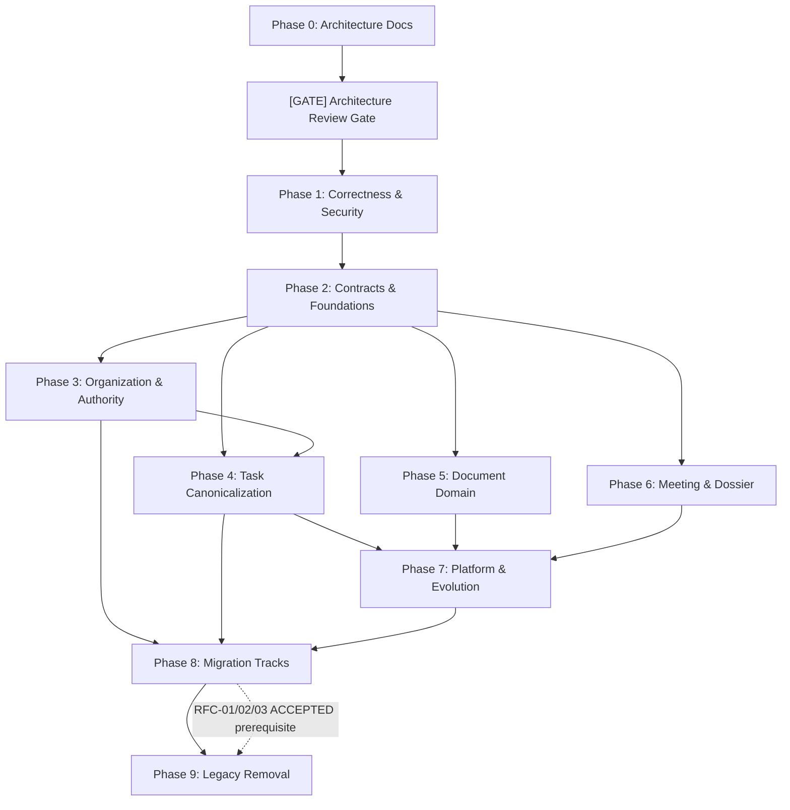

# QCET Implementation Plan v1

> Derived from: **Architecture Plan Issue #34 (FINAL/FROZEN 2026-09-22)**
>
> **STATUS: FINAL FOR ISSUE CREATION**
>
> **Hard constraints**: Không sửa `src/`, `prisma/`, config. Không chạy migration. Không commit/push/merge/deploy. Không tạo GitHub issues cho đến khi plan được duyệt.

---

## I. Architecture Governance Rules (Quy tắc Thực thi Kiến trúc)

1. **Architecture Review Gate & Governance**:
   - Ngay sau Phase 0, **BẮT BUỘC** có Architecture Review Gate do Owner trực tiếp đánh giá và ra quyết định chuyển trạng thái cho 4 ADRs nền tảng: **ADR-001, ADR-003, ADR-004, và ADR-007** (`PROPOSED` → `ACCEPTED` / `REJECTED` / `REVISED`).
   - **ADR-005 và ADR-006 tiếp tục giữ nguyên trạng thái `PROPOSED`** cho đến khi RFC-01 và RFC-02 hoàn tất ở Phase 4/3; không yêu cầu Gate Phase 0 chấp thuận sớm.
   - **Analysis, inventory, audit và RFC exploration** được phép thực hiện song song khi ADR hoặc RFC liên quan ở trạng thái `PROPOSED`.
   - **Implementation làm thay đổi hành vi (behavior-changing) hoặc lược đồ CSDL (schema-changing)** bắt buộc phải có **một decision artifact được CHẤP NHẬN (an ACCEPTED decision artifact: ADR, RFC, hoặc explicitly approved policy decision)**.
   - **Ngoại lệ (Fixes)**: Các cập nhật correctness/security fix nhằm phục hồi hành vi về một policy/ADR đã được `ACCEPTED` được phép tiến hành mà không cần tạo ADR mới, nhưng phải trích dẫn decision đã được chấp nhận và bằng chứng regression (ví dụ: WI-1.2 phục hồi hành vi theo ADR-002).
   - Cụ thể:
     - **ADR-001 ACCEPTED** bắt buộc trước WI-1.1 (Maker-Checker SoD).
     - **ADR-003 ACCEPTED** bắt buộc trước WI-2.2 (Single Status Normalizer) và WI-4.3 (OVERDUE Remediation).
     - **ADR-004 ACCEPTED** bắt buộc trước WI-5.1 (Document Status 2-Tier Sync).
     - **ADR-007 ACCEPTED** bắt buộc trước WI-7.6 (API Standards RFC 9457).
     - **RFC-08 ACCEPTED** bắt buộc trước WI-1.4b; **RFC-09 ACCEPTED** bắt buộc trước WI-1.5b.
     - **Meeting Governance ADR / Dossier Archival ADR ACCEPTED** bắt buộc trước các bước implementation behavior-changing ở WI-6.1c và WI-6.2c.
2. **Contextual Authority Policy**: Mọi quyết định thẩm quyền derive từ Contextual Authorization Policy Engine (`src/server/authorization/authorization-engine.ts`), không gán cứng vào `PositionAssignment` đơn lẻ và không dùng chuỗi role tĩnh.
3. **Migration Workflow Isolation**: Mỗi migration track là một parent workflow gồm các giai đoạn riêng biệt. **TUYỆT ĐỐI KHÔNG** giữ một git worktree sống qua observe window (1–2 tuần).

---

## II. Superseded Issues Traceability Register (#32 & #33)

Bảng dưới đây bảo đảm 100% yêu cầu thực tế từ hai issue không bị thất lạc:

| Nguồn gốc | Yêu cầu nghiệp vụ / Kỹ thuật gốc | Ánh xạ Work Item trong Implementation Plan v1 |
|:---|:---|:---|
| **#32** | User Directory visibility policy (chính sách hiển thị danh bạ nhân sự) | WI-1.4a, WI-1.4b (User Directory Visibility Policy) |
| **#32** | Canonical Dossier read policy (chính sách quyền đọc hồ sơ công việc) | WI-1.5a, WI-1.5b (Canonical Dossier Read Policy) |
| **#32** | Per-action Document/Dossier authorization audit | WI-1.6 (Document/Dossier Action Authorization Audit) |
| **#32** | Pre-existing security test debt triage | WI-1.7 (Security Baseline Debt Triage) |
| **#33** | Hệ thống nhiệm vụ duy nhất (Single Task System) | WI-0.1, WI-2.1, WI-4.1 |
| **#33** | Chuẩn hóa Maker-Checker SoD, chặn tự phê duyệt | WI-1.1 (Unify Maker-Checker SoD Guard) |
| **#33** | Phân định Lifecycle vs Temporal Attention | WI-2.2 (Normalizer), WI-4.3 (OVERDUE Remediation) |
| **#33** | Phân cấp nhiệm vụ cha - con (Hierarchy) | WI-0.1, WI-4.1 |
| **#33** | 8 chiều Workspace Dimensions | WI-2.1 (Semantic Contract Deduplication) |
| **#33** | Tách biệt Action Inbox khỏi Notification table | WI-7.1 (RFC-07), WI-7.2 (Notification Schema Evolution) |
| **#34-originated** | Trạng thái Document theo NĐ 30/2020 | WI-5.1 (Document Status 2-Tier Sync) |
| **#34-originated** | Mô hình Thẩm quyền dựa trên Contextual Policy | WI-1.2 (Compat shim), WI-3.3 (Domain Authority Interface) |
| **#34-originated** | Authorization Engine 10 bước mặc định DENY | WI-3.3 (Domain Authority via AuthorizationDecision) |
| **#34-originated** | API Contract RESTful & Problem Details RFC 9457 | WI-0.3 (OpenAPI Skeleton), WI-7.6 (API Standards RFC 9457) |

---

## III. Phased Implementation Strategy (10 Phases: Phase 0 đến Phase 9)

```
Phase 0: Architecture Documentation (#34 deliverables)
    ↓
[GATE] Architecture Review Gate (Owner reviews & ACCEPTS/REVISES proposed ADRs)
    ↓
Phase 1: Correctness & Security Foundations (BLOCKING: SoD + Role Compat + Security Baseline)
    ↓
Phase 2: Canonical Semantic Contracts & Shared Foundations
    ↓
Phase 3: Identity, Organization & Authority
    ↓                                          ┐
Phase 4: Task Domain Canonicalization          │ parallel after P2
    ↓                                          │
Phase 5: Document Domain                      │
    ↓                                          │
Phase 6: Meeting & Dossier Domains             ┘
    ↓
Phase 7: Platform — Outbox/Events, FileObject Model, Notifications, API Evolution
    ↓
Phase 8: Legacy Migration Tracks (Stage A: Expand/Backfill → Stage B: Cutover → Stage C: Observe)
    ↓
Phase 9: Legacy Removal (Stage D: Contract & Drop — sau khi Observe Window kết thúc an toàn)
```

### Dependency Graph



---

## IV. Work Items Chi Tiết

---

### Phase 0: Architecture Documentation

> **Prerequisite**: Không. **Parallel**: WI-0.1, WI-0.2, WI-0.3 chạy song song.

#### WI-0.1: Enterprise Product Architecture Document
- **Goal**: Tạo `docs/architecture/enterprise-product-architecture.md` 14 chương hoàn chỉnh.
- **Worktree**: `docs/arch-main` — single agent.

#### WI-0.2: ADR Documents (7 ADRs)
- **Goal**: Tạo `docs/architecture/decisions/ADR-001..007-*.md`.
- **Scope**: 7 files ADR. ADR-002 ACCEPTED, còn lại PROPOSED.

#### WI-0.3: Evolution Plan, Migration Map & OpenAPI Skeleton
- **Goal**: Tạo `docs/architecture/api-db-evolution.md`, `migration-map.md`, `docs/api/openapi.yaml`.

---

### [GATE] Architecture Review Gate
> **Owner Review Step — RESULT: GATE PASS (2026-09-22)**
> - **ADR-001**: `ACCEPTED` (Bổ sung điều khoản Maker-Checker SoD không bị bypass bởi ủy quyền).
> - **ADR-002**: `ACCEPTED` (Contextual Authorization Policy Engine).
> - **ADR-003**: `ACCEPTED` (`NOT_STARTED` là canonical initial state; `NEW` là presentation alias; derived attention `OVERDUE`; recoverable per-task remediation).
> - **ADR-004**: `ACCEPTED` (`Document.status` là persisted canonical administrative state; domain service độc quyền mutation và đồng bộ nguyên tử).
> - **ADR-007**: `ACCEPTED` (RFC 9457 error details; partial/inconsistent OCC coverage rectified; explicit API versioning policy).
> - **ADR-005 & ADR-006**: Giữ nguyên `PROPOSED` chờ RFC-01 và RFC-02.
>
> Toàn bộ các rào cản kiến trúc cho Phase 1 đã được dọn sạch.

---

### Phase 1: Correctness & Security Foundations (BLOCKING)

> **Prerequisite**: Phase 0 + Architecture Review Gate PASS.
> **Rationale**: Khắc phục ngay các lỗ hổng SoD, bug role và thiết lập baseline an ninh trước mọi refactor miền.
> **Execution Strategy**: Chia thành **2 Wave tuần tự** để triệt tiêu nguy cơ merge conflict trên các file `state-machine.ts`, `attention-resolver.ts`, `contract.ts`:
>
> - **Wave 1A (Chạy song song tối đa 6 worktrees)**:
>   - `WI-1.1` (SoD canonicalization — [CODE])
>   - `WI-1.3` (File authorization audit — [AUDIT ONLY])
>   - `WI-1.4a` (User Directory RFC-08 — [RFC ONLY])
>   - `WI-1.5a` (Dossier Policy RFC-09 — [RFC ONLY])
>   - `WI-1.6` (Doc/Dossier auth audit — [AUDIT ONLY])
>   - `WI-1.7` (Security debt triage — [TRIAGE ONLY])
> - **Wave 1B (Chạy sau khi WI-1.1 hoàn tất và merge vào main)**:
>   - `WI-1.2` (Role-set compatibility patch — [CODE])

#### WI-1.1: Unify Maker-Checker SoD Guard [Wave 1A]
- **Goal**: Hợp nhất 3 hàm `isMaker` thành 1 hàm canonical duy nhất. Maker = Creator ∪ DRI ∪ Assignee ∪ Result Submitter ∪ Deliverable Uploader.
- **ADR**: **BẮT BUỘC ADR-001 ACCEPTED** (Đã đạt).
- **Worktree**: `fix/sod-maker-checker`.

#### WI-1.2: Temporary Role-Set Compatibility Patch [Wave 1B — Sau khi WI-1.1 Merged]
- **Goal**: Đồng bộ tạm thời role strings giữa `state-machine.ts` và `attention-resolver.ts` để sửa bug TRUONG_KHOA/GIAM_DOC_TRUNG_TAM bị chặn duyệt sai.
- **Lưu ý**: Đây là correctness fix tuân thủ ADR-002 ACCEPTED; đánh dấu `// TEMPORARY COMPAT SHIM — remove after WI-3.3 authority delegation`. Chạy sau WI-1.1 để tránh merge conflict.
- **Worktree**: `fix/role-set-compat`.

#### WI-1.3: Security Assessment — File Authorization & Direct Object Reference Audit [Wave 1A]
- **Goal**: Kiểm toán và xác minh cơ chế bảo vệ truy cập tệp tin hiện hữu (`src/app/api/files/[...path]/route.ts`). Thử nghiệm các ca truy cập chéo đơn vị/chéo người dùng, nh��n diện khoảng cách bảo mật, ghi nhận bằng chứng và đề xuất follow-up issues.
- **Scope**: **Strictly audit-only.** Tuyệt đối không sửa code production trong task này; nếu phát hiện lỗ hổng nghiêm trọng sẽ tách thành security fix issue riêng.
- **Worktree**: `security/file-auth-audit`.

#### WI-1.4a: User Directory Visibility Policy RFC / Decision [Wave 1A]
- **Goal**: Evaluate school-wide directory vs unit-scoped vs capability/context-based visibility. Đề xuất một chính sách rõ ràng để Owner duyệt.
- **Output**: `docs/architecture/decisions/RFC-08-user-directory-policy.md`.
- **Worktree**: `security/user-directory-rfc`.

#### WI-1.4b: User Directory Visibility Policy Implementation & Tests [Sau Owner Gate RFC-08]
- **Goal**: Implement chính sách sau khi RFC-08 được Owner ACCEPTED.
- **Dependencies**: RFC-08 ACCEPTED.
- **Worktree**: `security/user-directory-policy`.

#### WI-1.5a: Canonical Dossier Read Policy Reconciliation / Decision [Wave 1A]
- **Goal**: Đối chiếu rule hiện tại trong `DossierService` và `dossier-policy.ts` (đang được route download file gọi), đề xuất một chính sách canonical duy nhất để Owner duyệt.
- **Output**: `docs/architecture/decisions/RFC-09-dossier-read-policy.md`.
- **Worktree**: `security/dossier-read-rfc`.

#### WI-1.5b: Canonical Dossier Read Policy Implementation & Tests [Sau Owner Gate RFC-09]
- **Goal**: Implement chính sách sau khi RFC-09 được Owner ACCEPTED.
- **Dependencies**: RFC-09 ACCEPTED.
- **Worktree**: `security/dossier-read-policy`.

#### WI-1.6: Document & Dossier Action Authorization Audit [Wave 1A]
- **Goal**: Kiểm toán toàn diện ma trận phân quyền từng hành động (per-action authorization) trên văn bản đến, văn bản đi và hồ sơ công việc.
- **Scope**: **Strictly audit-only.** Output bao gồm: evidence (bằng chứng hiện trạng), findings (phát hiện), và proposed follow-up issues (đề xuất issue triển khai). **Tuyệt đối không thực hiện production fixes tại work item này.** Mọi khắc phục đều trở thành follow-up implementation issues độc lập.
- **Worktree**: `security/doc-dossier-auth-audit`.

#### WI-1.7: Security Baseline Debt Triage [Wave 1A]
- **Goal**: Rà soát, tái hiện (reproduce), phân loại (classify) và tài liệu hóa (document) các test kiểm thử bảo mật tồn đọng; actual fixes sẽ được tạo thành các follow-up issues độc lập.
- **Lưu ý**: Strictly triage/reproduce/classify/document only; không fix trực tiếp trong task này.
- **Worktree**: `security/debt-triage`.

---

### Phase 2: Canonical Semantic Contracts & Shared Foundations

> **Prerequisite**: Phase 1.

#### WI-2.1: Canonical Semantic Contract Deduplication
- **Goal**: Xóa duplicate `DetailedKanbanProjection` tại `canonical-semantics.ts`. Đảm bảo Domain và UI import từ cùng canonical contract.
- **Worktree**: `refactor/semantic-contract`.

#### WI-2.2: Single Status Normalizer
- **Goal**: Hợp nhất `normalizeTaskStatus()` và `mapDbStatusToLifecycle()` thành flow nhất quán.
- **ADR**: **BẮT BUỘC ADR-003 ACCEPTED** trước khi triển khai code chuẩn hóa bộ trạng thái canonical.
- **Worktree**: `refactor/status-normalizer`.

---

### Phase 3: Identity, Organization & Authority

> **Prerequisite**: Phase 2.

#### WI-3.1: RFC-02 — Department ↔ OrganizationalUnit Analysis
- **Goal**: Audit consumers, lập ma trận mapping dữ liệu, kế hoạch parity và rollback. **Không migrate.**
- **Worktree**: `rfc/department-orgunit`.

#### WI-3.2: RFC-03 — DacumDelegation ↔ DelegationGrant Analysis
- **Goal**: Audit UI và API consumers của 2 hệ thống ủy quyền. **Không migrate.**
- **Worktree**: `rfc/delegation-consolidation`.

#### WI-3.3: Domain Authority via AuthorizationDecision Interface
- **Goal**: Refactor domain layer để nhận `AuthorizationDecision` / `CapabilityContext` từ application layer thay vì tự kiểm tra role strings tĩnh.
- **Dependency Direction Bắt buộc**: Server/Application Authorization Engine resolve capability → truyền kết quả dạng pure data (`AuthorizationDecision`) vào domain. Domain KHÔNG ĐƯỢC import `authorization-engine.ts` hay server code.
- **Worktree**: `refactor/authority-decision-interface`.

---

### Phase 4: Task Domain Canonicalization

> **Prerequisite**: Phase 2; WI-3.3 cho authority model.

#### WI-4.1: RFC-01 — TaskAssignee ↔ TaskActor Analysis
- **Goal**: Audit consumers đọc/ghi, lập ma trận mapping vai trò, kế hoạch parity test. **Không migrate.**
- **Worktree**: `rfc/task-actor`.

#### WI-4.2: RFC-06 — TaskScope vs TaskOriginLevel Boundary
- **Goal**: Phân định ranh giới ngữ nghĩa: `scope` (audience) vs `originLevel` (provenance).
- **Worktree**: `rfc/scope-origin`.

#### WI-4.3: OVERDUE Lifecycle Remediation Strategy
- **Goal**: Chuyển OVERDUE từ persisted status sang derived attention. **TUYỆT ĐỐI KHÔNG blindly UPDATE status='IN_PROGRESS'.**
- **ADR**: **BẮT BUỘC ADR-003 ACCEPTED**.
- **Worktree**: `refactor/overdue-remediation`.

---

### Phase 5: Document Domain

> **Prerequisite**: Phase 2.

#### WI-5.1: Document Status 2-Tier Sync Enforcement
- **Goal**: Đảm bảo `Document.status` (hành chính theo NĐ 30/2020) tự động đồng bộ từ workflow status chi tiết qua Domain Service.
- **ADR**: **BẮT BUỘC ADR-004 ACCEPTED**.
- **Worktree**: `fix/document-status-sync`.

#### WI-5.2: RFC-04 — Document Domain Layer Location Evaluation
- **Goal**: Đánh giá lộ trình di chuyển `src/lib/documents/` → `src/domain/documents/`.
- **Worktree**: `rfc/document-location`.

#### WI-5.3: RFC-05 — Document JSON/Text Relations Assessment
- **Goal**: Đánh giá chuẩn hóa `collaboratorIds` (CSV) và `coordinatingUnitIds` (JSON).
- **Worktree**: `rfc/json-text-relations`.

---

### Phase 6: Meeting & Dossier Domains

> **Prerequisite**: Phase 2.

#### WI-6.1a: Meeting FSM Behavior-Preserving Formalization & Tests
- **Goal**: Formalize State Machine cho Meeting bảo vệ quy trình họp (`DRAFT_AGENDA` → `INVITED` → `HELD` → `MINUTES_DRAFT` → `MINUTES_CONFIRMED`) giữ nguyên 100% hành vi hiện hữu, bổ sung unit test coverage toàn diện.
- **Scope**: Zero behavior change.
- **Worktree**: `feat/meeting-fsm-formalization`.

#### WI-6.1b: Meeting Governance ADR Creation
- **Goal**: Soạn thảo ADR đề xuất các thay đổi hành vi (chặn sửa biên bản sau xác nhận, kiểm soát quyền chốt nghị quyết).
- **Worktree**: `rfc/meeting-governance`.

#### WI-6.1c: Meeting FSM Behavior-Changing Transition Guards
- **Goal**: Triển khai các ràng buộc chuyển đổi trạng thái mới (behavior-changing).
- **ADR**: **BẮT BUỘC Meeting Governance ADR ACCEPTED**.
- **Worktree**: `feat/meeting-fsm-guards`.

#### WI-6.2a: Dossier FSM Behavior-Preserving Formalization & Tests
- **Goal**: Formalize State Machine cho Hồ sơ công việc (`OPEN` → `CLOSED` → `SUBMITTED_TO_ARCHIVE` → `ACCEPTED`/`ARCHIVED`) bảo toàn hành vi hiện tại và thêm test suite.
- **Scope**: Zero behavior change.
- **Worktree**: `feat/dossier-fsm-formalization`.

#### WI-6.2b: Dossier Archival Governance ADR Creation
- **Goal**: Soạn thảo ADR đề xuất SoD cho lưu trữ (Submitter ≠ Archivist).
- **Worktree**: `rfc/dossier-archival-governance`.

#### WI-6.2c: Dossier FSM Archival SoD Transition Guards
- **Goal**: Triển khai quy tắc SoD cứng cho lưu trữ (behavior-changing).
- **ADR**: **BẮT BUỘC Dossier Archival ADR ACCEPTED**.
- **Worktree**: `feat/dossier-fsm-guards`.

---

### Phase 7: Platform — Outbox/Events, FileObject Model, Notifications, API Evolution

> **Prerequisite**: Phase 4, 5, 6.

#### WI-7.1: RFC-07 — Action Inbox vs Notification Feed Separation
- **Goal**: Thiết kế Action Inbox dạng derived projection độc lập hoàn toàn khỏi bảng thông báo lịch sử `Notification`.
- **Worktree**: `rfc/action-inbox`.

#### WI-7.2: Notification Schema Evolution (Gated on RFC-07)
- **Goal**: Triển khai controlled vocabulary cho `Notification.category` và `type` sau khi RFC-07 chốt thiết kế. **Độc lập hoàn toàn khỏi WI-7.3.**
- **Dependencies**: WI-7.1 (RFC-07) hoàn tất.
- **Worktree**: `schema/notification-evolution`.

#### WI-7.3: Controlled Vocabulary for UnitWorkAssignment
- **Goal**: Thêm controlled vocabulary có constraint cho `UnitWorkAssignment.status`.
- **Worktree**: `schema/unit-assignment-status`.

#### WI-7.4: Transactional Outbox Infrastructure Assessment
- **Goal**: Đánh giá hiện trạng `OutboxEvent` và đặc tả Event Processor cho 12 domain events.
- **Worktree**: `assessment/outbox-infrastructure`.

#### WI-7.5: FileObject Canonical Model Evolution (Structural)
- **Goal**: Thiết kế model `FileObject` tập trung quản lý binary assets, metadata, upload limits và deduplication.
- **Worktree**: `design/file-object-model`.

#### WI-7.6: API Standards Implementation (RFC 9457)
- **Goal**: Chuẩn hóa phản hồi lỗi RFC 9457 (`application/problem+json`) và pagination headers trên toàn bộ API.
- **ADR**: **BẮT BUỘC ADR-007 ACCEPTED**.
- **Worktree**: `refactor/api-standards`.

---

### Phase 8: Legacy Migration Tracks (Parent Workflows)

> **Nguyên tắc cốt lõi**: Mỗi migration track là một quy trình nhiều giai đoạn (Multi-Stage Workflow).
> - **Stage A (Expand + Backfill + Parity Verify)**: Tạo worktree riêng `migration/<track>-prep` → hoàn thành → merge và **đóng worktree**.
> - **Stage B (Cutover Read & Write)**: Tạo worktree mới `migration/<track>-cutover` → chuyển đổi caller → verify zero fallback → merge và **đóng worktree**.
> - **Stage C (Observe Window)**: **KHÔNG DÙNG WORKTREE**. Hệ thống chạy quan sát 1–2 tuần trên production/staging để bảo đảm không có regression.
> - **Stage D (Contract / Drop Model)**: Chuyển giao sang **Phase 9** sau khi Observe Window đạt chuẩn.

#### WI-8.1: Migration Track — TaskAssignee → TaskActor
- **Prerequisites**: RFC-01 ACCEPTED, ADR-005 ACCEPTED.

#### WI-8.2: Migration Track — Department → OrganizationalUnit
- **Prerequisites**: RFC-02 ACCEPTED, ADR-006 ACCEPTED.

#### WI-8.3: Migration Track — DacumDelegation → DelegationGrant
- **Prerequisites**: RFC-03 ACCEPTED.

#### WI-8.4: Migration Track — OVERDUE Enum Removal Preparation
- **Prerequisites**: WI-4.3 verified, ADR-003 ACCEPTED.

---

### Phase 9: Legacy Removal (Stage D — Contract)

> **Prerequisite**: Toàn bộ Observe Windows ở Phase 8 tương ứng hoàn thành an toàn và được phê duyệt.
> Mỗi worktree ở Phase 9 là worktree mới, mở ra chỉ để thực thi migration xóa schema legacy và dọn dẹp code dư thừa.

#### WI-9.1: Drop TaskAssignee Model & Legacy Code
- **Worktree**: `cleanup/drop-task-assignee`.

#### WI-9.2: Drop Department Model & Foreign Keys
- **Worktree**: `cleanup/drop-department`.

#### WI-9.3: Drop DacumDelegation Model
- **Worktree**: `cleanup/drop-dacum-delegation`.

#### WI-9.4: Drop OVERDUE Value from TaskStatus Enum
- **Worktree**: `cleanup/drop-overdue-enum`.

---

## V. Proposed GitHub Issue Breakdown (41 Issues)

```
PHASE 0 — Architecture Documentation (1 issue)
  #34    [arch/rfc] Enterprise Architecture & Evolution Plan (WI-0.1, 0.2, 0.3)

[GATE] — Architecture Review Gate (Owner sign-off on PROPOSED ADRs)

PHASE 1 — Correctness & Security Foundations (9 issues, BLOCKING)
  #A     [fix/security] Unify Maker-Checker SoD guard (WI-1.1 — requires ADR-001 ACCEPTED)
  #B     [fix/correctness] Temporary role-set compatibility patch (WI-1.2)
  #C     [security/audit] File authorization & direct object reference audit (WI-1.3)
  #C1a   [security/rfc] User directory visibility policy RFC & Decision (WI-1.4a)
  #C1b   [security/policy] User directory visibility policy implementation (WI-1.4b — requires #C1a ACCEPTED)
  #C2a   [security/rfc] Canonical dossier read policy reconciliation (WI-1.5a)
  #C2b   [security/policy] Canonical dossier read policy implementation (WI-1.5b — requires #C2a ACCEPTED)
  #C3    [security/audit] Document & dossier action authorization audit (WI-1.6 — audit only)
  #C4    [security/debt] Security baseline test debt triage (WI-1.7 — triage/classify only)

PHASE 2 — Canonical Contracts & Shared Foundations (2 issues, parallel)
  #D     [refactor] Canonical semantic contract deduplication (WI-2.1)
  #E     [refactor] Single status normalizer (WI-2.2 — requires ADR-003 ACCEPTED)

PHASE 3 — Organization & Authority (3 issues)
  #F     [rfc] Department ↔ OrganizationalUnit analysis (WI-3.1)
  #G     [rfc] DacumDelegation ↔ DelegationGrant analysis (WI-3.2)
  #H     [refactor] Domain authority via AuthorizationDecision interface (WI-3.3)

PHASE 4 — Task Domain Canonicalization (3 issues)
  #I     [rfc] TaskAssignee ↔ TaskActor analysis (WI-4.1)
  #J     [rfc] TaskScope vs TaskOriginLevel boundary analysis (WI-4.2)
  #K     [refactor] OVERDUE lifecycle remediation strategy (WI-4.3 — requires ADR-003 ACCEPTED)

PHASE 5 — Document Domain (3 issues)
  #L     [fix] Document status 2-tier sync enforcement (WI-5.1 — requires ADR-004 ACCEPTED)
  #M     [rfc] Document domain layer location evaluation (WI-5.2)
  #N     [rfc] Document JSON/Text relation assessment (WI-5.3)

PHASE 6 — Meeting & Dossier Domains (6 issues, parallel tracks)
  #O1    [feat] Meeting FSM behavior-preserving formalization & tests (WI-6.1a)
  #O2    [rfc] Meeting Governance ADR creation (WI-6.1b — worktree rfc/meeting-governance)
  #O3    [feat] Meeting FSM behavior-changing transition guards (WI-6.1c — requires Meeting ADR ACCEPTED)
  #P1    [feat] Dossier FSM behavior-preserving formalization & tests (WI-6.2a)
  #P2    [rfc] Dossier Archival Governance ADR creation (WI-6.2b — worktree rfc/dossier-archival-governance)
  #P3    [feat] Dossier FSM archival SoD transition guards (WI-6.2c — requires Dossier ADR ACCEPTED)

PHASE 7 — Platform & Evolution (6 issues)
  #Q     [rfc] Action Inbox vs Notification feed separation (WI-7.1)
  #R     [schema] Notification schema evolution (WI-7.2 — gated on #Q)
  #S     [schema] UnitWorkAssignment controlled vocabulary (WI-7.3)
  #T     [assessment] Outbox infrastructure & event processor spec (WI-7.4)
  #U     [design] FileObject canonical model evolution (WI-7.5)
  #V     [refactor] API standards RFC 9457 implementation (WI-7.6 — requires ADR-007 ACCEPTED)

PHASE 8 — Migration Tracks (4 parent issues)
  #W     [migration] TaskAssignee → TaskActor cutover track (WI-8.1 — requires RFC-01 & ADR-005)
  #X     [migration] Department → OrganizationalUnit cutover track (WI-8.2 — requires RFC-02 & ADR-006)
  #Y     [migration] DacumDelegation → DelegationGrant cutover track (WI-8.3 — requires RFC-03)
  #Z     [migration] OVERDUE enum removal preparation track (WI-8.4 — requires #K verified)

PHASE 9 — Legacy Removal (4 issues — sau Observe Windows)
  #AA    [cleanup] Drop TaskAssignee model & legacy code (WI-9.1)
  #AB    [cleanup] Drop Department model & foreign keys (WI-9.2)
  #AC    [cleanup] Drop DacumDelegation model (WI-9.3)
  #AD    [cleanup] Drop OVERDUE value from TaskStatus enum (WI-9.4)
```

---

## VI. Parallelism & Worktree Lifecycle

- **Peak Concurrent Worktrees**: 7 (trong giai đoạn Phase 3, 4, 5, 6 overlap).
- **Worktree Lifecycle Policy**:
  - Mỗi worktree chỉ phục vụ đúng 1 task (PR).
  - Không có worktree nào tồn tại qua Observe Window.
  - Mọi thay đổi schema tuân thủ nguyên tắc: Expand PR → Observe → Contract PR.
