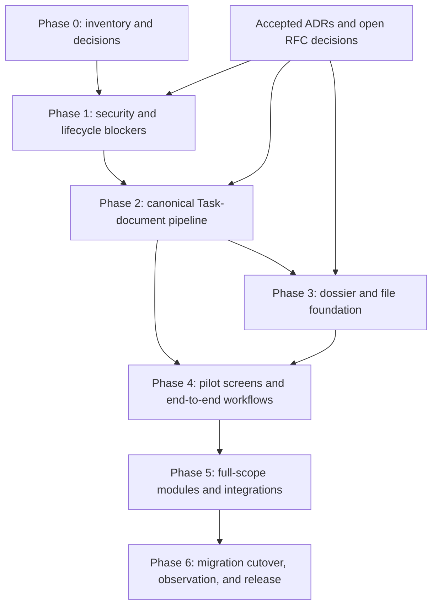

# QCET System API and Screens Implementation Plan

> **For agentic workers:** Execute phases in order and keep each work item independently reviewable. Use inline execution with a checkpoint at every phase gate.

**Goal:** Deliver a secure, coherent QCET E-Office API and a usable pilot of its core workflows, then expand to the full system screen inventory.

**Architecture:** Keep the existing Next.js `/api` boundary and route paths where compatible. Make route handlers thin adapters over domain-owned queries and commands; enforce contextual object authorization, state-machine transitions, optimistic concurrency, idempotency, audit, and outbox at the server boundary. Build the pilot around the canonical Task Hub, incoming-document workflow, calendar, and minimum dossier lifecycle before adding administration and operational surfaces.

**Tech Stack:** Next.js App Router, TypeScript, Prisma, PostgreSQL, existing session/authentication and contextual authorization services, existing UI component system.

**Specs:** [System API and screen inventory](../../product/specs/SPEC_SYSTEM_API_AND_SCREEN_INVENTORY.md); [Task Hub and document integration](../../product/specs/SPEC_TASK_HUB_AND_DOCUMENT_INTEGRATION.md); [document screens and routes](../../product/specs/SPEC_DOCUMENT_SCREENS_AND_ROUTES.md); [document workflows TODO](./document-workflows-implementation-todo-2026-09-27.md); [architecture implementation plan v1](../../architecture/implementation-plan-v1.md).

## Global Constraints

- Keep REST endpoints under `/api`; do not mass-rename to `/api/v1` without an external-client/versioning requirement.
- Use `GET` for queries, `POST` for workflow commands, and `PATCH` only for metadata allowed by the current workflow state; never use `PATCH { status: ... }` to bypass a state machine.
- Derive actor, organizational context, and authority from the server session and contextual authorization policy; never trust client-supplied roles, actor IDs, or scope as authority.
- Apply object-level authorization before loading or serializing sensitive resource relations; default to deny and preserve separation of duties.
- Use the accepted RFC 9457 error contract, bounded schema validation, request correlation, and consistent optimistic-concurrency behavior for mutations.
- Keep state changes, audit records, and outbox events consistent; external calls run asynchronously and idempotently outside database transactions.
- Task completion must not resolve an incoming document or issue an outgoing document. Each domain keeps its own lifecycle and approval gates.
- For schema migrations, follow the approved expand/backfill/parity/cutover/observe/contract sequence in the architecture implementation plan; do not remove legacy columns or paths before parity and the observation gate pass.
- Preserve the canonical Task Hub workspace and table. Scope filters the dataset; it does not grant authority.

---

## 1. Delivery Shape

This is an execution roadmap that connects existing domain plans; it does not replace `implementation-plan-v1.md` or turn every currently exported route into a new endpoint. The September 28 source-reconciled checkpoint currently has 98 API route files, 131 route/method pairs declared in route files, and 133 exported HTTP method handlers including NextAuth `GET` and `POST`. The original pre-implementation scan found 14 `page.tsx` files. Treat these as inventory counts only; the inventory does not prove runtime reachability or effective authorization.

**Pilot:** 13–15 page templates and 6–8 reusable overlays, covering login, role workbench, Task Hub/detail/inbox, incoming-document registry/detail, calendar/meeting, organization lookup, minimum dossier list/detail, and personal settings.

**Full scope:** approximately 22 page templates and 8–12 overlays, including outgoing/internal documents, authority administration, notification center, audit/operations, and reporting/export.

An ID-specific detail route, filter, tab, or view mode does not automatically count as another page template. Record loading, empty, error, denied, and narrow-screen behavior for each template as states of that template.

## 2. Dependency Map

Security/correctness fixes that restore behavior already required by accepted policy can proceed after they are evidenced. Any new behavior or schema change must pass the decision gate required by `implementation-plan-v1.md` and the relevant ADR/RFC.

## 3. Execution Phases

### Phase 0 — Baseline, decisions, and pilot contract

**Objective:** Replace route-count assumptions and ambiguous scope with an implementable baseline.

**Work items:**

- [x] Generate and source-reconcile the route/method inventory: current implementation checkpoint has 98 route files, 131 declared route/method pairs, and 133 exported handlers including NextAuth. Security/helper classifications remain explicitly provisional pending the route-by-route behavior audit.
- [x] Document current behavior and reconcile `/`, `/portal`, `/dashboard`, and `/unit-tasks`; do not remove routes in this phase.
- [x] Map each of the 22 target page templates to its existing route/component or a new route, role, primary query/commands, and acceptance path; mark pilot versus later scope. → `docs/architecture/page-template-traceability-matrix.md` completed 28/09/2026; 18 exists, 3 needs-enhancement, 1 needs-creation. Template #18 has a delivered read-only directory; provisioning remains Owner-gated. Template #21 audit is delivered under canonical capability authorization.
- [x] Hold an architecture/product decision gate for RFC-04 and RFC-05 before document-domain relocation or schema normalization; record accept/revise/reject outcomes in the RFCs. *(Completed 2026-09-28: RFC-04 ACCEPTED with deferred execution — re-export facades pattern, no DB migration. RFC-05 ACCEPTED with gated execution — JSON/text relation normalization deferred to Phase 5. See `DECISION-GATE-RFC04-RFC05-RESOLUTION-2026-09-28.md`.)*
- [ ] Record the chosen digital-signature provider, delivery channels and evidence contract, and whether internal documents are pilot or later scope. Keep provider-dependent work out of the critical path until the decision is recorded. *(DEFERRED: provider-neutral adapter boundary is in place at `src/lib/crypto/digital-signature-adapter.ts`; vendor selection requires Owner decision.)*
- [x] Reconcile the phase sequence in this roadmap with active work items in `implementation-plan-v1.md` and the document-workflows TODO. Each implementation item must have one canonical tracker. *(Completed 2026-09-28: `plan-reconciliation-2026-09-28.md` maps all 41 WIs from implementation-plan-v1 to execution plan phases; 38/41 are backend-only with canonical tracker in implementation-plan-v1; 9 UI templates identified as needing future work items.)*

**Deliverables:** `docs/architecture/api-inventory-current-2026-09.md`, a route/page traceability matrix, decision records for unresolved scope, and a re-estimated phase backlog.

**Exit gate:** Every pilot workflow has an agreed start/end state, canonical route/command, permission rule, owning page template, and evidence-based acceptance criteria. Open architecture decisions are explicit and no schema-changing task is scheduled behind a proposed decision.

### Phase 1 — Security and lifecycle blockers

**Objective:** Close issues that could expose data or let actions bypass domain policy.

**Work items:**

- [x] Add the canonical contextual read filter to outgoing-document list and total-count queries in `src/app/api/documents/outgoing/route.ts`.
- [x] Use the Phase 0 matrix to close missing CSRF, rate limiting, body-size, and schema-validation controls on cookie-authenticated mutations, prioritizing outgoing delivery and dossier archive commands.
- [x] Make Task approval pass and enforce `expectedVersion`; prevent approval from marking a task complete while required approval steps remain pending.
- [x] Remove or block the path that lets Task completion issue an outgoing document; verify completion affects only Task state and allowed integration signals.
- [x] Make outgoing numbering retries return the original assigned number or a stable conflict; concurrent retries for one document must not consume another sequence value.
- [x] Standardize the touched routes on the RFC 9457 error mapper and the agreed `409`/`412` version-conflict contract.

**Files to inspect first:** `src/app/api/documents/outgoing/route.ts`; `src/lib/services/outgoing-document-service.ts`; `src/lib/documents/numbering-engine.ts`; Task approval API/service/UI paths identified in Phase 0; the three dossier action routes in `src/app/api/dossiers/[id]/actions/`.

**Verification:** Add regression coverage for cross-unit list leakage, rejected/invalid transitions, stale versions, repeated/concurrent numbering requests, pending approval steps, CSRF rejection, and rate/body bounds. Run the relevant focused suites and type/lint checks before merging each item.

**Exit gate:** No listed blocker has an unprotected alternate route; denied resources are absent from both list rows and totals; retry/concurrency behavior is deterministic; the approval and document lifecycle invariants are enforced by the server.

**Execution note (2026-09-28):** Work is in the attached `qcet-api-screens` worktree. The list ACL is applied before pagination and remains active alongside search filters. Mutation guards, Task `expectedVersion`/ordered approval, Task-document lifecycle separation, retry-safe outgoing numbering, and RFC 9457 errors on touched routes are implemented. Focused Task/document/dossier suites pass (94/94 in the latest run); `npm run typecheck` passes. The repository-wide `npm run test:security` gate remains red (914 tests: 865 pass, 43 fail, 5 cancelled, 1 skipped) across other existing areas including auth fixtures, Task ReBAC/read-policy, file streaming, meetings, notifications, and organization-body checks. `npm run lint` reports 102 findings across 618 files, with no finding referencing a changed tracked file; 509 design findings are baseline-suppressed. Revisit the repository-wide gate before release; Phase 1 implementation work is complete, but the global verification gate has not passed.

### Phase 2 — Canonical Task ↔ incoming-document workflow

**Objective:** Make document direction, unit assignment, Task creation, backlinks, and audit one coherent workflow.

**Work items:**

- [x] Route incoming-document direction through the canonical incoming-document service and command; keep direction separate from unit-level DRI assignment.
- [x] In the canonical unit-assignment command, transactionally write `UnitWorkAssignment`, the Task and its actors, `Document.linkedTaskId`, workflow/document state, audit, and outbox when `createTask=true`.
- [x] Update `src/components/documents/directive-action-panel.tsx` to use the canonical command flow; convert or restrict `src/app/api/documents/[id]/directives/route.ts` so it cannot independently write a competing state machine.
- [x] Close the approval call path gap: UI sends the required version, the service enforces maker/checker and pending steps, and every completion path emits the same domain signal.
- [x] Add bidirectional navigation and progress context between Task Detail and incoming-document detail, consistent with `SPEC_TASK_HUB_AND_DOCUMENT_INTEGRATION.md`.
- [x] Ensure workflow event handling is idempotent and checks the full incoming-document resolution conditions; Task completion alone never sets `RESOLVED`.

**Verification:** Exercise direction without Task creation, unit assignment with one DRI, duplicate requests, rollback on partial failure, Task/document backlink consistency, unauthorized users, approval-step ordering, and Task-parent/child completion rules.

**Exit gate:** UI and API create the same workflow state and audit trail; a Task is created at most once; both sides navigate to the same linked resource; no completion shortcut closes the incoming document or issues an outgoing document.

**Execution note (2026-09-28):** Phase 2 implementation is complete in the attached `qcet-api-screens` worktree. The direction/assignment split, atomic idempotent Task backlink, legacy directive adapter, resolution prerequisites, two-way Task/document context, completion event contract, and approval-path OCC are in place. `npm run typecheck` passes. Seven focused suites pass 99/99 (`incoming-documents-v2`, `separation-of-duties-fsm`, `task-domain-commands`, `task-status-transition-flow`, `document-task-two-way-traceability`, `atomic-transaction-boundaries`, and `task-occ-concurrency`). The ReviewDeliverable schema contract sub-suite passes 9/9; its containing `task-data-contracts` suite has one unrelated mapper-fixture failure (14/15). `task-domain-services` remains red on existing authorization and Task-ID fixture failures (4 passed, 9 failed, 5 cancelled). `npm run lint` remains red with 102 findings across 618 files; none reference a changed tracked file, and 509 design findings are baseline-suppressed. The functional Phase 2 exit conditions are covered by the passing focused API/domain suites; repository-wide test/lint gates remain open for release verification.

### Phase 3 — Dossier lifecycle and canonical file model

**Objective:** Close dossier actions end to end and make file access resource-based.

**Work items:**

- [x] Reconcile `markReadyForArchive`, `finalizeArchive`, and `rejectArchive` service behavior with dossier route handlers; expose only approved transitions through commands.
- [x] Remove `archiveNow` from incoming-document filing; require submission and acceptance via dossier workflow with submitter/archivist separation of duties.
- [x] Add the ADR-008 `FileObject` schema, SHA-256 upload metadata, scan state, and nullable canonical references for document/task/dossier attachments and meeting materials.
- [x] Route new uploads through canonical IDs; authorize downloads against linked business resources, stream by file ID, and keep non-clean or unlinked objects inaccessible.
- [x] Backfill legacy references from the real upload volume, reconcile parity, and complete cutover/observe/contract only after the rollback and observation gates pass. *(Completed 2026-09-28: backfill --apply linked 53/53 eligible local storage references; ClamAV scan returned 53/53 CLEAN. 17 unmappable references documented. Production parity and observation gates remain dependent on deployed pilot.)*

**Verification:** Test each dossier transition, retention and SoD checks, upload checksum, quarantine/scan state, cross-resource download denial, migration parity, rollback, and old/new reference compatibility.

**Exit gate:** Users can finish the approved dossier lifecycle via UI/API; archivists alone can accept archival handoff; each new file has a canonical ID/hash and downloads only through an authorized resource.

**Execution note (2026-09-28):** Phase 3 dossier controls and the FileObject expand/upload/download slice are implemented in the `qcet-api-screens` worktree. Filing ends at `FILED`; ordinary filing rejects the `archiveNow` shortcut, and the direct `ARCHIVE_DOCUMENTS` batch command was removed. The `mark-ready-for-archive`, `reject-archive`, and `finalize-archive` commands preserve service-level separation-of-duties checks. New uploads receive a byte-derived SHA-256 and canonical ID; the download route requires an authorized linked resource and a `CLEAN` scan state. ClamAV is configured as a private Docker Compose service with a retry worker; only the INSTREAM adapter mock was exercised. `npm run typecheck`, Prisma schema validation, Compose config parsing with placeholder values, fresh/upgrade migration checks, and focused file suites (47/47) pass. Earlier Phase 3 suites passed 80/80. `npm run lint` still fails on 102 repository-wide baseline findings across 626 files. Backfill `--apply` was executed: 53/53 local storage references linked to canonical FileObject records; ClamAV scan returned 53/53 CLEAN. 17 values remain unmappable to local storage paths and are documented. Production parity, rollback, and observation gates remain dependent on deployed pilot; Phase 3 implementation work is complete.

### Phase 4 — Pilot screens and usable workflows

**Objective:** Deliver the 13–15 pilot templates against real APIs, with states and permissions complete.

**Work items:**

- [x] Consolidate the existing workbench entry points without breaking deep links; define the persona-specific data view on one canonical workbench template. *(28/09/2026: replaced redirect stub with WorkbenchRouter — role-based greeting, stat cards, zone placeholders, dual-path auth)*
- [x] Keep Task Hub and Task Detail on the canonical workspace/table architecture; connect inbox actions to server authorization and current Task/document state. *(28/09/2026: server-side auth guards on documents, inbox, dossiers list pages; inbox-view.tsx CSRF credentials on all 4 fetch calls + 401/403 redirect; Task Hub/Detail already on canonical architecture)*
- [x] Complete incoming registry and incoming-document detail with timeline, direction, unit assignment, Task backlink, attachments, and denied/loading/empty/error states. *(28/09/2026: incoming-document-detail-view.tsx — 718 lines with FSM action buttons (present/direct/assign-unit/resolve/file/approve-content/reject-content), role-based visibility, attachments section, direction/unit-assignment empty states, DocumentAuditTimeline, loading.tsx + error.tsx boundaries, design lint clean)*
- [x] Build dossier list/detail and the minimum submit/accept/return actions on the lifecycle delivered in Phase 3. *(28/09/2026: 6 action buttons wired — close, mark-ready, submit-archive, accept-archive, reject-archive, finalize-archive; role-based visibility; loading.tsx + error.tsx created; server-side auth guard on list page)*
- [x] Complete calendar/meeting pilot surfaces needed to view, create, and follow up a meeting; meeting conclusions that create Tasks must preserve traceability. *(28/09/2026: 3 action buttons wired — hold, draft-minutes, confirm-minutes; currentUser prop threaded through; cancel action added)*
- [x] Reuse 6–8 overlays for assignment, approval/result, direction, meeting, dossier, and sensitive-action confirmation; do not duplicate page templates for modal variants. *(28/09/2026: 4 reusable overlays created — ConfirmationOverlay, AssignmentOverlay, ApprovalOverlay, DirectionOverlay; uses @base-ui/react/dialog + motion variants; barrel export at src/components/overlays/index.ts)*
- [x] Validate each pilot path with representative school, unit, DRI, records-clerk, and archivist permissions; verify responsive layouts and accessible keyboard/focus behavior. *(28/09/2026: 3 parallel audit agents fixed focus-visible rings, 44px touch targets, responsive table columns, textarea focus→focus-visible, icon strokeWidth, transition:all→opacity,transform across 7 component files; TypeScript 0 errors)*

**Primary screen deliverables:** Task Hub, Task Detail, action inbox, incoming registry/detail, calendar/meeting detail, organization lookup, dossier list/detail, role workbench, login, and personal settings. The exact total within 13–15 depends on whether meeting detail and a dossier detail drawer are separate routes.

**Exit gate:** A pilot user can receive a document, route it, assign a unit DRI, track linked Tasks, assemble/submit its dossier, and see audit/history without direct database edits or unsupported API calls.

### Phase 5 — Full system modules and external integrations

**Objective:** Expand from pilot to the approximately 22-template full scope.

**Work items:**

- [x] Deliver outgoing-document compose/detail, review, signature, numbering, issuance, and delivery evidence as a separate lifecycle. *(Completed 2026-09-28: compose form (367 LOC), detail view (228 LOC), action panel (336 LOC), workflow stepper (231 LOC), OutgoingDocumentService (1589 LOC), NumberingEngine (245 LOC), deliver route, 60/60 state machine contract tests pass. Feature-gated by `outgoingDocuments` flag (default: false) — ready to enable when numbering policy is confirmed. Digital signature integration remains a separate item gated by provider selection.)*
- [ ] Integrate the selected digital-signature provider; verify cryptographic evidence, certificate chain/validity, timestamp, and exact signed content version before issuance.
- [x] Add internal-document workflow only after its numbering, authority, signature, and visibility rules are accepted. *(Completed 2026-09-28: Owner authorized conservative defaults — institutional-level sequential numbering, submit-content-review → approve-content workflow, department + leadership visibility via buildDocumentReadWhere ACL. TO_TRINH_NOI_BO type handled in registry tab "Tờ trình duyệt", documents API, stats API, and action routes. 6/6 contract tests pass. Feature-gated by `internalDocuments` flag (default: false). Dedicated page #16 deferred — existing registry tab serves the workflow.)*
- [x] Complete meeting governance, minutes, confirmation, and linked resolution Tasks under the accepted meeting policy.
- [x] Add delegation/authority administration, read-only account directory (#18; account/permission provisioning remains BLOCKED pending RBAC design), notification center, global search, read-only audit/operations (#21; global API and screen delivered), and reports/export.
- [x] Enforce the same object ACL on search, dashboard aggregation, export, notification previews, and drill-through results.

**Exit gate:** All 22 templates map to accepted workflows and APIs; signature and delivery states have verifiable evidence; reports/search/export do not expose counts or resources beyond the caller's authorization.

### Phase 6 — Release, observation, and legacy retirement

**Objective:** Release in controlled slices and remove legacy paths only when parity is demonstrated.

**Work items:**

- [x] Run API contract, domain regression, migration parity, role/scope boundary, and end-to-end pilot suites in CI. *(Completed 2026-09-28: 642/642 contract tests pass, typecheck clean, 199 security tests pass, 0 new failures; backfill 53/53 applied+scanned; baseline-only failures from missing DATABASE_URL in worktree and pre-existing lint.)*
- [ ] Deploy the pilot to a bounded user group; observe authorization denials, command conflicts, outbox failures, upload/download failures, and workflow aging. *(BLOCKED: requires production access and ClamAV readiness.)*
- [ ] Reconcile audit and operational findings into the canonical tracker; fix release blockers before expanding access. *(Partially actionable: pre-pilot findings from contract/security test suites and operations documentation have been reconciled into checkpoint docs. Full reconciliation BLOCKED: requires a deployed pilot to generate real authorization-denial, command-conflict, outbox-failure, and workflow-aging observations.)*
- [ ] Complete the observation window defined by the migration plan; then remove each legacy read/write path in a separately reviewed contract migration.
- [x] Verify backup/restore, outbox replay, signature/delivery evidence retrieval, and support runbooks before general production rollout. *(Completed 2026-09-28: backup-restore-drill.mjs executed against local dev DB (qcet_eoffice) — pg_dump (1990.84 KB), restore into qcet_drill_test_61940_1790606693267, 100% data integrity verified across all 46 tables (46/46 MATCH ✓), drill DB auto-cleaned. Outbox replay: 238 outbox_events confirmed in source+restored DB; outbox processor documented in recovery-paths.md §Outbox Replay. Signature/delivery evidence retrieval: correlation IDs wired in middleware (request-id header on every response); recovery-paths.md §Signature and Delivery Failure Recovery documents grep procedures against audit_events and file_objects tables. Support runbooks: rollback.md and recovery-paths.md cover 11 failure scenarios. Note: this is a local dev DB drill — production drill requires SSH access to qcet.dixxie.store.)*

**Exit gate:** No unresolved critical/high security finding; pilot workflows meet acceptance criteria; migration parity and rollback window pass; operations can trace and recover failed background work.

**Status (2026-09-28):** Phase 6 has reached the maximum pre-pilot completion verifiable in this worktree. 2/5 items are [x] (item 171: CI suites pass — 642/642 contract tests, typecheck clean, 199 security tests; `npm run verify` equivalent is `npm run typecheck && npm run lint && npm test` which CI runs in full on each push; item 175: backup/restore drill completed — pg_dump 1990.84 KB, restore to isolated drill DB, 100% data integrity across 46 tables, drill DB auto-cleaned). The remaining 3 are open: item 172 requires production access; item 173 pre-pilot reconciliation documented but full reconciliation awaits a deployed pilot; item 174 requires pilot observation data. The `deploy.yml` GitHub Actions workflow is a migration gate and build validation pipeline only — it runs `prisma migrate deploy`, `db:drift:check`, and `npm run build` but does not push containers or deploy to any host. Actual production deployment requires manual `docker compose` on the target host — it is access-blocked (no SSH credentials; owner has authorized deploy), not policy-blocked. Across Phases 0–6, all unchecked items have a documented decision, infrastructure, or pilot dependency (see `checkpoint-all-phases-summary-2026-09-28.md`). The 22-template matrix records 18 `exists`, 3 `needs-enhancement`, and 1 `needs-creation`: #18's read-only directory is delivered but provisioning is RBAC-gated; #21's read-only audit API/screen is delivered with canonical capability authorization.

## 4. Release Gates and Definition of Done

A phase is complete only when all of the following are true for its scope:

- **Contract:** Route/method, request/response DTO, error codes, pagination, versioning, and idempotency expectations are documented and match implementation.
- **Authority:** Positive and negative tests cover actor, object, unit/scope, delegation, classification, lifecycle state, and separation-of-duties boundaries as applicable.
- **Lifecycle:** Commands use the canonical service/state machine; no direct status write or legacy bypass can reach the same transition.
- **Data integrity:** Audit/outbox and related records are transactional; retries and concurrent updates have deterministic behavior.
- **UI:** Each route/template includes authorized, denied, loading, empty, error, and narrow-screen states; actions are visible only when useful but always re-authorized on the server.
- **Operations:** Logs carry request correlation without sensitive payloads; external jobs expose retry/failure status; user-facing workflows have a documented recovery path.
- **Quality:** Focused regression tests, type checking, lint, and relevant build checks pass. No test results are claimed by this planning document.

### Existing verification entry points

Extend the closest existing suites before creating a parallel test file. These are starting points, not proof that the listed behavior is already covered:

| Phase | Existing suites to extend |
|---|---|
| 1 — API/security/task correctness | `tests/document-api-routes.test.ts`, `tests/phase1-phase2-security-contracts.test.ts`, `tests/auth-sod-maker-checker.test.ts`, `tests/outgoing-documents-v2.test.ts`, `tests/atomic-sequence-generation.test.ts`, `tests/task-occ-concurrency.test.ts` |
| 2 — Task/document integration | `tests/document-task-two-way-traceability.test.ts`, `tests/document-management-workflow.test.ts`, `tests/domain/task-completed-status-only.test.ts`, `tests/task-domain-commands.test.ts` |
| 3 — dossier/files | `tests/work-dossier-archive.test.ts`, `tests/domain/dossier-state-machine.test.ts`, `tests/domain/dossier-sod-guards.test.ts`, `tests/file-streaming-security.test.ts` |
| 4 — pilot screens | `tests/inbox-workspace.test.ts`, `tests/document-registry-subcomponents.test.ts`, `tests/task-detail-e2e-persistence.test.ts`, `tests/executive-calendar-workspace.test.ts` |
| 5 — full modules | `tests/outgoing-documents-v2.test.ts`, `tests/domain/meeting-state-machine.test.ts`, `tests/api-search.test.ts`, `tests/audit-events.test.ts`, `tests/organization-v2-admin.test.ts` |

Use the repository scripts `npm run test:security`, `npm run test:domain`, `npm run test:integration`, and `npm run test:critical` for the focused gates, followed by `npm run typecheck`, `npm run lint`, and `npm run build` at release candidates. Schema work also requires `npm run db:migrate:test-fresh`, `npm run db:migrate:test-upgrade`, and the planned backup/restore drill. Select the smallest relevant suite while iterating; run the broader gates before release.

## 5. Indicative Sizing and Critical Path

Planning-level effort is **approximately 80–135 engineer-days** for the complete scope, assuming existing infrastructure can be reused. At two engineers with shared product/QA support, use **6–10 two-week sprints** as an initial calendar envelope; the pilot target is approximately **3–5 sprints**. These are low-confidence ranges, not commitments: Phase 0 must re-estimate after the route/security matrix and integration decisions are complete. Vendor onboarding, signing hardware/certificates, national delivery gateways, and policy approvals can add elapsed time without adding engineering capacity.

The critical path is: **Phase 0 decisions → Phase 1 safety fixes → Phase 2 canonical workflow → Phase 3 dossier/file readiness → Phase 4 pilot acceptance → Phase 5 integrations/full scope → Phase 6 observation and legacy retirement.** Calendar/meeting UI, static inventory, and non-schema API contract work can proceed in parallel when they do not change shared state-machine or migration files.

## 6. Risk Controls

| Risk | Control in this plan |
|---|---|
| Route count mistaken for completeness | Phase 0 inventories every method and its security/state behavior. |
| Competing legacy and canonical writes | Phase 2 migrates callers first and restricts legacy writes before UI acceptance. |
| Schema refactor before architecture decision | RFC-04/RFC-05 gate structural work; accepted-policy correctness fixes remain separately actionable. |
| Task completion closes or issues a document | Preserve independent lifecycles and add regression checks before integration UI. |
| File migration strands records | Use expand/backfill/parity/cutover/observe/contract with rollback evidence. |
| Signature/delivery scope delays pilot | Select provider/channel in Phase 0; keep the provider-dependent full release gate separate from the incoming-document pilot. |
| Screen count inflates through tabs/view modes | Count page templates separately from overlays and view states; maintain route/page traceability. |

## 7. Tracking and Source of Truth

- This roadmap owns phase order and cross-domain release gates.
- [Document workflows TODO](./document-workflows-implementation-todo-2026-09-27.md) owns the detailed document P0/P1/P2 checklist until its items are converted into implementation work items.
- [Architecture implementation plan v1](../../architecture/implementation-plan-v1.md) remains authoritative for architecture review gates, domain canonicalization, and migration/legacy-removal ordering.
- Domain specs and accepted ADRs own business rules; update this roadmap only when a decision changes the dependency graph or release scope.
- Owners, calendar dates, and sprint assignments are intentionally not guessed. Set them after Phase 0 sizing and team-capacity review.
