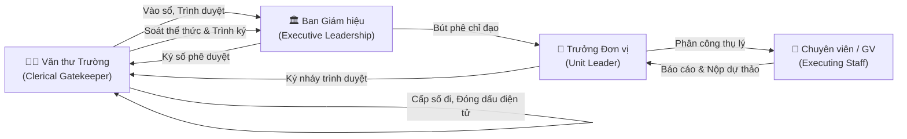
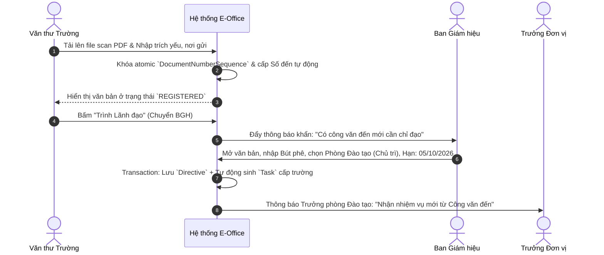
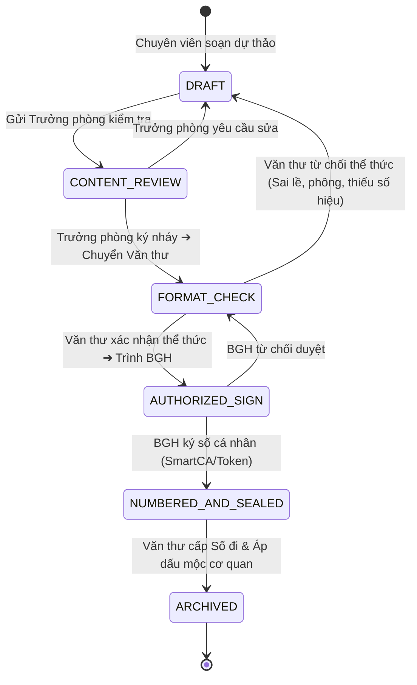

# SPEC: MODULE QUẢN LÝ VĂN BẢN ĐIỀU HÀNH & BÚT PHÊ GIAO VIỆC
## Hệ Thống Văn Phòng Điện Tử QCET E-Office

> [!IMPORTANT]
> **Tài liệu Đặc tả Tính năng Chuẩn mực (Feature Specification)**  
> Quy định chi tiết kiến trúc dữ liệu, luồng trạng thái máy FSM, giao diện người dùng và API endpoints cho phân hệ Văn bản.  
> Được xây dựng dựa trên sự kết hợp giữa **Nghị định 30/2020/NĐ-CP** và các tinh hoa đúc kết từ các hệ thống lớn (**VNPT iOffice, Viettel vOffice, VSS PortalOffice**).
>
> *Liên kết với: [[../../MASTER_ARCHITECTURE_BLUEPRINT|Master Architecture Blueprint]], [[../../domain/incoming-documents|Văn bản đến Domain]], [[../../domain/outgoing-documents|Văn bản đi Domain]]*.

---

## 1. MỤC TIÊU NGHIỆP VỤ & BỐI CẢNH

### 1.1. Vấn đề giải quyết
Hiện nay tại Trường Cao đẳng Kỹ thuật Công nghệ Quy Nhơn (QCET):
* Công văn đến từ các Sở, Bộ, Doanh nghiệp đối tác được văn thư tiếp nhận bằng bản giấy hoặc email phân tán, ghi sổ giấy thủ công bằng tay.
* Ban Giám hiệu bút phê trên giấy, văn thư mất thời gian photocopy và đi phát trực tiếp hoặc chụp ảnh gửi qua Zalo. Dẫn đến trôi tin nhắn, thất lạc tài liệu, khó đôn đốc hạn chót và không có số liệu để đánh giá trách nhiệm phòng ban.
* Hồ sơ trình ký văn bản đi phải in ấn nhiều bản thảo, cán bộ phải trực tiếp gõ cửa xin chữ ký nháy từng lãnh đạo phòng ban.

### 1.2. Mục tiêu cụ thể
1. **Số hóa 100% Sổ Văn bản Đến & Sổ Văn bản Đi** tuân thủ biểu mẫu chuẩn Phụ lục IV Nghị định số 30/2020/NĐ-CP. Cấp số tự động liên tục theo năm tài chính.
2. **Khai thông luồng Bút phê Điện tử (Document-to-Task Pipeline):** Ý kiến chỉ đạo của Ban Giám hiệu tự động sinh `Task` cấp trường gán về Đơn vị chủ trì, gắn liền hạn chót theo múi giờ chuẩn ICT (UTC+7).
3. **Cơ chế Thu hồi Thông minh (Undo / Recall Dispatch):** Cho phép người phân phối thu hồi văn bản gửi nhầm đơn vị nếu người nhận ở bước kế tiếp chưa mở văn bản (học hỏi từ VNPT iOffice v5.0).
4. **Chuẩn bị nền tảng Ký số Pháp lý:** Phân định rõ 4 hành vi pháp lý độc lập (Duyệt nội dung $\to$ Soát thể thức $\to$ Ký số Lãnh đạo $\to$ Áp dấu mộc cơ quan).

---

## 2. VAI TRÒ & KHÔNG GIAN TÁC NGHIỆP (ACTORS & WORKSPACES)

| Vai trò (Actor) | Trách nhiệm cốt lõi trong Module Văn bản | Quyền hạn trên Hệ thống |
| :--- | :--- | :--- |
| **Văn thư Trường** | Tiếp nhận công văn, bóc bì, scan màu PDF gốc, cấp số đến/đi tự động, thẩm tra thể thức văn bản đi, áp con dấu điện tử của Nhà trường, xuất sổ in ấn. | `document.register`, `document.format_check`, `document.seal`, `document.export` |
| **Ban Giám hiệu** | Xem văn bản trình, ghi bút phê điện tử (chỉ định Đơn vị chủ trì, phối hợp, hạn chót), ký số phê duyệt ban hành văn bản đi. | `document.directive`, `document.sign_authorized`, `document.assign_school` |
| **Trưởng Đơn vị** *(Trưởng phòng/khoa)* | Tiếp nhận văn bản BGH giao cho đơn vị, lập phiếu phân công thụ lý cho Chuyên viên, soát xét nội dung dự thảo văn bản đi, ký nháy tờ trình. | `document.unit_assign`, `document.review_content`, `document.initial_sign` |
| **Chuyên viên / Giảng viên** | Thụ lý văn bản được giao, nộp sản phẩm minh chứng hoặc soạn thảo dự thảo văn bản đi trả lời công văn. | `document.execute`, `document.draft` |

---

## 3. MÔ HÌNH DỮ LIỆU & BẤT BIẾN KỸ THUẬT (DATA MODEL & INVARIANTS)

### 3.1. Các thực thể Prisma cốt lõi
Module tận dụng triệt để các bảng đã có trong `prisma/schema.prisma`:

1. **`Document`**: Thực thể trung tâm lưu trữ thông tin pháp lý:
   - `documentType`: `INCOMING` (Đến), `OUTGOING` (Đi), `INTERNAL` (Nội bộ).
   - `registrationNumber`: Số văn bản đến (do trường cấp) hoặc Số ký hiệu văn bản đi (VD: `125/CĐKTCNQN-ĐT`).
   - `documentNumber`: Số thứ tự nguyên bản của nơi gửi đến.
   - `releaseDate`: Ngày ban hành văn bản.
   - `receivedDate`: Ngày tiếp nhận vào sổ.
   - `urgencyLevel`: `NORMAL`, `URGENT` (Khẩn), `VERY_URGENT` (Thượng khẩn), `FLASH` (Hỏa tốc).
   - `confidentialLevel`: `NORMAL`, `CONFIDENTIAL` (Mật).
   - `status`: Ánh xạ theo FSM vòng đời văn bản.

2. **`DocumentNumberSequence`**: Bộ đếm nguyên tử độc lập:
   - Đảm bảo tính liên tục của số đến/đi từ 01/01 đến 31/12 hàng năm.
   - Ngăn chặn triệt để hiện tượng trùng số hoặc nhảy số khi nhiều văn thư cùng thao tác qua giao dịch `SELECT ... FOR UPDATE` (Atomic Row Locking).

3. **`DocumentDirective`**: Lưu trữ bút phê của Ban Giám hiệu:
   - `content`: Lời chỉ đạo của Lãnh đạo.
   - `leadUnitId`: Đơn vị chủ trì thực hiện (Bắt buộc đúng 01 đơn vị).
   - `coordinatingUnitIds`: Danh sách các đơn vị phối hợp.
   - `deadline`: Hạn chót hoàn thành (Múi giờ ICT UTC+7).

4. **`DocumentAttachment`**: Quản lý tệp PDF scan màu gốc:
   - `fileUrl`: Đường dẫn lưu trữ (MinIO / Local Object Storage).
   - `fileSize`: Kích thước tệp (bytes).
   - `hashSha256`: Mã băm toàn vẹn chống chối bỏ và chống can thiệp file.
   - `isOriginal`: Đánh dấu văn bản gốc đã đóng dấu đỏ.

### 3.2. Năm bất biến kỹ thuật bắt buộc (Core Invariants)
1. **Bất biến Cấp số Liên tục:** Số văn bản đến và đi phải tăng dần liên tục, không nhảy số, không lùi số, không xóa số đã cấp. Nếu hủy một số, hệ thống ghi nhận trạng thái `CANCELLED` kèm lý do kiểm toán (Audit Log).
2. **Bất biến Đơn vị Chủ trì Duy nhất:** Mỗi chỉ đạo văn bản chỉ có **đúng 01 Đơn vị chủ trì** (`leadUnitId`), các đơn vị khác chỉ đóng vai trò phối hợp (`coordinatingUnitIds`). Không cho phép tình trạng "cha chung không ai khóc".
3. **Bất biến Mắt xích Document ➔ Task:** Khi Lãnh đạo xác nhận chỉ đạo, hệ thống bắt buộc chạy trong 1 Database Transaction: Lưu `DocumentDirective` đồng thời tạo 1 bản ghi `Task` liên kết `sourceDocumentId`.
4. **Bất biến Toàn vẹn File Ký số:** Tệp văn bản sau khi áp con dấu điện tử cơ quan là bất biến (`read-only`). Mọi chỉnh sửa sau đó đều vô hiệu hóa chữ ký số.
5. **Bất biến Thẩm quyền Văn thư:** Văn thư chỉ gác cổng thể thức (`FORMAT_CHECK`), tuyệt đối không được tự ý sửa nội dung chuyên môn của đơn vị soạn thảo.

---

## 4. CHI TIẾT CÁC LUỒNG NGHIỆP VỤ (BUSINESS PROCESS FLOWS)

### 4.1. Luồng 1: Tiếp nhận & Vào sổ Văn bản Đến (Incoming Flow)

### 4.2. Luồng 2: Thu hồi Văn bản Gửi nhầm (Recall / Undo Dispatch)
* **Kịch bản thực tế:** Văn thư hoặc Lãnh đạo phân phối nhầm công văn của Khoa Điện sang Khoa CNTT.
* **Quy tắc xử lý:**
  - Nếu Trưởng khoa CNTT **CHƯA MỞ VĂN BẢN** (trạng thái đọc `isRead = false`), người gửi có nút **"Thu hồi văn bản"** (Recall).
  - Khi bấm thu hồi: Hệ thống hủy thông báo gửi đến Khoa CNTT, chuyển trạng thái về lại màn hình phân phối của người gửi, ghi nhận vết Audit Log `DOCUMENT_RECALLED`.
  - Nếu người nhận **ĐÃ MỞ HOẶC ĐÃ PHÂN VIỆC**: Nút thu hồi tự động khóa, bắt buộc phải dùng tính năng chuyển tiếp hoặc trao đổi nghiệp vụ để tránh mất dữ liệu đang làm dở.

### 4.3. Luồng 3: Soạn thảo, Thẩm tra Thể thức & Ký số Văn bản Đi (Outgoing Flow)

---

## 5. THIẾT KẾ GIAO DIỆN & COMPONENTS (UI/UX - CHUẨN DESIGN.MD)

Các mô tả giao diện dưới đây thuộc đặc tả Module Văn bản. Màu và component dùng chung được đối chiếu qua [DESIGN.md](../../../DESIGN.md); mô tả than chì trong đặc tả cũ không phải chỉ thị ghi đè token hiện tại.

### 5.1. Màn hình Sổ Văn bản Đến (`src/app/documents/incoming/page.tsx`)
* **Header & Bộ lọc tinh gọn (Filter Bar):**
  - Thanh chọn năm tài chính: `[2026 ▼]`.
  - Bộ lọc breadcrumbs phẳng không viền hộp: `Tất cả` | `Chưa phân phối` | `Đang xử lý` | `Quá hạn`.
  - Hộp tìm kiếm tức thời theo Trích yếu, Số ký hiệu văn bản, Cơ quan gửi.
* **Bảng danh sách văn bản (Data Table):**
  - *Cột 1:* Số đến (In đậm, Badge xám trung tính).
  - *Cột 2:* Ngày đến & Ngày trên văn bản.
  - *Cột 3:* Cơ quan ban hành (Tỉnh, Bộ, Sở...).
  - *Cột 4:* Số ký hiệu gốc & Trích yếu nội dung (Cắt ngắn tối đa 2 dòng, hover hiện tooltip).
  - *Cột 5:* Đơn vị chủ trì thực hiện (Hiển thị tên đơn vị + Avatar người phụ trách).
  - *Cột 6:* Thời hạn & Trạng thái hạn chót (Nhãn ICT: `Còn 3 ngày`, `Hôm nay`, `Quá hạn 1 ngày` màu đỏ gạch không chói).
  - *Cột 7:* Thao tác nhanh (Xem PDF, Bút phê, Lịch sử).

### 5.2. Modal Bút phê 1 chạm của Lãnh đạo (`DocumentDirectiveModal.tsx`)
* Layout chia 2 nửa trực quan (Split-screen 50/50):
  - **Nửa trái:** Trình xem trước tệp PDF gốc (zoom, cuộn mượt mà).
  - **Nửa phải:** Form bút phê nhanh:
    1. *Khung ý kiến chỉ đạo:* Hỗ trợ các mẫu gợi ý nhanh (`"Kính chuyển Phòng Đào tạo chủ trì tham mưu xử lý"`, `"Khoa CNTT phối hợp thực hiện theo đúng tiến độ"`).
    2. *Đơn vị chủ trì:* Dropdown chọn 01 đơn vị (Gợi ý nhanh theo lịch sử).
    3. *Đơn vị phối hợp:* Multi-select checkboxes.
    4. *Hạn hoàn thành:* Input chọn ngày giờ (Mặc định gợi ý +5 ngày làm việc).
    5. *Nút CTA:* `[Ban hành Bút phê & Giao việc]` (Nổi bật, phản hồi micro-interaction theo quy tắc `ui-polish.md`).

---

## 6. DANH MỤC API ENDPOINTS

Tất cả các API đều tuân thủ chuẩn REST RFC 9457 (Problem Details for HTTP APIs) theo `ADR-007`:

| Method | Endpoint | Quyền hạn | Chức năng chi tiết |
| :--- | :--- | :--- | :--- |
| `GET` | `/api/documents/incoming` | Mọi user đăng nhập | Lấy danh sách sổ văn bản đến có phân trang, lọc theo năm và đơn vị. |
| `POST` | `/api/documents/incoming` | `VĂN THƯ`, `ADMIN` | Tiếp nhận và vào sổ văn bản đến mới (Cấp số tự động). |
| `GET` | `/api/documents/[id]` | Quyền xem theo OrgScope | Lấy chi tiết văn bản, danh sách file đính kèm, lịch sử bút phê. |
| `POST` | `/api/documents/[id]/directive` | `HIỆU TRƯỞNG`, `PHÓ HIỆU TRƯỞNG` | Ban hành bút phê chỉ đạo $\to$ Tự động sinh `Task`. |
| `POST` | `/api/documents/[id]/recall` | Người gửi (Văn thư/BGH) | Thu hồi văn bản phân phối nhầm nếu người nhận chưa mở. |
| `POST` | `/api/documents/outgoing/draft` | Chuyên viên, Giảng viên | Tạo mới bản dự thảo văn bản đi. |
| `POST` | `/api/documents/outgoing/[id]/format-check` | `VĂN THƯ` | Thẩm tra thể thức văn bản đi (Duyệt hoặc Yêu cầu sửa). |
| `POST` | `/api/documents/outgoing/[id]/sign` | Lãnh đạo có thẩm quyền | Ký số phê duyệt văn bản đi. |
| `POST` | `/api/documents/outgoing/[id]/release` | `VĂN THƯ` | Cấp số đi chính thức và đóng dấu điện tử phát hành. |
| `GET` | `/api/documents/export/registry-book` | `VĂN THƯ`, `CHÁNH VĂN PHÒNG` | Xuất Sổ văn bản đến/đi ra file Excel chuẩn Phụ lục IV NĐ 30. |

---

## 7. TIÊU CHÍ HOÀN THÀNH & KẾ HOẠCH NGHIỆM THU PILOT (DEFINITION OF DONE)

Module Văn bản được coi là hoàn tất giai đoạn Pilot khi đáp ứng đầy đủ **Checklist Kiểm thử Chấp nhận (UAT)**:

- [ ] **Test Cấp số Đồng thời (Concurrency Test):** Giả lập 10 request cùng tạo văn bản đến tại 1 thời điểm; số thứ tự được cấp phải tăng liên tục `1, 2, 3... 10` mà không bị trùng hoặc lỗi deadlock.
- [ ] **Test Mắt xích Document-to-Task:** Ban Giám hiệu ghi bút phê cho Phòng Đào tạo $\to$ Kiểm tra bảng `Task` trong CSDL có xuất hiện ngay 1 nhiệm vụ tương ứng với đúng `leadUnitId` và `deadline`.
- [ ] **Test Thu hồi Văn bản:** Gửi công văn đến cho Khoa CNTT $\to$ Thu hồi khi tài khoản Khoa CNTT chưa bấm xem $\to$ Xác nhận Khoa CNTT không còn thấy văn bản trong hộp thư đến.
- [ ] **Test Xuất Sổ Excel:** Bấm xuất Sổ văn bản đến năm 2026 $\to$ Mở file Excel kiểm tra đúng đủ 9 cột theo mẫu Phụ lục IV Nghị định 30/2020/NĐ-CP.
- [ ] **Test Thể thức Giao diện:** Giao diện hiển thị đúng chuẩn typography, không vỡ layout trên màn hình laptop 13-inch, không chạy các lệnh gây lỗi dev server cache.
